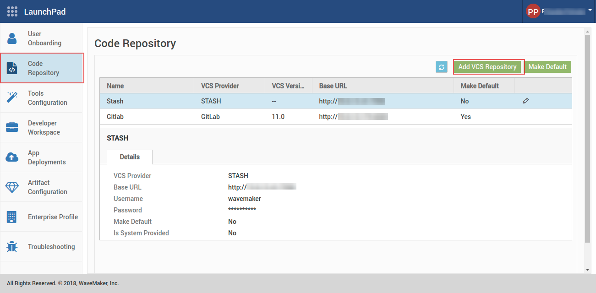

This section walks you through **Configuring WME**. You should have completed [Launching](/learn/installation/wme-setup-guide-launch-initialize/#launch-wme), [Initializing](/learn/installation/wme-setup-guide-launch-initialize/#initialize-wme) and [Setting up](/learn/installation/wme-setup-guide-access-setting/#setting-up-wme) of WME. These configurations are available from WaveMaker Launchpad.

## Adding Users

WaveMaker Enterprise supports team collaboration. To this end you can add users to your developer network and they can in turn access WME. The number of users that can be added is limited by the terms in License and the Developer Capacity of WME. See here for [Adding Capacity](/learn/installation/wme-setup-guide-adding-capacity/).

Following are the steps to add Users to the network by the Admin from **WaveMaker Launchpad**:

1. From the left menu, click on **User On-boarding**. 
2. On the User On-boarding page, click **Create User. **Create User window is displayed.
3. Enter the **Email**, **First Name**, **Last Name** and **Password** in their respective fields. 
4. Click **Create User**. Your user is now created.

## Uploading License

You can upload WaveMaker License from **WaveMaker Launchpad**.

 It is a two-step process:

1. **Upload Key bunch**: 
2. **Upload Keys**: 

The terms of License include:

1. License key, its status, and number
2. Effective and expiration dates
3. The maximum number of developers that can collaborate on the WME Studio platform
4. The maximum number of nodes or apps that can be deployed to the WME Cloud

**NOTE**: To avail the full benefits of the License in terms of Developers and Nodes (Apps), instances need to be added appropriately. See [Adding Capacity](/learn/installation/wme-setup-guide-adding-capacity/) for more details.

## Adding External VCS

###### Applicable to WaveMaker Studio only

During the course of app development, tracking code changes and synchronizing the changes, in case of collaborated development, is of the essence. WaveMaker provides Version Control Services for this purpose. By default, WaveMaker Studio comes with a version control system that runs within your VM based on Gitlab. You can choose to add an external repo of your choice.

1. From Launchpad, go to **Code Repository**. You will see the existing internal VCS server referred to as `vcs.wmenterprise.com`. This points to the Gitlab based VCS installed within your WME VM as part of Studio. 
2. If you have an **external repo** which you want to use for version control, you can add a new VCS configuration. Click **Add VCS Config** on the top right corner. Add VCS Configuration window is displayed. 
3. You can choose between GitLab or Bitbucket Enterprise version control systems. (Bitbucket option is available on WaveMaker ver 9.0.2 or higher).
4. Enter the appropriate **Base URL, Username** and **Password** in the respective fields.
5. Check the **Primary** box, if you want the new VCS server to be the default. **Note**: On selecting the Primary checkbox, the new VCS server becomes the default for all the projects that you create subsequently in Studio.
6. Click **Test and Add**. The new VCS server is now configured.

**Note**: After you create a new VCS server and make it Primary if you wish to edit the projects from the old VCS server when you sync/push the changes they will be made to the old VCS server and not the new VCS server. Since the project references are to the old server, there is no relation with the new VCS server.

Step 5: Adding Capacity to WME from Launchpad

Contents

- [1\. Getting Started](/learn/installation/wavemaker-enterprise-setup-guide/)
- [2\. Launching Instances](https://www.wavemaker.com/learn/installation/wme-setup-guide-launch-initialize/)
- [3\. Setting Up WME](/learn/installation/wme-setup-guide-access-setting/)
- [4\. Configuring WME](#)
    - [i. Adding Users](#adding-users)
    - [ii. Uploading License](#uploading-license)
    - [iii. External VCS Configuration](#adding-external-vcs)
- [5\. Adding Capacity](/learn/installation/wme-setup-guide-adding-capacity/)
- [6\. Maintaining WME](/learn/installation/wme-setup-guide-maintenance/)
- [7\. Upgrading WME](/learn/installation/wme-setup-guide-upgrading/)
