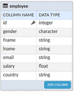

Jasper Reports is an open source Java reporting tool that can write to a variety of targets, such as: screen, a printer, into PDF, HTML, Microsoft Excel, RTF, ODT, Comma-separated values or XML files. It can be used in Java-enabled applications, including Java EE or web applications, to generate dynamic content.

-  To Integrate Jasper Reports in your WaveMaker application you will need to write the Java Service where by passing required parameters one can generate the report. [the link for creating Java service](/learn/app-development/services/java-services/java-service/)
- this example the Java Service will take database and jrxml file (JasperReports reports are defined in an XML file format, called JRXML) as input and create the pdf report.

1. **Jasper as dependency in pom.xml along with required exclusions:  ** is the relevant section that needs to be added by the developer. Adding the below dependency in , will automatically download the specified file from the repository and place it in the lib folder of the corresponding project.
    
    <dependency>
                <groupId>net.sf.jasperreports</groupId>
                <artifactId>jasperreports</artifactId>
                <version>6.4.1</version>
                <exclusions>
                    <exclusion>
                        <groupId>com.fasterxml.jackson.core</groupId>
                        <artifactId>jackson-core</artifactId>
                    </exclusion>
                    <exclusion>
                        <groupId>com.fasterxml.jackson.core</groupId>
                        <artifactId>jackson-databind</artifactId>
                    </exclusion>
                    <exclusion>
                        <groupId>com.fasterxml.jackson.core</groupId>
                        <artifactId>jackson-annotations</artifactId>
                    </exclusion>
                    <exclusion>
                        <groupId>org.apache.lucene</groupId>
                        <artifactId>lucene-core</artifactId>
                    </exclusion>
                    <exclusion>
                        <groupId>com.fasterxml.jackson.core</groupId>
                        <artifactId>lucene-analyzers-common</artifactId>
                    </exclusion>
                    <exclusion>
                        <groupId>org.apache.lucene</groupId>
                        <artifactId>lucene-queryparser</artifactId>
                    </exclusion>
                    <exclusion>
                        <groupId>org.jfree</groupId>
                        <artifactId>jcommon</artifactId>
                    </exclusion>
                    <exclusion>
                        <groupId>org.jfree</groupId>
                        <artifactId>jfreechart</artifactId>
                    </exclusion>
                    <exclusion>
                        <groupId>org.eclipse.jdt.core.compiler</groupId>
                        <artifactId>ecj</artifactId>
                    </exclusion>
                    <exclusion>
                        <groupId>org.codehaus.castor</groupId>
                        <artifactId>castor-xml</artifactId>
                    </exclusion>
                    <exclusion>
                        <groupId>org.olap4j</groupId>
                        <artifactId>olap4j</artifactId>
                    </exclusion>
                    <exclusion>
                        <groupId>com.google.zxing</groupId>
                        <artifactId>core</artifactId>
                    </exclusion>
                    <exclusion>
                        <groupId>com.ibm.icu</groupId>
                        <artifactId>icu4j</artifactId>
                    </exclusion>
                </exclusions>
            </dependency>
    
2. a database with a table named  with the following DB Schema and add sample data 
3. file has to be created as per your database. the file to _/src/main/resources_ For the above database, we have used the following

## in Integration

1. [Service Integration](http://[supsystic-show-popup id=119]) will create sample Java Service.
2. the below method () to the Java Service:
    
     void generatePdfReport(String jrxml, String database,HttpServletResponse response)
     {
       Connection conn = null;
       try
       {
         //Fetching database connection from spring bean
         DataSource ds = (DataSource)WMAppContext.getInstance().getSpringBean(database + "DataSource");
         conn = ds.getConnection(); // get connected to database 
    
         //Opening jrxml input stream file from class loader
         InputStream jrxmlInput = getClass().getClassLoader().getResource(jrxml).openStream();
    
         // loads the jrxml file
         JasperDesign design = JRXmlLoader.load(jrxmlInput); 
    
         //Compiling jrxml file 
         JasperReport jasperReport = JasperCompileManager.compileReport(design); 
    
         //Print jasper report
         JasperPrint jasperPrint = JasperFillManager.fillReport(jasperReport, new HashMap(), conn);
         logger.info("JasperPrint" + jasperPrint);
    
         //Export report to pdf format
         JRPdfExporter pdfExporter = new JRPdfExporter();
         pdfExporter.setExporterInput(new SimpleExporterInput(jasperPrint));
         ByteArrayOutputStream pdfReportStream = new ByteArrayOutputStream();
         pdfExporter.setExporterOutput(new SimpleOutputStreamExporterOutput(pdfReportStream));
         pdfExporter.exportReport();
    
         //Setting response header
         response.setContentType("application/pdf");
         response.setHeader("Content-Length", String.valueOf(pdfReportStream.size()));
         response.addHeader("Content-Disposition", "inline; filename=jasper.pdf;");
    
         //Closing stream
         OutputStream responseOutputStream = response.getOutputStream();
         responseOutputStream.write(pdfReportStream.toByteArray());
         responseOutputStream.close();
         pdfReportStream.close();
    
         logger.info("Completed Successfully: "); // logger will log the error into the studio logs
       } catch (Exception e) {
         logger.info("Error: ", e);
       } finally {
         if (conn==null) {
            //closing database connection
            conn.close();
         }
       }
     }
    
3. the following _files_:
    
     javax.servlet.http.\*;
    
    import org.slf4j.Logger;
    import org.slf4j.LoggerFactory;
    
    import org.springframework.beans.factory.annotation.Autowired;
    import com.wavemaker.runtime.WMAppContext; // used to load beans from app context
    
    import com.wavemaker.runtime.security.SecurityService; 
    import com.wavemaker.runtime.service.annotations.ExposeToClient; 
    import com.wavemaker.runtime.service.annotations.HideFromClient; 
    import java.io.ByteArrayOutputStream;
    import java.io.InputStream;
    import java.io.OutputStream;
    import java.sql.Connection;
    import java.util.HashMap;
    import javax.servlet.http.HttpServletResponse;
    import javax.sql.DataSource;
    import net.sf.jasperreports.engine.JasperCompileManager;
    import net.sf.jasperreports.engine.JasperFillManager;
    import net.sf.jasperreports.engine.JasperPrint;
    import net.sf.jasperreports.engine.JasperReport;
    import net.sf.jasperreports.engine.design.JasperDesign;
    import net.sf.jasperreports.engine.export.HtmlExporter;
    import net.sf.jasperreports.engine.export.JRPdfExporter;
    import net.sf.jasperreports.engine.util.JRLoader;
    import net.sf.jasperreports.engine.xml.JRXmlLoader;
    import net.sf.jasperreports.export.SimpleExporterInput;
    import net.sf.jasperreports.export.SimpleHtmlExporterOutput;
    import net.sf.jasperreports.export.SimpleOutputStreamExporterOutput;
    
    : Some of these import files will be available already in the sample Java Service.
4. /Create the page where you need to include the Jasper report
5. a [Service Variable](http://[supsystic-show-popup id=105]) with
    - as “” (the Java Service name created in step 1) and
    - as “” (the method name added in step 2)
6. to the tab
    1. field enter “” (the file name added as per prerequisite2) and
    2. field enter “” (database for which the report needs to be generated)
7. display the pdf file, drag and drop widget and set the Source property: `/myJava/generatePdfReport?jrxml=employee.jrxml&database=employee`

Reports Integration

- [Prerequisites](#prerequisites)
- [Steps in Integration](#steps)
