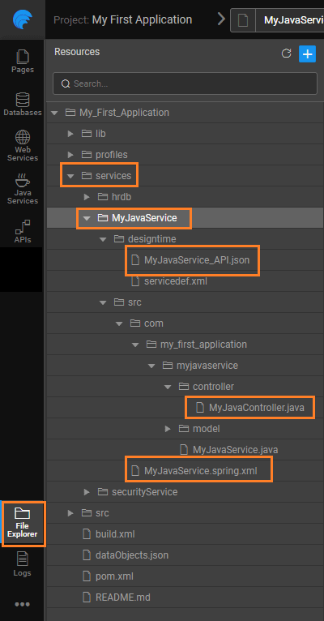

Services allow app developers to write custom business logic or enable integration with 3rd party libraries and tools and are deployed on the Server side. For every Java Service created in WaveMaker, its REST API contract is auto-generated and is ready for integration with front-end layer (web or mobile).

are required to invoke Java Service methods, each Variable can be configured to take the necessary method parameters required as data inputs and return JSON response. Variables internally perform the necessary conversion to invoke the equivalent REST API endpoint/resource for the Java Service methods.

you create a Java Service in WaveMaker, Java sample file is created. You can access this file from the _Services_ Resources. You can edit the file and even delete the service.

Java method can have input and output in the form of an individual or a set of parameters. These parameters can be of the following types: **parameters** can be of the type:

- objects,
- classes,
- collection of POJO classes and primitives,

- servlet response/request which can be passed as URL-based header params or in the form of cookies
- pageable object with values pertaining to the page to be retrieved, the size of each page and sort field name

**parameters** can be of the type:

- objects,
- classes,
- collection of POJO classes and primitives,

# Services framework

a Java Service generates multiple files, of which the following are of importance:

1. **Controller File**: MyJavaController.java, in this example - This file contains the details related to the Java Service. Public methods in the controller class are wrappers of the underlying Java Service code, acting as an endpoint which can be invoked as REST API. The methods can be hidden or exposed to the client using the directives: @HideFromClient and @ExposeToClient, respectively. Request JSON object from the invoking client is automatically converted to POJOs in the method parameter for POST/PUT/DELETE. Similarly, the response POJOs get converted to JSON object.
2. **JSON File**: MyJavaService\_API.json, in this example - contains the file structure and details as used by the API Documentation. This is available only during the design time.
3. **Bean Configuration File**: MyJavaService.spring.xml, in this example - Bean classes for service/method lookup

< Backend Services Overview

Rest APIs >

for Java Service Invocation >

Integration Services >

5\. Creating Backend Services

- 5.1 Overview
    - [Accessing Data](/learn/app-development/services/creating-backend-services/#accessing-data)
        - [Life-cycle of data](/learn/app-development/services/creating-backend-services/#life-cycle)
    - [Manipulating Data](/learn/app-development/services/creating-backend-services/#manipulating-data)
        - [Life-cycle of Events](/learn/app-development/services/creating-backend-services/#life-cycle-events)
    - [REST APIs](/learn/app-development/services/creating-backend-services/#rest-apis)
- 5.2 Web Services
    - [Overview](/learn/services/web-services/web-services/#overview)
    - [Variables for Invocation](/learn/services/web-services/web-services/#service-variable)
    - iii. Working with SOAP Services
        - [Overview](/learn/app-development/services/web-services/web-services/working-with-soap-services/#SOAP-service-setup)
        - [SOAP Service Setup](/learn/app-development/services/web-services/working-with-soap-services/#SOAP-service-setup)
        - [SOAP Service Settings](/learn/app-development/services/web-services/working-with-soap-services/#SOAP-service-settings)
        - [Generated REST APIs](/learn/app-development/services/web-services/working-with-soap-services/#generated-rest-apis)
        - [SOAP Service Usage](/learn/app-development/services/web-services/working-with-soap-services/#SOAP-service-usage)
    - iv. Working with REST Services
        - [ Overview](/learn/app-development/services/web-services/rest-services/)
        - [ Test REST Service](/learn/app-development/services/web-services/rest-services/#test-API)
        - [ Configure REST Service](/learn/app-development/services/web-services/rest-services/#configure-REST-service)
        - [REST Service Usage](/learn/app-development/services/web-services/rest-services/#REST-service-usage)
    - v. Working with Web Sockets
        - [Overview](/learn/app-development/services/web-services/working-with-websockets/)
        - [Service Integration](/learn/app-development/services/web-services/working-with-websockets/#import)
        - [Service Consumption](/learn/app-development/services/web-services/working-with-websockets/#variable)
        - [Use Cases](/learn/app-development/services/web-services/working-with-websockets/#use-cases)
- 5.3 Database Services
    - [Overview](/learn/app-development/services/database-services/database-services/)
    - [Supported Databases](/learn/app-development/services/database-services/database-services/#supported-databases)
    - iii. Working with Databases
        - [Overview](/learn/app-development/services/database-services/working-with-databases/)
        - [Adding Database](/learn/app-development/services/database-services/working-with-databases/#integrating-database)
        - [Database Actions](/learn/app-development/services/database-services/working-with-databases/#database-actions)
    - iv. Data Modelling
        - [Overview](/learn/app-development/services/database-services/data-modelling/)
        - [Configuration Settings](/learn/services/db-services/data-modelling/#configuration-settings)
        - [Database Designer](/learn/services/db-services/data-modelling/#database-designer)
            - [Schema Import Modes](/learn/app-development/services/database-services/database-schema-import-modes/)
        - ○ Working with Database Schema
            - [Overview](/learn/app-development/services/database-services/working-database-schema/)
            - [Adding Tables and Columns](/learn/app-development/services/database-services/working-database-schema/#add-tables-columns)
            - [Working with Relationships](/learn/app-development/services/database-services/working-database-schema/#database-relationships)
            - [Identity Generators for Primary Key Column](/learn/app-development/services/database-services/working-database-schema/#identity-generators)
            - [Column Metadata Configuration](/learn/app-development/services/database-services/working-database-schema/#column-metadata-configuration)
            - [Virtual Primary Keys and Relations](/learn/app-development/services/database-services/working-database-schema/#virtual-primary-keys)
            - [Temporal Support](/learn/app-development/services/database-services/temporal-support/)
    - v. Databases Access
        - [Overview](/learn/app-development/services/database-access/)
        - ○ Working with Queries
            - [Overview](/learn/app-development/services/database-services/working-with-queries/)
            - [Query Editor](/learn/app-development/services/database-services/working-with-queries/#query-editor)
            - [Types of Queries](/learn/app-development/services/database-services/working-with-queries/#query-types)
            - [Query Creation](/learn/app-development/services/database-services/working-with-queries/#query-creation)
            - [Query Usage](/learn/app-development/services/database-services/working-with-queries/#query-usage)
            - [Parameterised Query Creation](/learn/app-development/services/database-services/working-with-queries/#query-creation-parameterised)
            - [Query Operation Type](/learn/app-development/services/database-services/working-with-queries/#query-op-types)
            - [Query Architecture](/learn/app-development/services/database-services/working-with-queries/#query-architecture)
        - ○ Working with Stored Procedures
            - [Overview](/learn/app-development/services/db-services/working-stored-procedures/)
            - [Procedure Creation](/learn/app-development/services/db-services/working-stored-procedures/#procedure-creation)
            - [Procedure Parameters](/learn/app-development/services/db-services/working-stored-procedures/#proc-params)
            - [Procedure Invocation](/learn/app-development/services/db-services/working-stored-procedures/#procedure-invocation)
            - [Procedure Architecture](/learn/app-development/services/db-services/working-stored-procedures/#procedure-architecture)
        - [Versioning of Queries and Procedures](/learn/app-development/services/database-services/versioning-queries-procedures/)
        - [ Blob Support for Queries and Procedures](/learn/app-development/services/database-services/blob-support-queries-procedures/)
        - [Invoking Queries & Procedures from Java Service](/learn/app-development/services/database-services/invoking-queriesprocedures-java-services/)
        - [ Database Views](/learn/app-development/services/db-services/database-views/)
        - ○ Database Tools
            - [Overview](/learn/app-development/services/database-tools/)
            - [DB Shell](/learn/app-development/services/database-tools/#db-shell)
            - [DB Scripts](/learn/app-development/services/database-tools/#db-scripts)
                - [Import DB](/learn/app-development/services/database-tools/#import-db)
                - [Export DB](/learn/app-development/services/database-tools/#export-db)
    - vi. ORM Artifacts
        - [Layered Architecture](/learn/app-development/services/db-services/orm-artifacts/#layered-architecture)
        - [Generated Files](/learn/app-development/services/db-services/orm-artifacts/#generated-files)
        - [Generated APIs](/learn/app-development/services/db-services/orm-artifacts/#generated-apis)
            - [CRUD APIs](/learn/app-development/services/db-services/orm-artifacts/#crud-apis)
            - [Query APIs](/learn/app-development/services/db-services/orm-artifacts/#query-apis)
            - [Custom Query Syntax](/learn/app-development/services/db-services/orm-artifacts/#custom-query-syntax)
- [5.4 Java Services](#)
    - [ Overview](#overview)
    - [Java Services Framework](#java-services-framework)
    - iii. Integration Services
        - [Current Loggedin User](/learn/app-development/services/java-services/java-integration-services/#loggedin-user)
        - [External Java Libraries](/learn/app-development/services/java-services/java-integration-services/#external-java-libraries)
        - [Database Entities](/learn/app-development/services/java-services/java-integration-services/#db-services)
        - [Named Queries](/learn/app-development/services/java-services/java-integration-services/#query-service)
        - [Imported Web Services](/learn/app-development/services/java-services/java-integration-services/#web-services)
    - [Variables for Invocation](/learn/app-development/services/java-services/variables/)
    - [ Generated REST APIs](/learn/app-development/services/java-services/generated-rest-apis-api-designer/)
- 5.5 API Designer
    - [Overview](/learn/app-development/services/api-designer/api/)
    - [Database Services APIs](/learn/app-development/services/api-designer/database-service-apis/)
    - [Web Services APIs](/learn/app-development/services/api-designer/web-service-apis/)
    - [Java Services APIs](/learn/app-development/services/api-designer/java-service-apis/)
    - [Security Services APIs](/learn/app-development/services/api-designer/security-service-apis/)
- 5.6 3rd Party Libraries
    - [Overview](/learn/app-development/services/3rd-party-libraries/)
    - [Including resource files](/learn/app-development/services/3rd-party-libraries/#resource-files)
    - [Using third-party JavaScript file](/learn/app-development/services/3rd-party-libraries/using-3rd-party-javascript-files/)
    - [Using third-party jar file](/learn/app-development/services/3rd-party-libraries/using-3rd-party-jar-files/)
