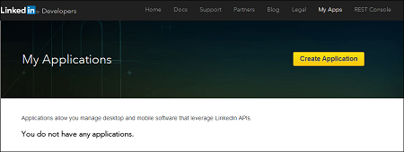
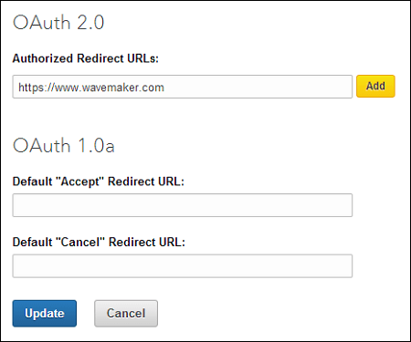
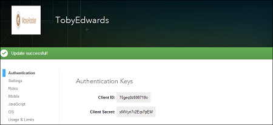
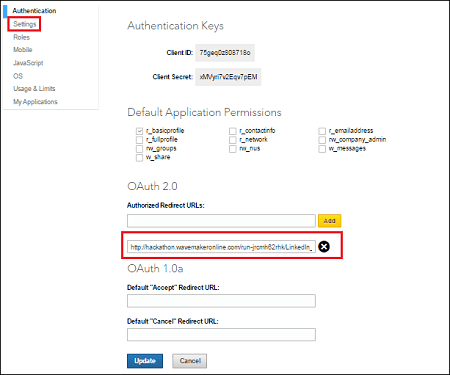

2.0 is an authorization framework, which is updated after the original OAuth protocol created in 2006. OAuth 2.0 is a standard protocol, which provides delegated secured access for web, mobile, and desktop applications. To know more about the working of WaveMaker OAuth Prefabs [ here](/learn/app-development/widgets/prefab/oauth-prefabs/)

## OAuth in WaveMaker

In order to use the OAuth prefab, please follow the below steps: : The screenshots from the LinkedIn website were current at the time of writing this document, the actual screens might differ.

1. on to [://developer.linkedin.com/](https://developer.linkedin.com/) and enter your credentials. LinkedIn Developers page is displayed. 
2. to My Apps and click **Application** Create a New Application page is displayed. 
3. **Name, Name, Description, Application Logo URL, Application Use, Website URL, Business Email** and **Phone** in their respective fields. Check the **LinkedIn API Terms of Use** checkbox and click Authorize Redirect URLs page is displayed. 
4. a valid sample **Redirect URLs** below **2.0** and click Click Your application is successfully created.  Note: Make a note of the ** ID** and ** Secret**

# Example

1. WaveMaker and create an application.
2. and confirm the settings and click on the Project Settings window.
3. a Template for Main page and click
4. and Drop the **Prefab** from the Prefabs Tab under OAuth.You can use the default login page created by WaveMaker.
5. can set the **Mode** to be:
    
    - will in the run mode after initialization of the Prefab the app would automatically be navigated to the OAuth Authorization page
    - (default mode) will invoke the OAuth Authorization page on click of the login button
    
    
6. the Properties Panel, below **PROPERTIES**, enter the **, Page, Scope** and in their respective fields. 
7. and Run the application.
8. you run the application, redirect URL is generated. You might have to click REMOVE TOOLBAR to get the URL. Copy the redirect uri till the  For example, if your url looks like this: `://www.linkedin.com/uas/oauth2/authorization?client_id=xxx&response_type=xxx&redirect_uri=https://www.wavemakeronline.com/run-xyz/projectname/prefabs/LinkedInOAuth/oAuthHandler/callback&state=xxx&scope=xxx` use only: `://www.wavemakeronline.com/run-xyz/projectname/prefabs/LinkedInOAuth/oAuthHandler/callback`
9. to LinkedIn Developers – your project page and click on Settings on the left side. Add the generated redirect URL below **2.0** and Click 
10. back to WaveMaker application and again Run the app. You will see the WaveMaker Login page if you have set the Login Mode to manual. Click the Login using Linkedin button. 
11. will be redirected to the LinkedIn Allow Access screen, this will be the screen you will first see if you have set Login Mode to auto. Enter your credentials to Login and click **Access** You can now see the application with **Token** and **URL** 
12. use LinkedIn APIs, you need to [the appropriate web service](/learn/web-services/#setup) Go to [://apigee.com/console/linkedin](https://apigee.com/console/linkedin), select the required API and get the Authorization key.
13. WaveMaker app designer, import a web service with the proper credentials as obtained from the above step. 

[9\. Custom Widgets - Prefabs](/learn/app-development/widgets/widget-library/#prefabs)

- [9.1 Youtube](/learn/app-development/widgets/prefab/youtube/)
- [9.2 Googlemaps](/learn/app-development/widgets/prefab/googlemaps/)
- [9.3 QRCode](/learn/app-development/widgets/prefab/qrcode/)
- [9.4 OAuth Prefabs](/learn/app-development/widgets/prefab/oauth-prefabs/)
    - [9.4.1 Box](/learn/app-development/widgets/prefab/oauth-prefabs/box/)
    - [9.4.2 Facebook](/learn/app-development/widgets/prefab/oauth-prefabs/facebook/)
    - [9.4.3 Google](/learn/app-development/widgets/prefab/oauth-prefabs/google/)
    - [9.4.4 Instagram](learn/app-development/widgets/prefab/oauth-prefabs/instagram/)
    - [9.4.5 LinkedIn](#)
