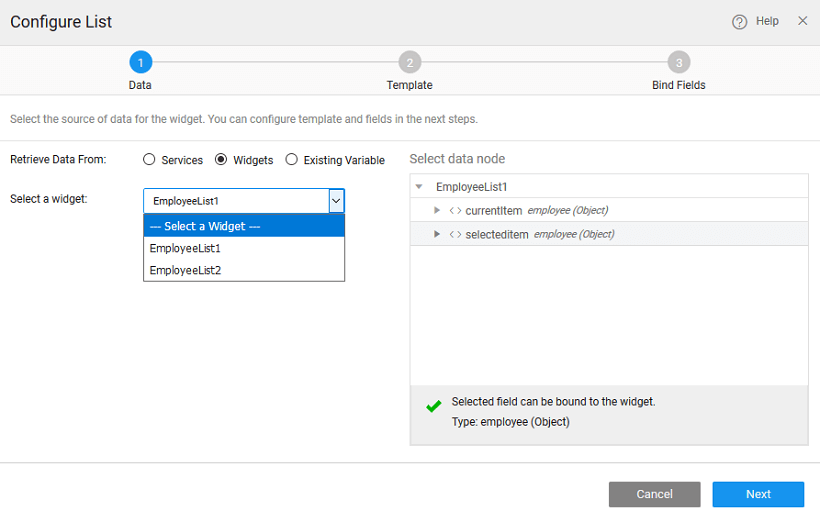

## Employee List

can use the List widget to list data from a database. This post gives you a basic List usage by building an Employee List.

**\-requisites:**

1. a web responsive app
2. a page to hold the list

**:**

We will be building the following list:

## Data

can be different scenarios to deal with when configuring your List Widget with a data source. The data source can be from a service like a Database, web or Java Service or from an another widget on the page.

- **1**: You do not have any services available in your project.
    
    - will be prompted to import a service by either [Integration](http://[supsystic-show-popup id=106]), or [Service Integration](http://[supsystic-show-popup id=115]), or [Service Integration](http://[supsystic-show-popup id=119]) Click the appropriate button to proceed.
    - a service is available in your application, you can proceed to bind the widget to data source and follow the same steps as mentioned in scenario 2
    
    
- **2**– There are no variables created for any of the services in your application
    
    - **Data From**: Services is selected by default.
    - Services option and select the Service Type and Service - here we are using Database CRUD API from hrdb database service.
    - the **/Entity** of the service which would correspond to the entity in case of database service or a method in case of web/java services 
    - **Creation**: Once you select the service and Table/Entity for the service, a default variable will be created for you – see the Variable Name field populated by default which will be holding the dataset of the service. You can also change the Variable name, if required.
    - **the Data Node**: You are given the option of choosing either the entire dataset – when you are binding the widget to a data source or any of the fields in the dataset. Select data node tree when binding a single widget or a List item to a field in the dataset.
    - **Configuration Options**: You also have the option of setting the following Data Configuration options:
        - **per request**: with an option to enter the number of records to be fetched on each request. The default is 20. For this example, we have set it to 5.
        - **Data on input change**: which is checked on by default. This means that whenever there is a change in the input parameter or filter field of the variable the data will be fetched from the service. This option will have an impact on the app performance.
        - **data on Page Load**: which is checked on by default. This allows for data to be shown when the page is loaded. If this is not checked, you will not be able to view the data when the page gets loaded. Instead, No Data Found message appears on the widget at runtime.
    
    
- **3**– If the variables are already created in the project
    
    - **Data From**: Select **Variable.**
    - **a Variable** from the drop-down list of the variables available in the application. You can select the one needed to bind the List Widget to. You can also search for a specific variable by typing in select variable option. If you are able to find your variable in the drop-down select the same.
    - you select the variables, it shows the dataset that it is bound to.
    - Data Configuration options are already set for this variable, you do not see those options in this scenario.
    
    
- **4**: Binding to widget
    
    - **Data From**: Select the Retrieve Data From option as Widget that was dragged and dropped onto the canvas of the project.
    - **a widget** from the drop-down list. This will list the widgets present on this page, you cannot access the widgets from other pages.
    - can  **data node** to be the entire widget or the selecteditem node in case of another Data Table or List or Cards or result from a Live Filter
    - you are not using a Variable the Data Configuration options will not be available.
    
    

## Template

this step, you are expected to select a and style suitable for the current use case. For this example, we are choosing _List_ as the template and as pagination style.

## Data Fields

- template selected in the previous step provides a set of widgets that need to be bound to the corresponding field from the data source selected in the first step.
- the widget and bind to the corresponding properties like Caption etc. to the fields by selecting the field from the drop-down list.

## View

the Canvas, you can further enhance the list design by adding/removing widgets, setting properties etc.

## View

Test Run or Preview the App

[Use Cases](/learn/app-development/widgets/datalive/list/list-use-cases/)

- [1\. List Basic Usage](/learn/app-development/widgets/datalive/list/list-basic-usage/)
    - [Data Selection](#data-selection)
    - [Template Selection](#template-selection)
    - [Binding Fields](#binding-fields)
    - [Design](#design)
    - [Run/Preview](#run)
- [2\. How to group list items](/learn/how-tos/list-grouped/)
- [3\. How to group list items based upon multiple fields](/learn/how-tos/list-multi-grouped/)
- [4\. How to include data table within a list](/learn/how-tos/list-data-table/)
- [5\. How to build editable list using live form](/learn/how-tos/building-editable-list/)
- [6\. How to build list from the selected item of another list](/learn/how-tos/building-cascading-lists/)
- [7\. How to access list items](/learn/how-tos/list-item-access/)
