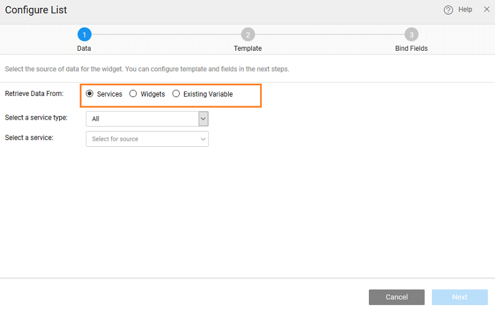

The first step in configuring a list is to define the data that needs to be displayed. This data can be in the form of Services or Widget or Existing Variable.

### Variable Source

Variable binding will allow you to

- - List data from a database table through Database CRUD Variables;
    - List the results from a Web Service, Java Service or a Query;
    - List values stored in a Model.

You can either create a new variable or use existing variables. The behavior of data displayed will be defined by the Variable/Data Configuration properties. These properties are at the Variable level, you can configure them only when creating a new variable; for existing variables the properties set at the time of variable creation will be used. To modify these, you will have to go to variable dialog and make changes. Of particular interest are:

- _Records per request_ - this is the number of records that will be displayed on a page. Configure the Pagination property to enable user navigation to various pages of data;
- _Update data on input change_ - this property defines when the data displayed will be refreshed. When enabled the data is reloaded whenever the input to the Variable (in the form of filter fields for Live and parameter values for Database APIs Variable) changes;
- _Request data on page load_ - enabling this property will ensure that the data within the data table is loaded at the time of page load.

### Widget Source

Widgets can be a source of data in some cases. For example, you might want to display the results from a Live Filter or more details of a selected row/item from a Data Table or another List. Widget option will allow you to achieve this. Selecting Widget as the data source will display the various options available.

< Overview

Templates >

[1\. Live & Data Widgets](/learn/app-development/widgets/widget-library/#data-live)

- [1.1 Cards](/learn/app-development/widgets/datalive/cards/)
- [1.2 Data Table](/learn/app-development/widgets/datalive/data-table/)
- [1.3 Form](/learn/app-development/widgets/datalive/form/)
- [1.4 List](/learn/app-development/widgets/datalive/list/)
    - [i. Data Source](/learn/app-development/widgets/datalive/list/list-data-source/)
        - [○ Variable Source](#variable-source)
        - [○ Widget Source](#widget-source)
    - [ii. Templates](/learn/app-development/widgets/datalive/list/list-templates/)
        - [○ Action List](/learn/app-development/widgets/datalive/list/list-templates/#action-list)
        - [○ Contact List](/learn/app-development/widgets/datalive/list/list-templates/#contact-list)
        - [○ Email List](/learn/app-development/widgets/datalive/list/list-templates/#email-list)
        - [○ Media List](/learn/app-development/widgets/datalive/list/list-templates/#media-list)
    - [iii. List Configuration](/learn/app-development/widgets/datalive/list/configuration/)
        - [○ Items per row](/learn/app-development/widgets/datalive/list/configuration/#items-per-row)
        - [○ Grouping & Ordering](/learn/app-development/widgets/datalive/list/configuration/#grouping-ordering)
        - [○ Pagination](/learn/app-development/widgets/datalive/list/configuration/#pagin)
        - [○ Message](/learn/app-development/widgets/datalive/list/configuration/#message)
    - [iv. List Behavior Settings](/learn/app-development/widgets/datalive/list/behavior-settings/)
        - [○ Selection Limit](/learn/app-development/widgets/datalive/list/behavior-settings/#selection-limit)
        - [○ MultiSelect](/learn/app-development/widgets/datalive/list/behavior-settings/#multiselect)
        - [○ Item Reordering](/learn/app-development/widgets/datalive/list/behavior-settings/#item-reordering)
    - [v. Properties, Events & Methods](/learn/app-development/widgets/datalive/list/list-properties-events-methods/)
        - [○ Properties](/learn/app-development/widgets/datalive/list/list-properties-events-methods/#properties)
        - [○ Events](/learn/app-development/widgets/datalive/list/list-properties-events-methods/#events)
        - [○ Methods](/learn/app-development/widgets/datalive/list/list-properties-events-methods/#methods)
    - [vi. Use Cases](/learn/app-development/widgets/datalive/list/list-use-cases/)
- [1.5 Live Form](/learn/app-development/widgets/datalive/live-form/)
- [1.6 Live Filter](/learn/app-development/widgets/datalive/live-filter/)
