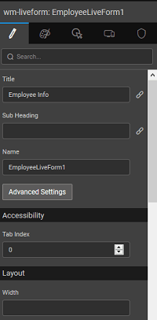

main features of a Live Form are as follows:

- and **Heading** can be set for the Live Form
- **Form Data** can be set to value or bound to another widget like Data Table, List or Live Filter. These define the values to be displayed when the Live Form is first loaded
- **Value** defines the database entity on which the insert or update operations will be performed. This is set to the Variable selected in the data selection step while configuring the Live Form   
- a Live Form in Dialog mode, the On Sucess event is set to trigger event. That is, by default after successful save of Form data the Form dialog will close. You can choose to disable this behavior by removing the On Success event. 

other features of a Live Form include:

- ** Validation Type ** form level. It can be
    - : here all the failed validation messages will be shown under the corresponding field;
    - : the HTML validations will be applied and displayed for the first failed field, the validation messages set at the field level will be displayed once the field loses focus;
    - _Validations_: validations will not be performed in this case.
- the to:
    - or _\-Only_
    - or disable _Complete_ Enabling Auto Complete will give suggestions in the form of a drop-down selection box to the user while entering the data at run time
- properties in terms of , , and
- Properties like
    - \- either or in a
    - **text** for display on , , , and

< Layouts

Configuration >

[1\. Live & Data Widgets](/learn/app-development/widgets/widget-library/#data-live)

- [1.1 Cards](/learn/app-development/widgets/datalive/cards/)
- [1.2 Data Table](/learn/app-development/widgets/datalive/data-table/)
- [1.3 Form](/learn/app-development/widgets/datalive/form/)
- [1.4 List](/learn/app-development/widgets/datalive/list/)
- [1.5 Live Form](/learn/app-development/widgets/datalive/live-form/)
    - [Data Source](/learn/app-development/widgets/datalive/live-form/live-form-data-source/)
    - [Layouts](/learn/app-development/widgets/datalive/live-form/liveform-layouts/)
    - [Configuration](/learn/app-development/widgets/datalive/live-form/liveform-configurations/)
    - [Fields Configuration](/learn/app-development/widgets/datalive/live-form/fields-configuration/)
        - [Display Options](/learn/app-development/widgets/datalive/live-form/fields-configuration/#display)
        - [Validations](/learn/app-development/widgets/datalive/live-form/fields-configuration/#validations)
        - [Widget Usage](/learn/app-development/widgets/datalive/live-form/fields-configuration/#widgets)
    - [Actions](/learn/app-development/widgets/datalive/live-form/liveform-actions/)
    - [Events & Methods](/learn/app-development/widgets/datalive/live-form/events-methods/)
        - [Events](/learn/app-development/widgets/datalive/live-form/events-methods/#events)
        - [Methods](/learn/app-development/widgets/datalive/live-form/events-methods/#methods)
    - [Use Cases](/learn/app-development/widgets/datalive/live-form/liveform-use-cases/)
- [1.6 Live Filter](/learn/app-development/widgets/datalive/live-filter/)
