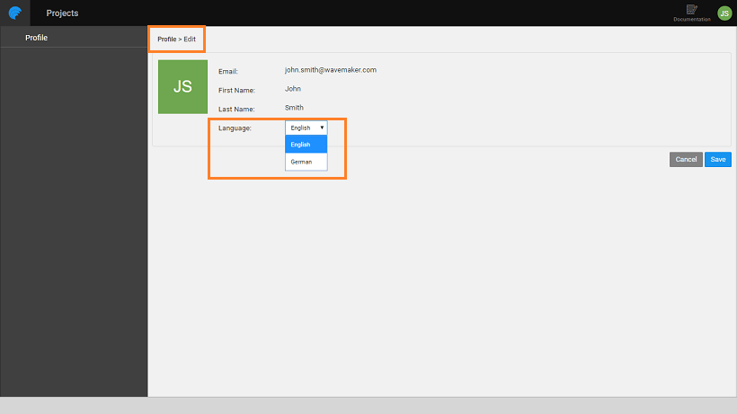

Localization is the adaptation of a product or service to meet the needs of a particular language, culture or desired populations’ look and feel. In WaveMaker, localization can be achieved at two levels:

1. **Application Localization** which is the process of rendering your app in multiple languages. This is supported in the following ways:
    
    - From Project Settings, by setting the **default language** and date time formats, you can ensure that the app user gets to work in the set language and locale ([click here for more](/learn/how-tos/setting-language-date-format/)).
    - Using the **Select Locale** widget end user can choose the language to render the application in ([click here for more](/learn/app-development/widgets/form-widgets/select-locale-usage/)).
    
    For more information, see [App Localization](/learn/how-tos/localization-wavemaker-apps/).

2. **Platform Localization** can be used to enable the app developers to develop in their native language. This feature is available only in the Enterprise version. This process is discussed in detail in this document ([click here for more](#platform_locale));

## Platform Localization

> Available only for Enterprise Version from 10.GA release.

### Setting Language Preference

- You can set your personal preference, from Studio, by opening the Account Profile. 
- Edit Profile and choose the preferred language. 
- The Default Language for all users will be set from Launchpad by the Admin. 

### Adding Language Bundles

**NOTE**: This is for the Advanced Developers only. To enable Locale support for Studio, language bundles need to be added to the following locations. By default, English and German language bundles are already bundled with the platform.

- **For Launchpad & EDN**: To add a new locale support
    1. Copy _en.properties_ file. Pick any file from any one location given below.
    2. Rename to <localeId>.properties. The _localeId_ represents the language to be supported, for example, **en** for English and **de** for German.
    3. Make the appropriate changes to the content.
    4. Add the file at the following locations:
        
        | **Module** | **File name with path** |
        | --- | --- |
        | wavemaker-framework | - wavemaker-core/src/main/resources/locale/fwk\_exception\_messages\_.properties |
        | login-service | - wavemaker-login/wavemaker-login-portal/src/main/resources/locale/login\_exception\_messages\_.properties         - wavemaker-login/wavemaker-login-portal/src/main/resources/locale/login\_messages\_.properties - wavemaker-login/wavemaker-login-portal/src/main/resources/locale/login\_validation\_error\_messages\_.properties - wavemaker-login/wavemaker-login-portal/src/main/resources/locale/login\_validation\_messages\_.properties |
        | edn-service | - wavemaker-edn/wavemaker-edn-server/src/main/resources/locale/edn\_activity\_messages\_.properties  - wavemaker-edn/wavemaker-edn-server/src/main/resources/locale/edn\_exception\_messages\_.properties - wavemaker-edn/wavemaker-edn-server/src/main/resources/locale/edn\_notification\_messages\_.properties |
        | wavemaker-cloud-commons | - wm-cloud-file-store/src/main/resources/locale/wm\_fs\_exception\_messages\_.properties  - wm-cloud-ssl/src/main/resources/locale/wm\_ssl\_exception\_messages\_.properties |
        
- **For Studio Frontend:** This language bundle is used to change the Studio user interface. To add a new locale support
    1. Copy _en.json_ file. Pick any file from any one location given below.
    2. Rename to <localeId>.json. The _localeId_ represents the language to be supported, for example, **en** for English and **de** for German.
    3. Make the appropriate changes to the content.
    4. Add the file at the following locations:
        
        | **Module** | **File name with path** |
        | --- | --- |
        | wavemaker-studio | - wavemaker-studio/wavemaker-studio-editor/src/main/webapp/editor/scripts/modules/i18n/messages |
        | login-service | - wavemaker-login/wavemaker-login-portal/src/main/resources/locale/login\_exception\_messages\_.properties  - wavemaker-login/wavemaker-login-portal/src/main/resources/locale/login\_messages\_.properties - wavemaker-login/wavemaker-login-portal/src/main/resources/locale/login\_validation\_error\_messages\_.properties  - wavemaker-login/wavemaker-login-portal/src/main/resources/locale/login\_validation\_messages\_.properties |
        | edn-service | - wavemaker-edn/wavemaker-edn-server/src/main/resources/locale/edn\_activity\_messages\_.properties - wavemaker-edn/wavemaker-edn-server/src/main/resources/locale/edn\_exception\_messages\_.properties - wavemaker-edn/wavemaker-edn-server/src/main/resources/locale/edn\_notification\_messages\_.properties |
        | wavemaker-cloud-commons | - wm-cloud-file-store/src/main/resources/locale/wm\_fs\_exception\_messages\_.properties - wm-cloud-ssl/src/main/resources/locale/wm\_ssl\_exception\_messages\_.properties |
        
- **For Studio Backend:** Studio makes use of module APIs to work with backend services. These language bundles contain mostly the error or success messages from the service. To add a new locale support:
    1. Copy _en.json_ file. Pick any file from any one location given below.
    2. Rename to <localeId>.json. The _localeId_ represents the language to be supported, for example, **en** for English and **de** for German.
    3. Make the appropriate changes to the content.
    4. Add the file at the following locations:
        
        | **Module** | **File name with path** |
        | --- | --- |
        | wavemaker-framework | - wavemaker-core/src/main/resources/locale/fwk\_exception\_messages\_.properties |
        | login-service | - wavemaker-login/wavemaker-login-portal/src/main/resources/locale/login\_exception\_messages\_.properties  - wavemaker-login/wavemaker-login-portal/src/main/resources/locale/login\_messages\_.properties  - wavemaker-login/wavemaker-login-portal/src/main/resources/locale/login\_validation\_error\_messages\_.properties - wavemaker-login/wavemaker-login-portal/src/main/resources/locale/login\_validation\_messages\_.properties |
        | edn-service | - wavemaker-edn/wavemaker-edn-server/src/main/resources/locale/edn\_activity\_messages\_.properties  - wavemaker-edn/wavemaker-edn-server/src/main/resources/locale/edn\_exception\_messages\_.properties  - wavemaker-edn/wavemaker-edn-server/src/main/resources/locale/edn\_notification\_messages\_.properties |
        | wavemaker-cloud-commons | - wm-cloud-file-store/src/main/resources/locale/wm\_fs\_exception\_messages\_.properties - wm-cloud-ssl/src/main/resources/locale/wm\_ssl\_exception\_messages\_.properties |
        

### Update Build Scripts

Once the language bundles are added, the flyway script needs to be updated and build process initiated for the languages to take effect.

- New locale has to be inserted to the PostgreSQL Database, by adding the insert statement to the flyway script file. Following are the instructions:
    - Go to the directory: wavemaker-login-service/wavemaker-login/wavemaker-login-portal/src/main/resources/db\_scripts/postgresql/
    - Add a flyway script file incrementing the version number. For example, if you have the recent version of flyway script as wmlogin\_v74\_\_RBAC\_model\_permissions.sql, create a new file with the following name: wmlogin\_v75\_\_new\_locale\_.sql (note double underscore after the version number v75)
    - Add the following statement in the above newly created file, after replacing the placeholders for localeId, DisplayName, and Language. INSERT INTO SUPPORTED\_LOCALE (LOCALE\_ID, DISPLAY\_NAME, LANGUAGE) values ('<localeId>','<DisplayName>','<Language>'); For example to insert German locale: INSERT INTO SUPPORTED\_LOCALE (LOCALE\_ID, DISPLAY\_NAME, LANGUAGE) values ('de', 'German', 'German');
- Initiate the platform build.
- Post-build, when developers log into the platform they will be able to see the language in their profiles for selection.
