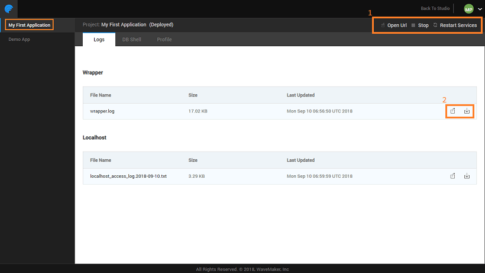
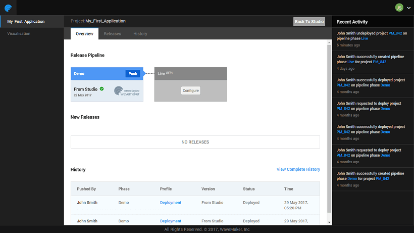
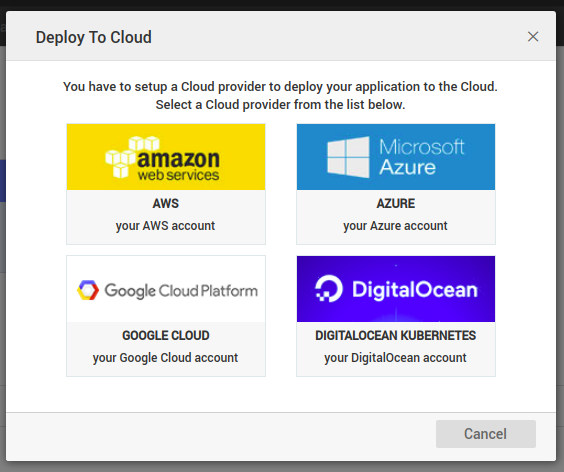
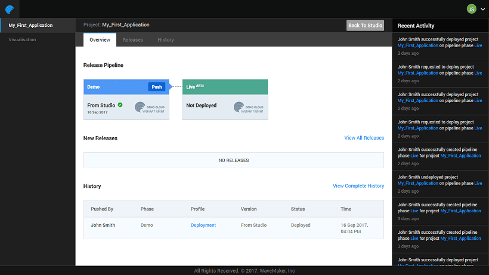
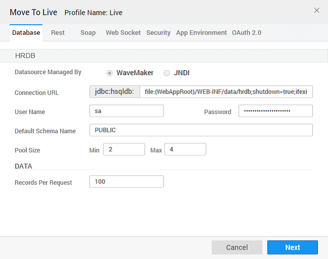
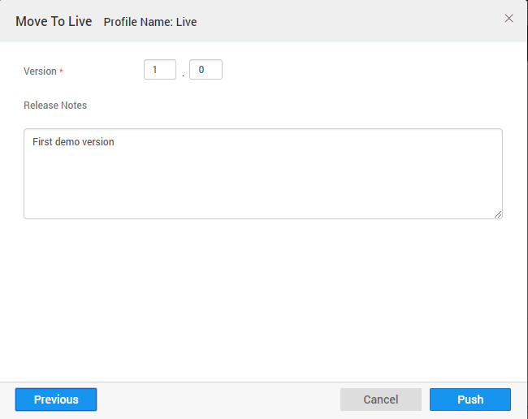
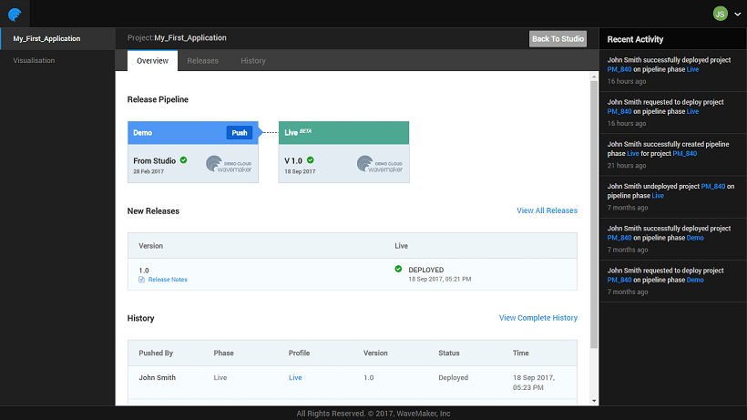
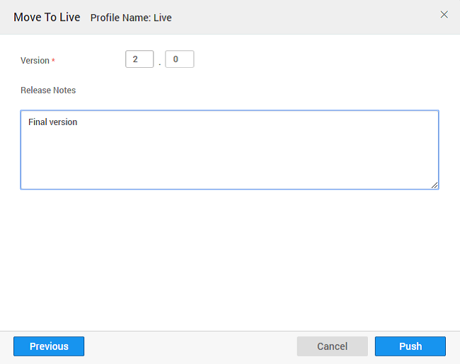
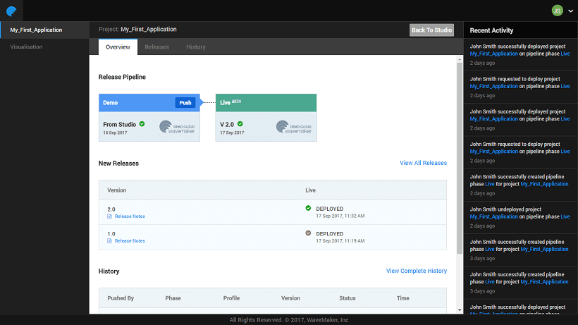

  **Portal** is a place for you as the project owner to manage the deployed apps. The one-click deployment from Studio hosts the app on WaveMaker Demo Cloud using the [ Profile](http://[supsystic-show-popup id=109]) Apps Portal will enable the project owner to configure phases and push the apps from one phase to the next. From this portal you can:

1. the deployment environment for each phase - Stage (WME) and Live. The configurations involves setting the various services like Database, Web Services, Security, REST Services
2. the app from one phase to another without the need to modify the app. Push will deploy the app into the new deployment environment. A separate URL is generated for each phase. You can version the apps for easy tracking.

## Portal

can access the Apps Portal in two ways:

1. selecting **Deployed Apps** button from the Project Dashboard,
2. using the **App** option under Deploy from the Project Workspace Main Menu - this will open the app for management.

### Deployed Apps

By selecting **Deployed Apps** button from the Project Dashboard, you will see a list of deployed apps. 

- the right side you can find
    - total number of apps owned by you that can be deployed;
    - of apps deployed in Demo and Live Phases;
    - deployment activity
- will also find cards for the deployed apps,
    - last deployment activity for that app,
    - live, the version that is live and the date it was deployed to live
- can select any app from the listing for management for more details. [more](#manage-deployed-app)

### App

using the **App** option under Deploy from the Project Workspace Main Menu - this will open the app for management. **this option will be available only for deployed apps**

# Deployed App

an app from the App Portal or Manage App from Project Workspace will give you the details about the app. You can view the deployed app details.

1. the header you can
    - the deployed app URL
    - the deployed app, this will disable the deploy URL
    - **services** like Tomcat etc..
2. the with an option to view the entire log or download it.
3. to **shell** and export/import database.
4. the app configuration , you will be able to view the configurations of all the services used within the app like the database, web services, security etc.

# Live Phase

the app is tested and ready to go live, you can push the app from Demo to Live. Before that, you need to set the configurations for the Live phase.

**for WME users**:

- users can use the same steps to configure both Stage and Live phases.
- users need to add instances for Stage and Live phases  configuration. ( [here for adding instances)](/learn/installation/wme-setup-guide-adding-capacity/)

 ** in Configuring Live Phase**:

1. the Configure button for the Live phase and select the Cloud Provider - you can choose between WaveMaker Demo Cloud or external provider like AWS, Azure or Google.
2. we will show steps in **Demo Cloud**,
    
    - - [here for AWS configuration](/learn/app-development/deployment/deployment-to-aws/),
        - [here for Azure configuration](/learn/app-development/deployment/deployment-to-azure/),
        - [here for Google Cloud configuration](/learn/app-development/deployment/deployment-google-cloud/)
    
    
3. WaveMaker Demo Cloud will initiate Live Pipeline setup and will auto-configure the phase and you can push the app to the Live phase.

# to Live

the app is tested and live phase has been configured, you can push the app from Demo to Live. 

1. you Push from Demo to Live a dialog for configuration profiles will be displayed. The configuration settings from the Deployment phase is selected which can be modified or retained as is to create the Live Configuration Profile.  You can also mention the version number and release notes for tracking purposes 
2. the configuration is set, you can Push the app from Demo to Live.
3. deployed, you can view the current release along with release notes and the latest history. You can view all releases/history.  Hover over the Live card to visit the Details page or launch the app. Selecting  will let you:
    - app details, you can
        - the deployed app URL
        - the deployed app, this will disable the deploy URL
        - **services** like Tomcat etc..
        - your apps association with the provider
        - and **Memory Usage** the app
        - **a brief history** with the option to view complete history
    - the app configuration profile, you will be able to view the configurations of all the services used within the app like the database, web services, security etc.
    - the logs with an option to view the entire log or download it.
    - the provider details. For AWS/Azure/Google Cloud provider you can download the key pair .pem file. You can also edit the key pair by uploading a new .pem file. **:** this option is available for phases configured on AWS or Azure Cloud or Google Cloud.
    - to DB shell and export/import database.
    - the deployment history

## Versioning

Once you have deployed and pushed the app to Live Phase, for various reasons like enhancements or due to requirement changes, your app can undergo changes. You can deploy the app with a change in version number. this will overwrite the previous version in Live phase.  

< Release Management

to AWS >

to Azure >

to Google Cloud >

to Web Server >

Profile >

9\. Deployment

- 9.1 One-Click Deployment
    - [Overview](/learn/app-development/deployment/one-click-deployment/)
    - [Deployment to Cloud](/learn/app-development/deployment/one-click-deployment/#cloud-deployment)
- 9.2 Release Management
    - [Overview](/learn/app-development/deployment/release-management/)
    - [Implementation](/learn/app-development/deployment/release-management/#working)
- [9.3 Manage Deployed Apps](#)
    - [Overview](#)
    - [Apps Portal](#apps-portal)
    - [Manage Deployed App](#manage-deployed-app)
    - [Configure Live Phase](#configure-live)
    - [Push to Live](#push-to-live)
    - [App Versioning](#versioning)
    - [AWS Deployment](/learn/app-development/deployment/deployment-to-aws/)
    - [Azure Deployment](/learn/app-development/deployment/deployment-to-azure/)
    - [Google Cloud Deployment](/learn/app-development/deployment/deployment-google-cloud/)
- 9.4 Deployment to Web Server
    - [Overview](/learn/app-development/deployment/deployment-web-server/#)
    - [WAR file generation](/learn/app-development/deployment/deployment-web-server/#war-file-generation)
    - [Deployment to Tomcat](/learn/how-tos/wavemaker-application-deployment-tomcat/)
    - [Deployment to WebSphere](/learn/how-tos/wavemaker-application-deployment-websphere-liberty-profile/)
    - [Deployment to JBoss](/learn/how-tos/wavemaker-application-deployment-jboss/)
    - [Deployment to WebLogic](/learn/how-tos/wavemaker-application-deployment-weblogic-application-server/)
- 9.5 Configuration Profiles
    - [Overview](/learn/app-development/deployment/configuration-profiles/)
    - [Development Profiles](/learn/app-development/deployment/configuration-profiles/#dev-profile)
    - [Deployment Profiles](/learn/app-development/deployment/configuration-profiles/#deploy-profile)
    - [Custom Profiles](/learn/app-development/deployment/configuration-profiles/#custom-profile)
