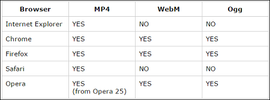
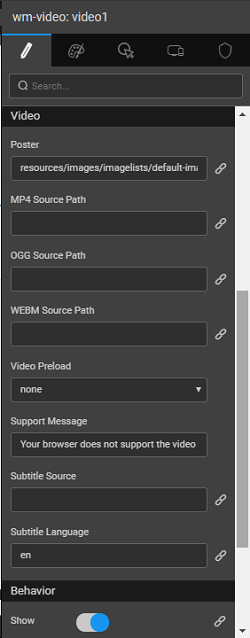
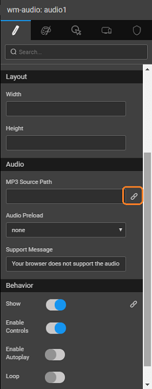
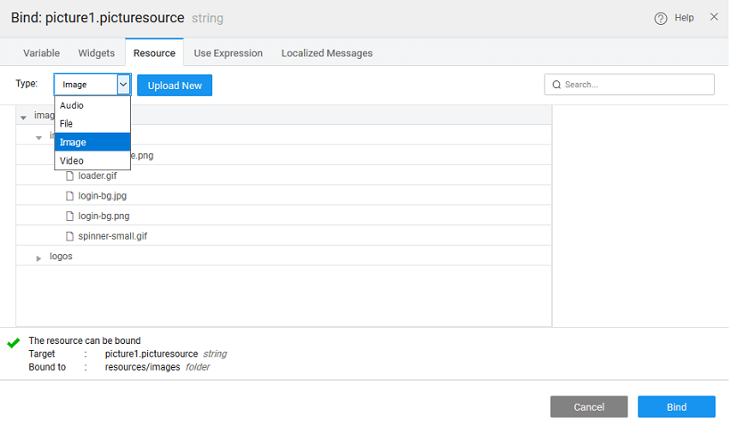

WaveMaker supports all three types of media - image, audio and video in the form of three widgets:

1. ,
2. and

Just drag and drop the desired widget and bind it to the resource using the Property Panel.

: **widget** can be used by itself or within any widget like Live List or Data Grid or Carousel etc.. It can be bound to a database column containing the URL for the picture resource location. Example, the picurl field of Employee database from Sample DB. : The following table gives the browser support for **/video resource**: 

following features are available for all the three media widgets,

1. the Property panel of the media widget:
    - : find the “Source” property. Notice the bind icon (represented by a chain link). Click on it. The Bind modal dialog pops up. 
    - : find the “Video” section. Locate the “MP4 Source Path” option and click on the “Bind” icon (represented by a chain link). Click on it. The Bind modal dialog pops up. 
    - : find the “Audio” section. Locate the “MP3 Source Path” option and click on the “Bind” icon (represented by a chain link). Click on it. The Bind modal dialog pops up. 
2. the modal dialog, click on the “Resource” tab.
    
    - : find the “Upload New” button and click on it. “Import Image” modal dialog pops up.
    - : From the “Type” dropdown, select the “Video” option. Click the “Upload New” button. “Import Video” modal dialog pops up.
    - : from the “Type” dropdown, select the “Audio” option. Click the “Upload New” button. “Import Audio” modal dialog pops up.
    
    
3. customizations can also be done to the displayed item.
    - _:_ the properties such as Width and Height can be adjusted. Valid values, for example, can be 50px for Width, 75px for Height, etc.
    -  :
        1. — a boolean specifying whether the file should play as soon as it can
        2. — a boolean specifying whether the file should be repeatedly played.
        3. — a boolean specifying whether the browser should display its default media controls
        4. — none/metadata/auto — where 'metadata' means preload just the metadata and 'auto' leaves the browser to decide whether to preload the whole file.
    - :
        1. and Width - These attributes sets the dimensions of the video
        2. \- Poster frame to show prior to video playback
        3. 4 source path - Sets the media resources for MP4 media elements
        4. source path - Sets the media resources for Ogg media elements
        5. source path - Sets the media resources for WebM media elements
        6. preload - Hints how much buffering the media resource will likely need
        7. message - Allows the user agent to display video content within the element's playback area
        8. source - This property is used to specify subtitles, caption files or other files containing text, that should be visible when the media is playing.
        9. language - Specifies the language of the track text data (required if kind="subtitles")
        10. controls - Check/Uncheck for enabling controls\[play, pause, stop or volume\] for the media player.
        11. autoplay
        12. \- Whether to loop the media resource
        13. \- Whether to mute the media resource by default

# & Events

### Widget Properties

name is a unique identifier for picture widget.

text or HTML you enter for this property will be shown as a tooltip if the mouse hovers over this widget for 1.5 seconds.

index

tab index attribute specifies the tab order of an element. You can use this property to change the default tabbing order for widget access using the tab key. The value can range from 0 to 32767. The default is 0 and -1 makes the element non-focusable.

NOTE: In Safari browsers, by default, Tab highlights only text fields. To enable Tab functionality, in Safari Browser from Preferences -> Advanced -> Accessibility set the option "Press Tab to highlight each item on a webpage".

property specifies the source for the picture. The source can be either a file or a URL

- : enter the directory and filename for the image to display (supported file types include .jpg, .gif and .png). By default, WaveMaker looks for images in the src/main/webapp directory of the project. Every WaveMaker project has a data directory under src/main/webapp, so this is a good place to put pictures.
- : enter a URL to any internet-accessible image. To display the file, foo.jpg, in the project directory src/main/webapp/resources/images/imagelists/, enter the following into the source property:resources/images/imagelists/foo.jpg or simply foo.jpg

property will act as placeholder image for the picture. When the picture from the Source value is not provided or not available then placeholder picture will be shown.

property can automatically size an image to the height or width of the picture widget. The options are:

- : the image is displayed at its default size
- : the image is resized so that the width of the image is the same as the width of the picture widget
- : the image is resized so that the height of the image is the same as the height of the picture widget
- image is resized so that the height and width of the image is the same as the height of the picture widget

property controls the shape of the data point. Can be:

- ,
- , or

width of your widget can be specified in px or % (i.e 50px, 75%).

height of your widget can be specified in px or % (i.e 50px, 75%).

determines whether or not a component is visible. It is a bindable property.

on Demand (visible only when show property is bound to a variable)

this property is set and show property is bound, the initialization of the widget will be deferred till the widget becomes visible. This behavior improves the load time. Use this feature with caution, as it has a downside (as we will not be able to interact with the widget through script until the widget is initialized). When show property is not bound the widget will be initialized immediately.

property controls the animation of an element. The animation is based on the CSS classes and works only in the run mode.

URL

this if you want the provided URL to be encoded at the run time. Enabling this property will encode the special characters in the URL and enable rendering of the image which otherwise might fail. By default, it is set to false.

### Widget Events

**Events**

click

event handler is called whenever the click event is triggered on a widget.

double click

event handler is called whenever the double click event is triggered on a widget.

mouse enter

event handler is called whenever the mouse enters the widget.

mouse leave

event handler is called whenever the mouse leaves the widget.

**Events**

tap

event handler is called whenever the tap event is triggered on a widget.

double tap

event handler is called whenever the double tap event is triggered on a widget.

### Widget Properties

name is a unique identifier for audio widget.

text or HTML you enter for this property will be shown as a tooltip if the mouse hovers over this widget for 1.5 seconds.

index

tab index attribute specifies the tab order of an element. You can use this property to change the default tabbing order for widget access using the tab key. The value can range from 0 to 32767. The default is 0 and -1 makes the element non-focusable.

NOTE: In Safari browsers, by default, Tab highlights only text fields. To enable Tab functionality, in Safari Browser from Preferences -> Advanced -> Accessibility set the option "Press Tab to highlight each item on a webpage".

width of your widget can be specified in px or % (i.e 50px, 75%).

height of your widget can be specified in px or % (i.e 50px, 75%).

3 Source Path

property allows you to set the file path of a mp3 file.

Preload

property allows if and how the author thinks the audio should be loaded when the page loads. Can be set to:

- \- default
- , or

Message

property allows you to set the message when the audio file is not supported by the HTML5 media player.

determines whether or not a component is visible.

Controls

property allows you to enable that audio/video controls should be displayed (such as a play/pause button etc).

Autoplay

property allows you to enable if and how the author thinks the video should be loaded when the page loads.

property allows you to enable that the video will start over again, every time it is finished.

property allows you to enable that the audio output of the audio/video should be muted.

### Widget Properties

name is a unique identifier for video widget.

text or HTML you enter for this property will be shown as a tooltip if the mouse hovers over this widget for 1.5 seconds.

index

tab index attribute specifies the tab order of an element. You can use this property to change the default tabbing order for widget access using the tab key. The value can range from 0 to 32767. The default is 0 and -1 makes the element non-focusable.

NOTE: In Safari browsers, by default, Tab highlights only text fields. To enable Tab functionality, in Safari Browser from Preferences -> Advanced -> Accessibility set the option "Press Tab to highlight each item on a webpage".

width of your widget can be specified in px or % (i.e 50px, 75%).

height of your widget can be specified in px or % (i.e 50px, 75%).

property allows you to set an image to be shown while the video is downloading, or until the user hits the play button.

4 Source Path

property allows you to set an video/mp4 format of the video.

Source Path

property allows you to set an video/Ogg source of the video.

Source Path

property allows you to set an video/WebM source of the video.

Preload

property allows if and how the author thinks the video should be loaded when the page loads. Can be set to:

- \- default
- , or

Message

property allows setting the message when Html 5 video is not supported.

Source

property allows setting the source URL for the subtitle in the .vtt format.

Language

property allows setting the language for the subtitle.

determines whether or not a component is visible.

Controls

property allows you to enable that audio/video controls should be displayed (such as a play/pause button etc).

Autoplay

property allows you to enable if and how the author thinks the video should be loaded when the page loads.

property allows you to enable that the video will start over again, every time it is finished.

property allows you to enable that the audio output of the audio/video should be muted.

[4\. Basic Widgets](/learn/app-development/widgets/widget-library/#basic)

- [4.1 Anchor](/learn/app-development/widgets/basic/anchor/)
- [4.2 Audio](/learn/app-development/widgets/media-widgets/)
    - [Features](#features)
    - [Properties](#audio-properties)
- [4.3 HTML](/learn/app-development/widgets/basic/html/)
- [4.4 Icon](/learn/app-development/widgets/basic/icon/)
- [4.5 Iframe](/learn/app-development/widgets/basic/iframe/)
- [4.6 Label](/learn/app-development/widgets/basic/label/)
- [4.7 Message](/learn/app-development/widgets/basic/message/)
- [4.8 Picture](/learn/app-development/widgets/media-widgets/)
    - [Features](#features)
    - [Properties](#picture-properties)
    - [Events](#picture-events)
- [4.9 Progress Bar](/learn/app-development/widgets/basic/progress-bar/)
- [4.10 Richtext Editor](/learn/app-development/widgets/basic/richtext-editor/)
- [4.11 Search](/learn/app-development/widgets/basic/search/)
- [4.12 Spinner](/learn/app-development/widgets/basic/spinner/)
- [4.13 Tree](/learn/app-development/widgets/basic/tree/)
- [4.14 Video](/learn/app-development/widgets/media-widgets/)
    - [Features](#features)
    - [Properties](#video-properties)
