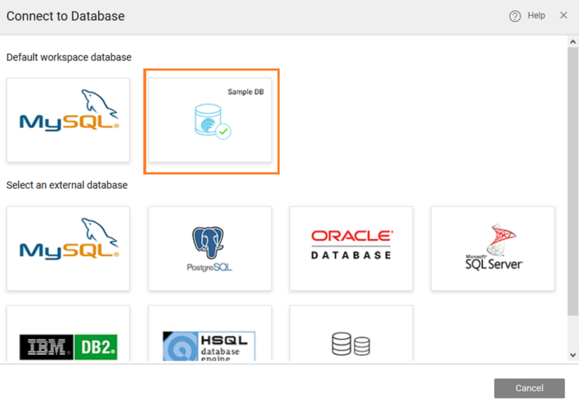

to create a **mobile application** that will scan an employee id barcode and display the corresponding _Profile_ We will be using the sample hrdb shipped with WaveMaker.

this mobile application, you will learn about the following functionalities:

- of a **Mobile** app
- a **Database**
- of widgets
- of and variables

following steps will help you to build a simple mobile app with the above-mentioned functionalities.

to WaveMaker using your credentials. You will be directed to Projects Dashboard page.

## Mobile App

Creating an app involves the following steps:

1. **App**, from the project dashboard page. : If you have not created any projects, you will be directed to **Apps** Select the tab to see the Create App option.
2. , from **your platform** dialog. **** 
3. **Mobile Application** dialog, enter the  **Name** the project in their respective fields and set the **avatar** (project image) if required and click 
4. **settings** dialog will be displayed.  You can modify the following (optional):

- **prefix** – Package prefix defines the default package for the generated code across all services. This can be modified as per your requirements.
- information – created by default, which can be modified.
- the **language** for the project, this can be used in conjunction with to set the language for the application.

- **Page** is created by default, with a _Column layout with top navbar and tabbar_

## Datasource - Database

We will Import a database to add data source to our application

1. the Main Menu, click on  and select  the drop-down list. This will enable us to include a data source (database) into our application. 
2. need to choose the Database Provider of the database being imported. For this tutorial, we will use the inbuilt sample database that ships with WaveMaker. Click **database** link. 
3. **tables** that you want to import from the chosen database. Here we will go with the default setting and import all the tables by clicking 
4. successful import, you can choose to work with the data model generated or use the DB widgets created or go back to the canvas you are working on. Click to get back to the project workspace. 

## Design

Drag and drop following widgets

scanner

to scan product id

search the fetched product

(text1)

view the scanned barcode value(Employee id)

(text2)

view fetched Employee Name

(text3)

view fetched Employee Designation

(picture1)

view fetched Employee image

## Creation

Select the Variable option from the Create Menu. From the variable dialog:

1. variable type as live variable
2. a variable (say, empSearchVariable) with Employee table as the Type 
3. next steps will help in filtering data based on the output of QRCode /Barcode widget.
4. on data tab and select eid field binding icon. 
5. to use expression tab as per the below screenshot and search for the widget with name text1 in the search box and bind its data value to the eid field. 
6. on Save and Close button 

## Bindings

For the various widgets dropped in the UI Design step, do the following:

1. text1 set value from barcode data value. This would display the barcode value and we are passing the same value to the above variable  
2. text2 set value from empSearchVariable variable->firstname. This would display name of the product as per the filter. 
3. for text3 set value from empSearchVariable variable->jobtitle and for picture1 set Source value from empSearchVariable variable->picurl

## Events

For the various widgets dropped in the UI Design step, do the following:

1. button1 set On tap event value as empSearchVariable. Hence, on click of the button, the variable would be called. 

- and run the project. Based on the Barcode generated the Employee name, job title and image changes in UI.
- APK file for using the App in mobile
- with generated APK. Click for Demo Apk file generated for the application. : For demo purpose, we have used Employee ids as 1,2,3... You can create a QR code for numbers and scan it for the respective product name, description etc. Sample QR Code generators online: http://www.qr-code-generator.com/

[App Tutorials](/learn/tutorials/#tab-mob-tutorials)

- [1\. First Mobile App](/learn/hybrid-mobile/first-mobile-app/)
- [2\. Mobile App Integrated with Database](/learn/hybrid-mobile/mobile-app-integrated-database/)
- [3\. Mobile App using Bar Code Scanner](/learn/hybrid-mobile/mobile-app-using-bar-code/)
    - [App Creation](#creation)
    - [Integrating Datasource](#datasource)
    - [UI Design](#ui-design)
    - [Variable Creation](#variables)
    - [Widget Binding](#binding)
