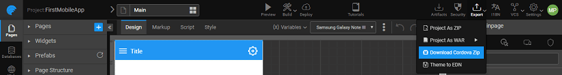
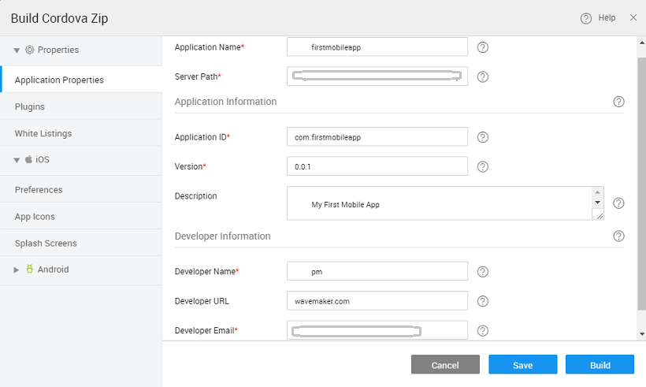

process for a mobile application can be performed through Automated Build process where you can generate .apk (Android application package) or .ipa file (iOS App Store package). Another way is to download Cordova/PhoneGap compatible .zip files to build systems manually for Android/iOS platforms.

WaveMaker Studio supports you to build mobile applications in the following ways:

- **[for Android](/learn/hybrid-mobile/mobile-build-android/)**: Through this build, you can generate APK files which can be signed and hosted on PlayStore.
- **[to PhoneGap](/learn/hybrid-mobile/mobile-build-phonegap/)**: Through this build, it provides you a complete package of building both apk/ipa files for Android and iOS platforms.
- **[Build](#manual)**: Through this build, you can generate or download a .zip file which can be further developed to be hosted on any mobile platform.

# Build - Cordova zip

you want to customize build process you can issue Cordova/PhoneGap commands seamlessly for building artifacts.

To perform a Cordova Build, from the **Menu** of the Project Workspace, under  option select **as Cordova Zip.** opens the **Cordova Zip** window.

Before clicking on Save/Build, you need to set the build properties: Refer to the properties section of [Build](#android) and [ Build](/learn/docs/mobile-build/#iOS_Build)

 To save the properties for future builds,  click  on  to download the zip file.

1. that Cordova@8.0.0 is setup on your machine, [here for details](https://cordova.apache.org/)
2. the zip contents (say, CORDOVA\_PROJECT folder)
3. the terminal, go to CORDOVA\_PROJECT (where the file was extracted to) directory and run the following commands:
    - **Android**:
        
        $cordova platform add android@7.0.0
        
        The above command will add Android Platform to your project structure and also install all plugins that you specified in config.xml.
        
        $cordova build
        
        Once the build completes you can find the debug version of .apk in your platform/android/build/outputs/apk folder.
        - **publishing to Play store**
            - need a Keystore for signing your apk if you do not have the Keystore create one [these instructions](http://docs.phonegap.com/phonegap-build/signing/android/#generating-a-private-key)
            - CORDOVA\_PROJECT/platforms/android folder, create a file named "**\-signing.properties**" with following details:
                
                \=<path to keystore file>
                storePassword=<your\_store\_password>
                storeType=<your\_store\_type> (eg JKS)
                keyAlias=<your\_key\_alias>
                keyPassword=<your\_key\_password>
                
            - the following command
                
                $cordova build --release
                
    - **iOS** Run the following commands in your Mac:
        
        $cordova platform add ios
        $cordova build ios --device
        
        This will produce the .ipa file and you can install it on your iOS device using iTunes or XCode.
        - XCode, go to Windows → Devices then add your .ipa file to the device. Open the project in Xcode and run the following command:
            
             CORDOVA\_PROJECT/platforms/ios/\*.xcodeproj
            
        - Xcode, one can run the project in emulators or create a .ipa file to publish. [here for more details](https://developer.apple.com/library/content/documentation/IDEs/Conceptual/AppDistributionGuide/LaunchingYourApponDevices/LaunchingYourApponDevices.html)
        - install the app on an iPhone, connect a device to the MacBook with USB cable.
        - that device in Xcode and click on run button. This will install the app on the device.

If you have PhoneGap installed in your system, it can allow both Cordova and PhoneGap commands to build apps.

For eg: You can issue PhoneGap commands like below:

$phonegap platform add ios
$phonegap build ios

Or you can safely issue Cordova commands as well.

$phonegap cordova platform add ios
$phonegap cordova build ios --device

3 Platform Installer

- 3.1 Test Run (Preview)
    - [App Preview](/learn/hybrid-mobile/test-run/#preview)
    - [Debugging Mobile Apps](/learn/hybrid-mobile/debugging-mobile-apps/)
        - [on Android](/learn/hybrid-mobile/debugging-mobile-apps/#android)
        - [on iOS](/learn/hybrid-mobile/debugging-mobile-apps/#ios)
    - [Testing using Wavelens](/learn/hybrid-mobile/testing-hybrid-mobile-apps-using-wavelens/)
- [3.2 Mobile Build](#)
    - [Android Build](/learn/hybrid-mobile/mobile-build/#android)
    - [Send to PhoneGap](/learn/hybrid-mobile/mobile-build-phonegap/#phonegap)
    - [Manual build - Using cordova zip](#)
