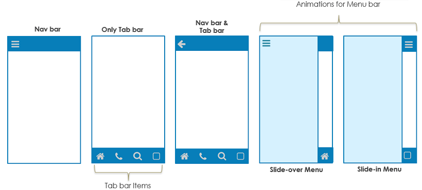
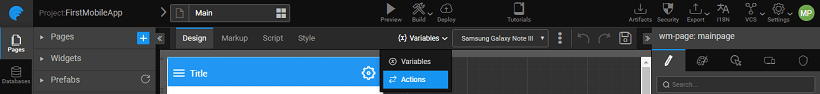
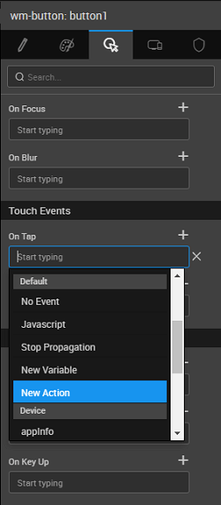
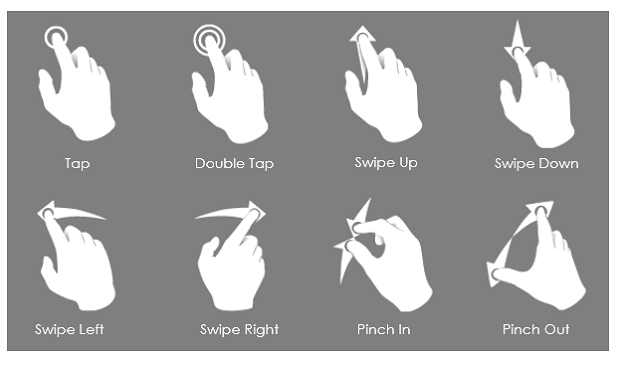

mentioned in [Design Overview](/learn/app-development/ui-design/design-overview/), a WaveMaker app is a collection of pages. Same is true for Mobile Apps. Each page can be designed by selecting a proper layout and arranging widgets within it. The app flow can be achieved using page navigation and actions to trigger this navigation.

# Layouts

**Layouts** help you design the structure of the page by demarcating the mobile navbar, tabbar and one or two content columns.

Page Layout is set at the time of adding new page to your app or can be changed from the Workspace Toolbar More options  A ** Layout** has the following containers - mobile navbar, tabbar and content. The content can have one or two. To change the layout of a page, simply click on the desired layout to see it take effect on the design canvas. Following Page Layout options are available: 

- **Layout** - without any mobile navbar or a tabbar.
- **column Layout** with the top navbar.
- **column Layout** with the top navbar.
- **column Layout** with top navbar and tabbar.
- **column Layout** with top navbar and tabbar.

**:** In the case of a two column layout, a button to toggle left panel appears on left side of the mobile navbar. A typical page layout with mobile navbar, tabbar and content have the following structure, as can be seen from the Files tab on the Files and Services panel on the left: 

can be added to the _\_content._ The widgets in a container can be left-aligned, right-aligned or centered. navbar and tabbar are widgets which can be customized.

### Widgets

can use the **Widgets** to arrange the widgets on a web page. [on Container Widgets](/learn/app-development/widgets/widget-library/#container)

# Navigation & Actions

mentioned in the previous section, default top navbar can be selected as part of the Page Layout. This Navbar can be configured to enable pre-defined controls for left navigation, back button or search. In addition, custom actions like add, edit, delete etc. can also be incorporated. Navbar can have Menu, Popover widgets.

 are several ways for the user to move from one page to another. A ** Action** can be triggered when an event occurs to enable navigation. For example:

- events - Use _tap_ event to trigger a navigation
-  events – Use, say, Checkbox_ Change_ event to trigger a navigation.

Navigation Action specifies exactly how the user should move from one page to another when an event occurs. Navigation Action is a component you can add to your project and provide the following options:

- – Navigates to the specified page.
-  – Navigates to the previous page.
- – Navigates to the specified accordion of the specified page.
- – Navigates to the specified tab of the specified page.
- – Navigates to the specified segment of the specified page.

in the application happens using a **Action** Whenever a page is created a corresponding navigation action is generated or one can create a call action manually from the Actions Dialog. Actions Dialog can be accessed by selection Actions from Variables Workspace Toolbar.

 

can be to a page or to a component like a tab or accordion pane on a page. Navigation action can be invoked in two ways:

1. the Navigation Action to a Widget event - For example: Touch Event like on Tap – Use the tap touch event to trigger a Navigation Action to move to a new page or segment. 
2. invoking the Navigation Action used when we want to validate the user action or state of the application before allowing the navigation. For example: Assuming a scenario, allow the navigation only when the user selects a subscriptionType, then the onClick event can trigger a JavaScript function:
    
     = funtion($event, widget){
      //navigate to subscribe page only when subscriptionType is provided
      if (Page.Widgets.subscriptionType.datavalue) {
          Page.Actions.goToPage\_subscription.navigate();
       }
     };
    
     

# Transitions & Gestures

Transitions for rendering a page can be set as the call variable behavior. These will define the page behavior during navigation. You have the following options:

 Gestures from a mobile device can be bound to actionable events like deleting content, moving out from unread list etc. These gestures include

1. , Double Tap
2. Up, Swipe Down
3. Left, Swipe Right
4. In, Pinch Out

 These gestures can be set from the Events property of the concerned Widget. 

2 Mobile UI Design

- [2.1 Mobile Page Concepts](#)
    - [Page Layouts](/learn/hybrid-mobile/mobile-page-concepts/#page-layouts)
    - [Page Navigation & Actions](/learn/hybrid-mobile/mobile-page-concepts/#page-navigation-actions)
    - [Page Transitions & Gestures](/learn/hybrid-mobile/mobile-page-concepts/#page-transitions-gestures)
- 2.2 Mobile Tabbar
    - [Features](/learn/hybrid-mobile/mobile-tabbar/#features)
    - [Properties](/learn/hybrid-mobile/mobile-tabbar/#properties)
    - [Events](/learn/hybrid-mobile/mobile-tabbar/#events)
    - [Use Cases](/learn/hybrid-mobile/mobile-tabbar/#use-cases)
- 2.3 Mobile Navbar
    - [Features](/learn/hybrid-mobile/mobile-navbar/#features)
    - [Properties](/learn/hybrid-mobile/mobile-navbar/#properties)
    - [Events](/learn/hybrid-mobile/mobile-navbar/#events)
    - [Use Cases](/learn/hybrid-mobile/mobile-navbar/#use-cases)
- 2.4 Mobile & Device Widgets
    - [Media List](/learn/app-development/widgets/mobile-widgets/media-list/)
    - [Segmented Control](/learn/app-development/widgets/mobile-widgets/segmented-control/)
    - [Barcode Scanner](/learn/app-development/widgets/mobile-widgets/barcode-scanner/)
    - [Camera](/learn/app-development/widgets/mobile-widgets/camera/)
- 2.5 Gesture Support
    - [Swipe Gesture](/learn/hybrid-mobile/gesture-support/#swipe)
    - [Limitations](/learn/hybrid-mobile/gesture-support/#limit)
