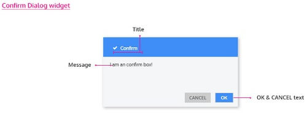
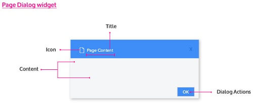
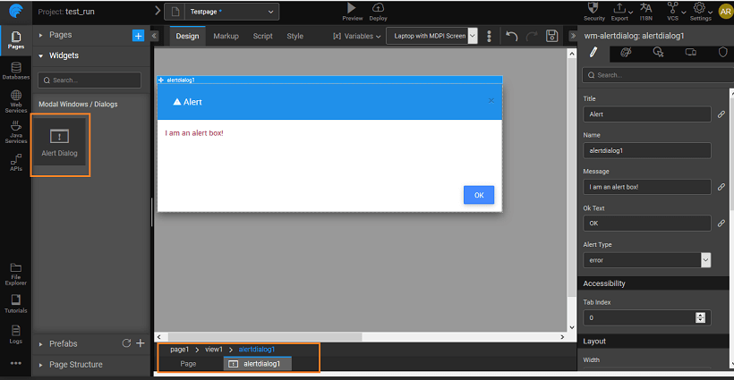
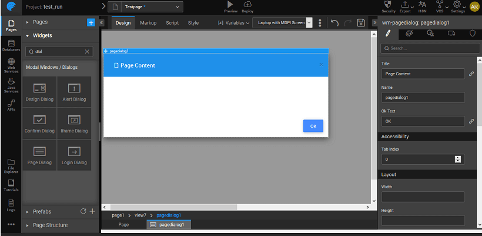

provides the facility to add pop-up windows to your project through the **widgets** Pop-up windows are a way to give additional information to users without cluttering your project space. This can be for alerts, getting additional information like user name, or for login purposes. There are six types of Dialog widgets provided by WaveMaker.

and dropping a dialog creates a containing the dialog. The view can be selected from the **Structure** or from the given at the bottom. The display of the dialog box at runtime is usually associated with the event of a widget. You can also trigger the dialog by calling methods from

**:** Even though the dialog widget is placed in a view, that view is not available for navigation.

## Dialog

For **Dialog**, you can set:

- name, the title of the alert pop-up, message to be displayed in the pop-up, text on the OK button and the type of alert - error, information, success or warning.
- icon for display next to the title of the alert box, you can pick the icon from the [dialog](/learn/app-development/widgets/basic/icon/)

## Dialog

Dialog is used to get confirmation from the user. In addition to the properties mentioned for Alert Dialog, it has an additional  The most common usage is to confirm a delete action.

## Dialog

Dialog gives a for obtaining additional information from the user, like the name. It is a composite widget with Labels and Text widgets. It comes with two buttons 

## Dialog

Iframe Dialog is a popup window that displays content from an external source (URL) in a dialog. It has an property, where you mention the external source for the content.

**:** Since WaveMaker is secured, only secure URLs can be displayed in the Iframe.

## Dialog

Dialog is a popup window that displays Login page content and can be dismissed by the user. Especially used to refresh the membership or for additional confirmation. The events that can be set include , and

## Dialog

Dialog is a popup window that displays page content and can be dismissed by the user. The property of this widget can be set to the desired [page](/learn/app-development/ui-design/page-concepts/partial-pages/) content.

# Access

widget in your project can be accessed by associating the open and properties of the dialog with an event of any other widget. The dialog can be accessed through scripting by adding to the _controller_ and adding the code for and as shown below, here we are displaying an alert dialog on click of a button: Click event of the button should trigger the following JavaScript code:

   
Page.button3Click = function($event, widget) {
     Page.Widgets.alertdialog1.open();
 }

hiding dialog:

/\*\* function called on button1 click \*\*/
        Page.button1Click = function($event, widget) {
            Page.Widgets.alertdialog1.close();
        };

# & Events

### **Dialog Properties**

the title of an alert dialog.

name is a unique identifier for alert dialog.

the message of the widget.

Text

widget gives a pop-up window. It can be used to give a warning message to the user. For example, you are about to leave this page.

Type

property will help in identifying the type of alert in the alert box. Can be set to error (default), information, success, and warning.

index

tab index attribute specifies the tab order of an element. You can use this property to change the default tabbing order for widget access using the tab key. The value can range from 0 to 32767. The default is 0 and -1 makes the element non-focusable.

NOTE: In Safari browsers, by default, Tab highlights only text fields. To enable Tab functionality, in Safari Browser from Preferences -> Advanced -> Accessibility set the option "Press Tab to highlight each item on a webpage".

width of your widget can be specified in px or % (i.e 50px, 75%).

height of your widget can be specified in px or % (i.e 50px, 75%).

property, if set true, adds a backdrop for the dialog restricting the closure of the dialog when the user clicks outside of the dialog. The default value is false, which allows close of dialog on click outside.

Default Close Action

property allows the user to access close action from header through an "x" icon; and also enables close through ESC key.

property controls the animation of an element. The animation is based on the CSS classes and works only in the run mode.

property if set true allows closing of dialog on ESC keypress. The default is true.

Class

property defines the class of the icon that is applied to the button.

Width

property; but you will need this if you are using the button's iconUrl. Please enter the width of your icon. WARNING: It's best to specify size in pixels, not percent.

Height

property; but you will need this if you are using the button's iconUrl. Please enter the height of your icon. WARNING: It's best to specify size in pixels, not percent.

Margin

property; only has meaning if you specify the button's iconUrl. Values should all have "px" next to them. Use this to adjust the space between the icon and the button text.

**Events**

ok

event handler is called whenever an ok event is triggered.

close

event handler is called whenever a close event is triggered.

open

widget gives a pop-up window. It can be used to give a warning message to the user. For example, you are about to leave this page.

### **Dialog Properties**

the title of the widget.

name is a unique identifier for the confirm dialog.

the display message for the widget.

Text

Confirm Dialog prompts to get confirmation from the user.

Text

widget gives a pop-up window. It can be used to get confirmation of an action from the user. For example, do you want to delete this item?

index

tab index attribute specifies the tab order of an element. You can use this property to change the default tabbing order for widget access using the tab key. The value can range from 0 to 32767. The default is 0 and -1 makes the element non-focusable.

NOTE: In Safari browsers, by default, Tab highlights only text fields. To enable Tab functionality, in Safari Browser from Preferences -> Advanced -> Accessibility set the option "Press Tab to highlight each item on a webpage".

width of your widget can be specified in px or % (i.e 50px, 75%).

height of your widget can be specified in px or % (i.e 50px, 75%).

property, if set true, adds a backdrop for the dialog restricting the closure of the dialog when the user clicks outside of the dialog. The default value is false, which allows close of dialog on click outside.

Default Close Action

property allows the user to access close action from header through an "x" icon; and also enables close through ESC key.

property controls the animation of an element. The animation is based on the CSS classes and works only in the run mode.

property if set true allows closing of dialog on ESC keypress. The default is true.

Class

property defines the class of the icon that is applied to the button.

Width

property; but you will need this if you are using the button's iconUrl. Please enter the width of your icon. WARNING: It's best to specify size in pixels, not percent.

Height

property; but you will need this if you are using the button's iconUrl. Please enter the height of your icon. WARNING: It's best to specify size in pixels, not percent.

Margin

property; only has meaning if you specify the button's iconUrl. Values should all have "px" next to them. Use this to adjust the space between the icon and the button text.

**Events**

ok

event handler is called whenever an ok event is triggered.

cancel

event handler is called whenever a cancel event is triggered.

close

event handler is called whenever a close event is triggered.

open

widget gives a pop-up window. It can be used to give a warning message to the user. For example, you are about to leave this page.

### **Dialog Properties**

the title of the design dialog.

name is a unique identifier for design dialog.

index

tab index attribute specifies the tab order of an element. You can use this property to change the default tabbing order for widget access using the tab key. The value can range from 0 to 32767. The default is 0 and -1 makes the element non-focusable.

NOTE: In Safari browsers, by default, Tab highlights only text fields. To enable Tab functionality, in Safari Browser from Preferences -> Advanced -> Accessibility set the option "Press Tab to highlight each item on a webpage".

width of your widget can be specified in px or % (i.e 50px, 75%).

height of your widget can be specified in px or % (i.e 50px, 75%).

Header

/hide header of the design dialog.

property, if set true, adds a backdrop for the dialog restricting the closure of the dialog when the user clicks outside of the dialog. The default value is false, which allows close of dialog on click outside.

Default Close Action

property allows the user to access close action from header through an "x" icon; and also enables close through ESC key.

property controls the animation of an element. The animation is based on the CSS classes and works only in the run mode.

Class

property defines the class of the icon that is applied to the button.

Width

property; but you will need this if you are using the button's iconUrl. Please enter the width of your icon. WARNING: It's best to specify size in pixels, not percent.

Height

property; but you will need this if you are using the button's iconUrl. Please enter the height of your icon. WARNING: It's best to specify size in pixels, not percent.

Margin

property; only has meaning if you specify the button's iconUrl. Values should all have "px" next to them. Use this to adjust the space between the icon and the button text.

**Events**

close

event handler is called whenever a close event is triggered.

open

widget gives a pop-up window. It can be used to give a warning message to the user. For example, you are about to leave this page.

### **Dialog Properties**

Check this if you want the provided URL to be encoded at the run time.

the title of iframe dialog.

name is a unique identifier for iframe dialog.

Text

widget gives a pop-up window. It can be used to provide contextual information from an HTML source to the user. For example, here is a sample from the source.

index

tab index attribute specifies the tab order of an element. You can use this property to change the default tabbing order for widget access using the tab key. The value can range from 0 to 32767. The default is 0 and -1 makes the element non-focusable.

NOTE: In Safari browsers, by default, Tab highlights only text fields. To enable Tab functionality, in Safari Browser from Preferences -> Advanced -> Accessibility set the option "Press Tab to highlight each item on a webpage".

width of your widget can be specified in px or % (i.e 50px, 75%).

height of your widget can be specified in px or % (i.e 50px, 75%).

Header

/hide header of the iframe dialog.

property, if set true, adds a backdrop for the dialog restricting the closure of the dialog when the user clicks outside of the dialog. The default value is false, which allows close of dialog on click outside.

URL entered for this property will be shown in the dialog content.

Default Close Action

property allows the user to access close action from header through an "x" icon; and also enables close through ESC key.

actions

property shows/hides actions section of the iframe dialog.

property controls the animation of an element. The animation is based on the CSS classes and works only in the run mode.

URL

this if you want the provided URL to be encoded at the run time. Enabling this property will encode the special characters in the URL and enable rendering of the page which otherwise might fail. By default, it is set to false.

property if set true allows closing of dialog on ESC keypress. The default is true.

Class

property defines the class of the icon that is applied to the button.

Width

property; but you will need this if you are using the button's iconUrl. Please enter the width of your icon. WARNING: It's best to specify size in pixels, not percent.

Height

property; but you will need this if you are using the button's iconUrl. Please enter the height of your icon. WARNING: It's best to specify size in pixels, not percent.

Margin

property; only has meaning if you specify the button's iconUrl. Values should all have "px" next to them. Use this to adjust the space between the icon and the button text.

**Events**

ok

event handler is called whenever an ok event is triggered.

close

event handler is called whenever a close event is triggered.

open

widget gives a pop-up window. It can be used to give a warning message to the user. For example, you are about to leave this page.

### **Dialog Properties**

the title of the widget.

name is a unique identifier for the widget.

Text

widget gives a pop-up window. It can be used to provide contextual information to the user.

index

tab index attribute specifies the tab order of an element. You can use this property to change the default tabbing order for widget access using the tab key. The value can range from 0 to 32767. The default is 0 and -1 makes the element non-focusable.

NOTE: In Safari browsers, by default, Tab highlights only text fields. To enable Tab functionality, in Safari Browser from Preferences -> Advanced -> Accessibility set the option "Press Tab to highlight each item on a webpage".

width of your widget can be specified in px or % (i.e 50px, 75%).

height of your widget can be specified in px or % (i.e 50px, 75%).

property, if set true, adds a backdrop for the dialog restricting the closure of the dialog when the user clicks outside of the dialog. The default value is false, which allows close of dialog on click outside.

's content to be included in the widget.

Default Close Action

property allows the user to access close action from header through an "x" icon; and also enables close through ESC key.

actions

property shows/hides actions section of the widget.

property controls the animation of an element. The animation is based on the CSS classes and works only in the run mode.

property if set true allows closing of dialog on ESC keypress. The default is true.

Class

property defines the class of the icon that is applied to the button.

Width

property; but you will need this if you are using the button's iconUrl. Please enter the width of your icon. WARNING: It's best to specify size in pixels, not percent.

Height

property; but you will need this if you are using the button's iconUrl. Please enter the height of your icon. WARNING: It's best to specify size in pixels, not percent.

Margin

property; only has meaning if you specify the button's iconUrl. Values should all have "px" next to them. Use this to adjust the space between the icon and the button text.

load

event handler is called when the widget is loaded.

**Events**

ok

event handler is called whenever an ok event is triggered.

close

event handler is called whenever a close event is triggered.

open

widget gives a pop-up window. It can be used to give a warning message to the user. For example, you are about to leave this page.

### **Dialog Properties**

the title of the widget.

name is a unique identifier for the widget.

width of your widget can be specified in px or % (i.e 50px, 75%).

property, if set true, adds a backdrop for the dialog restricting the closure of the dialog when the user clicks outside of the dialog. The default value is false, which allows close of dialog on click outside.

property controls the animation of an element. The animation is based on the CSS classes and works only in the run mode.

property if set true allows closing of dialog on ESC keypress. The default is true.

Class

property defines the class of the icon that is applied to the button.

Width

property; but you will need this if you are using the button's iconUrl. Please enter the width of your icon. WARNING: It's best to specify size in pixels, not percent.

Height

property; but you will need this if you are using the button's iconUrl. Please enter the height of your icon. WARNING: It's best to specify size in pixels, not percent.

Margin

property; only has meaning if you specify the button's iconUrl. Values should all have "px" next to them. Use this to adjust the space between the icon and the button text.

**Events**

submit

event handler is called whenever a submit event is triggered.

close

event handler is called whenever a close event is triggered.

open

widget gives a pop-up window. It can be used to give a warning message to the user. For example, you are about to leave this page.

success

event handler is called whenever a success event is triggered.

error

event handler is called whenever an error event is triggered.

[8\. Modal Dialog Widgets](/learn/app-development/widgets/widget-library/#dialog)

- [Overview](#overview)
- [Features](#features)
    - [Alert Dialog](#alert-dialog)
    - [Confirm Dialog](#confirm-dialog)
    - [Design Dialog](#design-dialog)
    - [Iframe Dialog](#iframe-dialog)
    - [Login Dialog](#login-dialog)
    - [Page Dialog](#page-dialog)
- [Script Access](#script-access)
- [Properties & Events](#properties-events)
    - [Alert Dialog](#alert_properties)
    - [Confirm Dialog](#confirm_properties)
    - [Design Dialog](#design_properties)
    - [Iframe Dialog](#iframe_properties)
    - [Login Dialog](#login_properties)
    - [Page Dialog](#page_properties)
