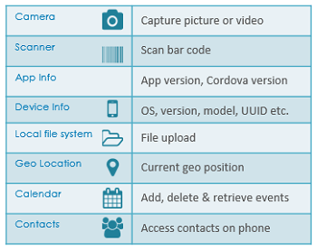

offers various features which make the Mobile App building process easy. These features in the form of device widgets, device variables etc. allow you to concentrate on implementing the business logic by taking care of platform specific adaptation.

# Look n Feel

choosing the appropriate Device setting, you can see the UI effect at design time and at runtime from the Preview option.

Design ModePreview Mode

Mobile Themes give native look-n-feel on the same page based on the Platform (IOS, Android etc.). Most importantly themes adhere to design guidelines of the Platform. 

The following widgets are rendered using the Native UI Controls:

- and Time Picker
- or Dropdown Menu

- Browser

- or Message Display

# Specific Widgets

**Widgets** allow your Mobile App to take advantage of Device Functionality. Two such widgets are available:

1. \- will pass control to the device camera and once the camera is clicked the control is passed back to the App
2. **Scanner** - will launch the barcode scanner and the captured image is available for further processing within the App

[more about Mobile widgets](/learn/app-development/widgets/widget-library/#mobile)

# Features & Variables

Device Variables can be created to access various Device Features like contacts, geolocation etc.. 

1. Main Menu, select Create -> Variables
2. Device Variable
3. the appropriate Service
4. upon the chosen Service various Operations are available

[more about Device Variables](/learn/app-development/variables/device-variables/)

1 Mobile Apps

- 1.1 Mobile App Development
    - [App Architecture](/learn/hybrid-mobile/building-hybrid-mobile-apps/#mobile-app-architecture)
    - [App Development](/learn/hybrid-mobile/building-hybrid-mobile-apps/#mobile-app-development)
    - [Testing on Mobile](/learn/hybrid-mobile/building-hybrid-mobile-apps/#testing-mobile)
    - [Creating Installer](/learn/hybrid-mobile/building-hybrid-mobile-apps/#creating-installer)
- [1.2 Native Device Support](#)
    - [Platform Look n Feel](#platform-support)
    - [Device Specific Widgets](#device-specific-widgets)
    - [Device Variables](#device-features-variables)
- 1.3 Offline Data Support
    - [Mechanism](/learn/hybrid-mobile/offline-data-support/#working)
    - [Storage Layer](/learn/hybrid-mobile/offline-data-support/#storage-layer)
    - [Sync Layer](/learn/hybrid-mobile/offline-data-support/#sync-layer)
    - [Enabling](/learn/hybrid-mobile/offline-data-support/#enabling)
        - [DB Configuration](/learn/hybrid-mobile/offline-data-support/#db)
        - [Variable Configuration](/learn/hybrid-mobile/offline-data-support/#variable)
        - [Plugin Configuration](/learn/hybrid-mobile/offline-data-support/#plugin)
        - [Security Configuration](/learn/hybrid-mobile/offline-data-support/#security)
    - [Support & Limitations](/learn/hybrid-mobile/offline-data-support/#limitations)
    - [Use Cases](/learn/hybrid-mobile/offline-data-support/#use-cases)
