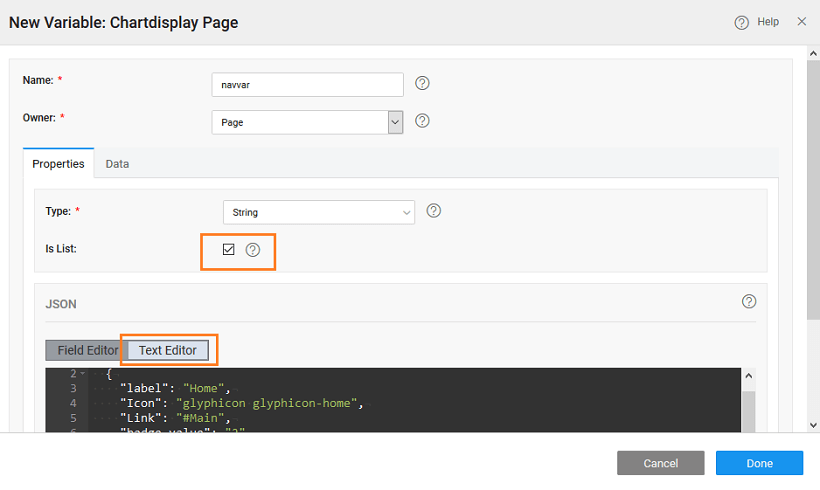

In this post, we will walk through the steps to create a simple navigation, with icons and links to pages.

 We will be using a Model Variable for the purpose of this example:

1. or Open page where you want to use the Nav Widget
2. the Variables dialog from the Variables menu and using New Variable create a Model variable ( [more about variables)](/learn/app-development/variables/model-variable/) 
3. a new Model Variable called as select 
4. the following in the _Editor_, this defines the structure for Menu identifying , , , _Value_ and _\-action_ Icons can be [from glyphicons](http://glyphicons.com/) or [awesome](https://fortawesome.github.io/Font-Awesome/cheatsheet/) icons.
    
    \[
      {
        "label": "Home",
        "Icon": "glyphicon glyphicon-home",
        "Link": "#Main",
        "badge-value": "2",
        "sub-action": {
          "label": "Sub-action"
        }
      },
      {
        "label": "Projects",
        "Icon": "wi wi-folder-open",
        "Link": "#projects",
        "badge-value": "3"
      },
      {
        "label": "Services",
        "Icon": "wi wi-settings-applications",
        "Link": "#services",
        "badge-value": "1"
      }
    \]
    
5. the property of the Menu widget to the variable created in the previous step.
6. the
    
    - _Label_ to label,
    - _Icon_ to Icon,
    - _Link_ to Link,
    - _Badge_ to badge-value,
    - _Actions_ to sub-action.
    
    If you need you can modify the JSON structure given for the Model Variable and do the appropriate settings. 
7. the application and see the menu in action.

## Nav

You can have multiple levels of nav-items. Follow the steps from the above example, replace the Variable JSON with the below code:

\[
{
"label": "item1",
"icon": "wi wi-euro-symbol",
"children": \[
{
"label": "sub-menu-item1",
"icon": "wi wi-euro-symbol"
},
{
"label": "sub-menu-item2",
"icon": "wi wi-euro-symbol",
"children": \[
{
"label": "sub-menu-child-item1",
"icon": "wi wi-euro-symbol",
"children": \[
{
"label": "sub-menu-child-item1-item1",
"icon": "wi wi-euro-symbol",
"path": "/item1/item2/item1/item1"
},
{
"label": "sub-menu-child-item1-item2",
"icon": "wi wi-euro-symbol",
"path": "/item1/item2/item1/item2"
}
\]
},
{
"label": "sub-menu-child-item2",
"icon": "wi wi-euro-symbol"
}
\]
}
\]
},
{
"label": "item2",
"icon": "wi wi-euro-symbol"
},
{
"label": "item3",
"icon": "wi wi-euro-symbol"
},
{
"label": "item4",
"icon": "wi wi-euro-symbol"
}
\]

You will get the following nav: 

[6\. Navigation Widgets](/learn/app-development/widgets/widget-library/#nav-widgets)

- [6.1 Breadcrumb](/learn/app-development/widgets/navigation/breadcrumb/)
- [6.2 Dropdown Menu](/learn/app-development/widgets/navigation/dropdown-menu/)
- [6.3 Nav](/learn/app-development/widgets/navigation/nav/)
    - [Properties](/learn/app-development/widgets/navigation/nav/#properties)
    - [Use Cases](/learn/app-development/widgets/navigation/nav/#use-cases)
- [6.4 Nav Bar](/learn/app-development/widgets/navigation/nav-bar/)
- [6.5 Popover](/learn/app-development/widgets/navigation/popover/)
