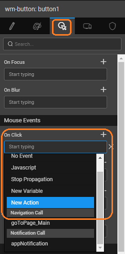

**Action** provides navigation capabilities to help in navigating from one page or view to another. By default, for every page added to the app, a navigation action is created with the name **\__<pagename>. _** can choose to create a new Navigation Action.

# Creation

**Action** can be used to redirect the user to another page.

1. are two ways of creating a Navigation Action:
    - the Action option from Variables on the Workspace Toolbar  click New Action from the Actions dialog. 
    - , as a New Action event on any widget 
2. both the cases, a **Action** wizard will open.
    1. Type
    2. the **Target** to:
        - _Page_ to navigate to last visited page
        - to navigate to the page as selected in the Page Name field
        - to navigate to the specified Accordion pane created the selected Page
        - to navigate to the specified Tab pane created on the selected Page
    3. \- set by default which can be modified
    4. \- the scope of the Action being created. By default it is set to Page, you can change it to Application if you want this action to be available across the app.
    5. to complete the action creation process
3. will be directed to the Actions dialog, with the new action listed. As you can see:
    1. Navigation Action is created,
    2. the selected target,
    3. properties tab contains Page Name.

Name

page name to navigate to. This option will not appear for goToPreviousPage Operation.

/Accordion Name

tab/accordion pane’s name to navigate to if the operation is selected. This option will not appear for goToPreviousPage and goToPage Operation.

## (options)

This method invokes the navigation action

:

(object): This object can include fields like:

- **: the** \-value pair of data to be passed via the variable to the other page in the form of URL params

_Value_: None

_:_

  // Example 1: Navigate to TestPage
Page.Actions.goToPage\_TestPage.invoke();

// Example 2: Navigate to TestPage with url params
Page.Actions.goToPage\_TestPage.invoke({
     data: {
         'param1': "param value",
         "param2": "param value 2"
     }
});

## (object)

This method  the input fields on the Navigation Action.

: object or \-value pair of data to be passed via the variable to the other page in the form of URL params

_Value_: None

_:_

// Example 1: Navigate to TestPage
Var nv = Page.Actions.goToPage\_TestPage;
nv.setData({
   'param1': "param value",
   "param2": "param value 2"
});
nv.invoke();

< Variables & Actions

6\. Data Integration - Variables

- 6.1 Binding Layer
    - [Overview](/learn/app-development/variables/data-integration/)
- [6.2 Variables and Actions](/learn/app-development/variables/variables-actions/)
    - [Overview](/learn/app-development/variables/variables-actions/#)
    - [Variables](/learn/app-development/variables/variables-actions/#variables)
        - a. Database CRUD
            - [Overview](/learn/app-development/variables/database-crud/)
            - [Variable Creation](/learn/app-development/variables/database-crud/#creation)
            - [Properties](/learn/app-development/variables/database-crud/#properties)
            - [Events](/learn/app-development/variables/database-crud/#events)
            - [Methods](/learn/app-development/variables/database-crud/#methods)
        - b. Database API
            - [Overview](/learn/app-development/variables/database-apis/)
            - [Variable Creation](/learn/app-development/variables/database-apis/#creation)
            - [Properties](/learn/app-development/variables/database-apis/#properties)
            - [Events](/learn/app-development/variables/database-apis/#events)
            - [Methods](/learn/app-development/variables/database-apis/#methods)
        - c. Web Service
            - [Overview](/learn/app-development/variables/web-service/)
            - [Variable Creation](/learn/app-development/variables/web-service/#creation)
            - [Properties](/learn/app-development/variables/web-service/#properties)
            - [Events](/learn/app-development/variables/web-service/#events)
            - [Methods](/learn/app-development/variables/web-service/#methods)
        - d. Java Service
            - [Overview](/learn/app-development/variables/java-services)
            - [Variable Creation](/learn/app-development/variables/java-services/#creation)
            - [Properties](/learn/app-development/variables/java-services/#properties)
            - [Events](/learn/app-development/variables/java-services/#events)
            - [Methods](/learn/app-development/variables/java-services/#methods)
        - e. Security Service
            - [Overview](/learn/app-development/variables/security-service/)
            - [Variable Creation](/learn/app-development/variables/security-service/#creation)
            - [Properties](/learn/app-development/variables/security-service/#properties)
            - [Events](/learn/app-development/variables/security-service/#events)
            - [Methods](/learn/app-development/variables/security-service/#methods)
        - f. Model
            - [Overview](/learn/app-development/variables/model-variable/)
            - [Variable Creation](/learn/app-development/variables/model-variable/#creation)
            - [Properties](/learn/app-development/variables/model-variable/#properties)
            - [Events](/learn/app-development/variables/model-variable/#events)
            - [Methods](/learn/app-development/variables/model-variable/#methods)
        - g. Device Variables
            - [Overview](/learn/hybrid-mobile/device-variables/#)
            - [Services](/learn/hybrid-mobile/device-variables/#services)
            - [Operations](/learn/hybrid-mobile/device-variables/#operations)
            - [Events](/learn/hybrid-mobile/device-variables/#events)
            - [Methods](/learn/hybrid-mobile/device-variables/#methods)
            - [Usage](/learn/hybrid-mobile/device-variables/#usage)
    - [Actions](/learn/app-development/variables/variables-actions/#actions)
        - [Navigation](#)
            - [Overview](#)
            - [Action Creation](#creation)
            - [Properties](#properties)
            - [Methods](#methods)
        - ii. Login
            - [Overview](/learn/app-development/variables/login-action/)
            - [Action Creation](/learn/app-development/variables/login-action/#creation)
            - [Properties](/learn/app-development/variables/login-action/#properties)
            - [Data](/learn/app-development/variables/login-action/#data)
            - [Events](/learn/app-development/variables/login-action/#events)
        - iii. Logout
            - [Overview](/learn/app-development/variables/logout-action/)
            - [Action Creation](/learn/app-development/variables/logout-action/#creation)
            - [Properties](/learn/app-development/variables/logout-action/#properties)
            - [Events](/learn/app-development/variables/logout-action/#events)
        - iv. Timer
            - [Overview](/learn/app-development/variables/timer-action/)
            - [Action Creation](/learn/app-development/variables/timer-action/#creation)
            - [Properties](/learn/app-development/variables/timer-action/#properties)
            - [Events](/learn/app-development/variables/timer-action/#events)
            - [Methods](/learn/app-development/variables/timer-action/#methods)
        - v. Notification
            - [Overview](/learn/app-development/variables/notification-action/)
            - [Action Creation](/learn/app-development/variables/notification-action/#creation)
            - [Properties](/learn/app-development/variables/notification-action/#properties)
            - [Events](/learn/app-development/variables/notification-action/#events)
            - [Methods](/learn/app-development/variables/notification-action/#methods)
    - [Scoping](/learn/app-development/variables/variables-actions/#scoping)
    - [Variable Events](/learn/app-development/variables/variables-actions/#events)
    - [Error Handling](/learn/app-development/variables/variables-actions/#error-handling)
- 6.3 Variable Binding
    - [Overview](/learn/variables/variable-binding/#)
    - [Data Binding](/learn/variables/variable-binding/#data-binding)
    - [Widget Binding](/learn/variables/variable-binding/#widget-binding)
    - [Binding Options](/learn/variables/variable-binding/#binding-options)
- 6.4 JavaScript Access
    - [Overview](/learn/variables/accessing-elements-via-javascript/#)
    - [Widget Controllers](/learn/variables/accessing-elements-via-javascript/#widget-controllers)
    - [Page Scripting](/learn/variables/accessing-elements-via-javascript/#page-scripting)
    - [Script Access](/learn/variables/accessing-elements-via-javascript/#script-access)
