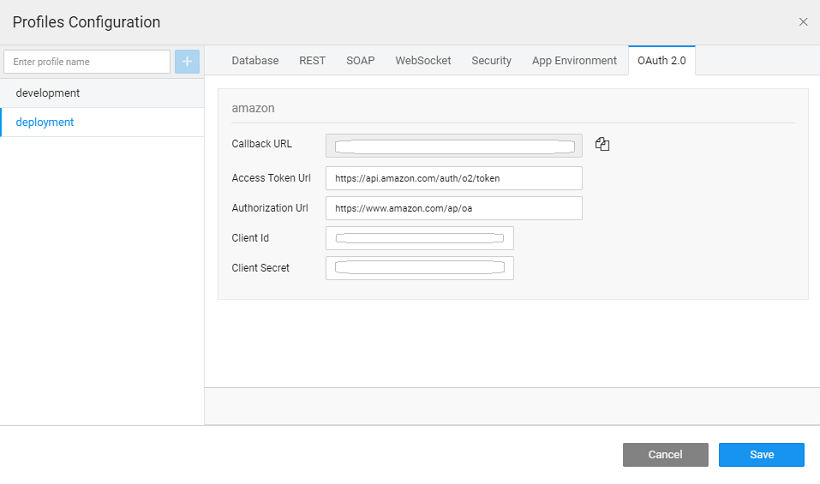

**2** is an authorization framework that enables applications to obtain limited access to user accounts on an HTTP service, such as Facebook, GitHub, etc.. OAuth 2 focuses on client developer simplicity by providing secured delegated access for web and desktop applications. It works by delegating user authentication to the service that hosts the user account and authorizing third-party applications to access the user account.

 The device flow is illustrated in the above image. The steps include:

1. client requests the authorization server to give the access. The request includes the client identifier in it.
2. authorization server provides a verification code, an end- user code, and the end-user verification URI.
3. client instructs the end-user to use its user-agent (elsewhere) and visit the provided end-user verification URI. The client provides the end-user with the end-user code that is necessary to enter, in order to gain access.
4. authorization server authenticates the end-user (via the user-agent) and prompts the end-user to grant the client's access request. If the end-user accepts the client's request, then the end-user enters the end-user code provided by the client. The authorization server validates this end-user code.
5. the end-user authorizes (or denies) the client's request (D), the client continuously polls the authorization server to verify if the end-user authorization step is successfully accomplished. The client's request includes the verification code and its client identifier.
6. that the end-user has granted access, the authorization server validates the verification code provided by the client and eventually responds with the access token.

Configuring an app to use these Web Services can be an uphill task. WaveMaker abstracts OAuth and offers API integration without the need for writing code. WaveMaker integrates the OAuth 2.0 configuration while [a REST Service](http://[supsystic-show-popup id=115]) by:

- the   of  the  API to be invoked within the app,
- **Authentication** to OAuth 2.0,
- **OAuth Provider**, and
- the **Configuration**

## Implementation

You can [a REST service](http://[supsystic-show-popup id=115]) to your app from the Web Services Resource Explorer. In the Web Service dialog

1. the URL that you want to invoke
2. OAuth ProviderSet **Authentication** to OAuth 2.0 
3. **Provider**: You can either
    - [a provider](#providers) from the list. WaveMaker provides support for most OAuth providers.
    - a provider
4. you have selected an OAuth Provider, you will be prompted for the following details: 
    - **ID** is the OAuth 2.0 Service Provider, selected from the list or enter the name if you are adding your own.
    - **URL** is pre populated by WaveMaker and is not editable. You can copy this link and use it to as the callback URL in OAuth Provider app settings page.
    - **URL** and  **Token URL** of the OAuth service provider for obtaining the authorization and access to the service. These fields are auto-populated in case of the selected providers, else you need to enter them manually.
    - Credentials issued once your app is registered with the Provider. It will be in the form of **ID** and  **Secret**
    - **Access Token As** Header or Query. Usually, the OAuth providers need the access token to be sent as a part of Header, few might require it as a Query parameter. Check with your OAuth provider and select the appropriate option. It is set to Header by default.
    -  defines what the access token can do and what resources it can access. For the listed Providers the popular Scopes are listed for you to select. Check with the selected OAuth 2 service provider to understand how to further configure this field.
5. you have configured the OAuth 2 Provider, the configuration to complete the Import process. While testing, you will be prompted to enter the login credentials. This is to obtain the Access Token details and to set the various configuration settings. 
6. the Headers, Query Params and Path Parameters, as needed.
7. have the option to change the provider details and provider itself.
8. the [Settings](http://[supsystic-show-popup id=107]) under [Configuration](http://[supsystic-show-popup id=109]) you will find the OAuth 2.0 configurations. These can be configured seperately for Deployment profile to be used while deploying the app. Remember to to register the call back url provided therein with the oauth server. 

## Behavior

Just like any REST Service, you need to create a variable to access the OAuth APIs. [Creation](http://[supsystic-show-popup id=105]) When the service is invoked through the variable, the user will be prompted to enter their credentials.

## OAuth 2.0 Providers

WaveMaker provides few OAuth 2 service providers out of the box. When selected the provider details are pre-populated and need to be further configured. These providers include:

[Link](http://login.amazon.com/manageApps)

[Link](https://developer.box.com/)

[Link](https://www.dropbox.com/developers)

[Link](https://developers.facebook.com/)

[Link](https://github.com/settings/developers)

[Link](https://console.developers.google.com)

[Link](https://www.instagram.com/developer/)

[Link](https://www.linkedin.com/developer/apps/)

[Link](https://apps.dev.microsoft.com)

[Link](https://login.salesforce.com/)

< Web Services Overview

< 3rd Party REST Services

for the Web Services >

5\. Creating Backend Services

- 5.1 Overview
    - [Accessing Data](/learn/app-development/services/creating-backend-services/#accessing-data)
        - [Life-cycle of data](/learn/app-development/services/creating-backend-services/#life-cycle)
    - [Manipulating Data](/learn/app-development/services/creating-backend-services/#manipulating-data)
        - [Life-cycle of Events](/learn/app-development/services/creating-backend-services/#life-cycle-events)
    - [REST APIs](/learn/app-development/services/creating-backend-services/#rest-apis)
- [5.2 Web Services](/learn/app-development/services/web-services/web-services/)
    - [Overview](/learn/app-development/services/web-services/web-services/#overview)
    - [Variables for Invocation](/learn/app-development/services/web-services/web-services/#service-variable)
    - iii. Working with SOAP Services
        - [Overview](/learn/app-development/services/web-services/working-with-soap-services/)
        - [SOAP Service Setup](/learn/app-development/services/web-services/working-with-soap-services/#SOAP-service-setup)
        - [SOAP Service Settings](/learn/app-development/services/web-services/working-with-soap-services/#SOAP-service-settings)
        - [Generated REST APIs](/learn/app-development/services/web-services/working-with-soap-services/#generated-rest-apis)
        - [SOAP Service Usage](/learn/app-development/services/web-services/working-with-soap-services/#SOAP-service-usage)
    - [Working with REST Services](/learn/app-development/services/web-services/rest-services/#)
        - [ Overview](/learn/app-development/services/web-services/rest-services/#)
        - [ Test REST Service](/learn/app-development/services/web-services/rest-services/#test-API)
        - [ Configure REST Service](/learn/app-development/services/web-services/rest-services/#configure-REST-service)
        - [REST Service Usage](/learn/app-development/services/web-services/rest-services/#REST-service-usage)
        - [REST Services Using OAuth 2.0](#)
    - v. Working with Web Sockets
        - [Overview](/learn/app-development/services/web-services/working-with-websockets/)
        - [Service Integration](/learn/app-development/services/web-services/working-with-websockets/#import)
        - [Service Consumption](/learn/app-development/services/web-services/working-with-websockets/#variable)
        - [Use Cases](/learn/app-development/services/web-services/working-with-websockets/#use-cases)
- 5.3 Database Services
    - i. Working with Databases
        - [Overview](/learn/app-development/services/database-services/#working-with-db)
        - [Database Service Architecture](/learn/app-development/services/database-services/#database-architecture)
        - [Supported Databases](/learn/app-development/services/database-services/#supported-databases)
        - [Integrating Database](/learn/app-development/services/database-services/#integrating-database)
        - [Database Actions](/learn/app-development/services/database-services/#database-actions)
    - ii. Data Modelling
        - [Overview](/learn/app-development/services/database-services/data-modelling/)
        - [Configuration Settings](/learn/services/db-services/data-modelling/#configuration-settings)
        - [Database Designer](/learn/services/db-services/data-modelling/#database-designer)
            - [Schema Import Modes](/learn/app-development/services/database-services/database-schema-import-modes/)
        - ○ Working with Database Schema
            - [Overview](/learn/app-development/services/database-services/working-database-schema/)
            - [Adding Tables and Columns](/learn/app-development/services/database-services/working-database-schema/#add-tables-columns)
            - [Working with Relationships](/learn/app-development/services/database-services/working-database-schema/#database-relationships)
            - [Identity Generators for Primary Key Column](/learn/app-development/services/database-services/working-database-schema/#identity-generators)
            - [Column Metadata Configuration](/learn/app-development/services/database-services/working-database-schema/#column-metadata-configuration)
            - [Virtual Primary Keys and Relations](/learn/app-development/services/database-services/working-database-schema/#virtual-primary-keys)
            - [Temporal Support](/learn/app-development/services/database-services/temporal-support/)
    - ii. Databases Access
        - [Overview](/learn/app-development/services/database-access/)
        - ○ Working with Queries
            - [Overview](/learn/app-development/services/database-services/working-with-queries/)
            - [Query Editor](/learn/app-development/services/database-services/working-with-queries/#query-editor)
            - [Types of Queries](/learn/app-development/services/database-services/working-with-queries/#query-types)
            - [Query Creation](/learn/app-development/services/database-services/working-with-queries/#query-creation)
            - [Query Usage](/learn/app-development/services/database-services/working-with-queries/#query-usage)
            - [Parameterised Query Creation](/learn/app-development/services/database-services/working-with-queries/#query-creation-parameterised)
            - [Query Operation Type](/learn/app-development/services/database-services/working-with-queries/#query-op-types)
            - [Query Architecture](/learn/app-development/services/database-services/working-with-queries/#query-architecture)
        - ○ Working with Stored Procedures
            - [Overview](/learn/app-development/services/db-services/working-stored-procedures/)
            - [Procedure Creation](/learn/app-development/services/db-services/working-stored-procedures/#procedure-creation)
            - [Procedure Parameters](/learn/app-development/services/db-services/working-stored-procedures/#proc-params)
            - [Procedure Invocation](/learn/app-development/services/db-services/working-stored-procedures/#procedure-invocation)
            - [Procedure Architecture](/learn/app-development/services/db-services/working-stored-procedures/#procedure-architecture)
        - [Versioning of Queries and Procedures](/learn/app-development/services/database-services/versioning-queries-procedures/)
        - [ Blob Support for Queries and Procedures](/learn/app-development/services/database-services/blob-support-queries-procedures/)
        - [Invoking Queries & Procedures from Java Service](/learn/app-development/services/database-services/invoking-queriesprocedures-java-services/)
        - [ Database Views](/learn/app-development/services/db-services/database-views/)
        - ○ Database Tools
            - [Overview](/learn/app-development/services/database-tools/)
            - [DB Shell](/learn/app-development/services/database-tools/#db-shell)
            - [DB Scripts](/learn/app-development/services/database-tools/#db-scripts)
                - [Import DB](/learn/app-development/services/database-tools/#import-db)
                - [Export DB](/learn/app-development/services/database-tools/#export-db)
    - iv. ORM Artifacts
        - [Database Integration Process](/learn/app-development/services/db-services/orm-artifacts/#database-integration-process)
        - [Layered Architecture](/learn/app-development/services/db-services/orm-artifacts/#layered-architecture)
        - [Generated Files](/learn/app-development/services/db-services/orm-artifacts/#generated-files)
        - [Generated APIs](/learn/app-development/services/db-services/orm-artifacts/#generated-apis)
            - [CRUD APIs](/learn/app-development/services/db-services/orm-artifacts/#crud-apis)
            - [Query APIs](/learn/app-development/services/db-services/orm-artifacts/#query-apis)
            - [Custom Query Syntax](/learn/app-development/services/db-services/orm-artifacts/#custom-query-syntax)
- 5.4 Java Services
    - [ Overview](/learn/app-development/services/java-services/java-service/#overview)
    - [Java Services Framework](/learn/app-development/services/java-services/java-service/#java-services-framework)
    - iii. Integration Services
        - [Current Loggedin User](/learn/app-development/services/java-services/java-integration-services/#loggedin-user)
        - [External Java Libraries](/learn/app-development/services/java-services/java-integration-services/#external-java-libraries)
        - [Database Entities](/learn/app-development/services/java-services/java-integration-services/#db-services)
        - [Named Queries](/learn/app-development/services/java-services/java-integration-services/#query-service)
        - [Imported Web Services](/learn/app-development/services/java-services/java-integration-services/#web-services)
    - [Variables for Invocation](/learn/app-development/services/java-services/variables/)
    - [ Generated REST APIs](/learn/app-development/services/java-services/generated-rest-apis-api-designer/)
- 5.5 API Designer
    - [Overview](/learn/app-development/services/api-designer/api/)
    - [Database Services APIs](/learn/app-development/services/api-designer/database-service-apis/)
    - [Web Services APIs](/learn/app-development/services/api-designer/web-service-apis/)
    - [Java Services APIs](/learn/app-development/services/api-designer/java-service-apis/)
    - [Security Services APIs](/learn/app-development/services/api-designer/security-service-apis/)
- 5.6 3rd Party Libraries
    - [Overview](/learn/app-development/services/3rd-party-libraries/)
    - [Including resource files](/learn/app-development/services/3rd-party-libraries/#resource-files)
    - [Using third-party JavaScript file](/learn/app-development/services/3rd-party-libraries/using-3rd-party-javascript-files/)
    - [Using third-party jar file](/learn/app-development/services/3rd-party-libraries/using-3rd-party-jar-files/)
