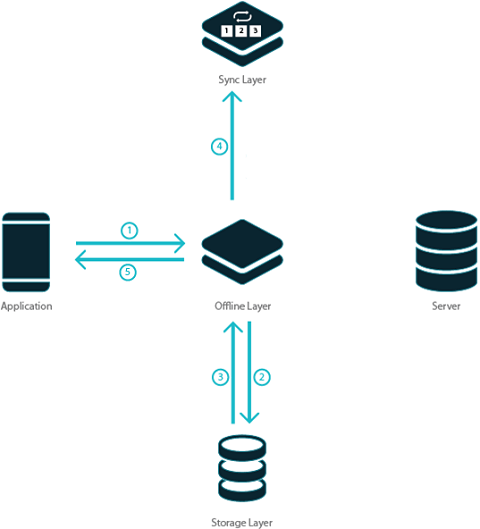

support for mobile applications can be thought of as the ability of the application to react gracefully to the lack of stability in the network connection. That is, apps should work even when not connected to any network. This is especially true of mobile apps for on-the-move users and for users working out of remote areas. In this context, one of the most complicated scenarios will be that of “ _data access_”.

a mobile app is not able to communicate to the back-end server due to lack of network connection, the app is said to be in _mode_ In offline mode, app user cannot perform any action and has to wait till network connection is available. This inability of a mobile app to work offline results in potential loss of time and business for the app user. To facilitate offline access to app users, app developers are having to spend a lot of time and effort in redesigning the apps.

is providing **data support** as an out-of-the-box feature so that developers can enable offline support to existing components.

enable offline data support, WaveMaker has a built-in **layer. **

1. app is online, it gets data from server and saves it for offline usage
2. the app is offline, data saved above will be used to answer all data requests.
3. the app is offline, all changes done by the user are recorded.
4. the app comes online, offline data changes are pushed to the server.

# Offline Support works in WaveMaker

mentioned earlier, the offline layer intercepts all data requests. When the app is online, it forwards the request to the server and receives the responses from the server. When the app is offline, it consumes the request and provides the response. The offline layer includes:

1. **layer ** to store data and answer all data calls from Variables based on Database CRUD APIs.
2. **layer** used to pull data from the server and push data changes to the server.

: At the time of developing a mobile app in WaveMaker, you can define the database entities that need to be available in offline mode so as to enhance app performance.

**Behavior when Online:**

1. API call on behalf of a Database CRUD Variable to an entity is intercepted by the offline layer.
2. call is forwarded to the server.
3. server returns the entity data corresponding to the API call.
4. offline layer stores the data sent by the server in its storage layer.
5. entity data is forwarded as the response to the app.

1. **modification request** through a Database CRUD Variable is received by the offline layer.
2. request is forwarded to the server.
3. entity data is returned by the server.
4. offline layer updates its storage layer.
5. data is forwarded as a response to the app.

**Behavior when Offline:**

1. API call on behalf of a Database CRUD Variable to an entity is intercepted by the offline layer.
2. request is forwarded to the storage layer (since the server is not reachable).
3. entity data is received from the storage layer.
4. data is forwarded as a response to the app.

1.   **modification request** is intercepted by the offline layer through a call to Database CRUD Variable,
2. corresponding entity in the storage layer is updated.
3. entity data from storage layout received by the offline layer.
4. data modification request is added to the queue within the sync layer.
5. data prepared by the storage layer is sent as a response to the app.

Thus, all data modification requests are added to the sync layer queue.

**Behavior when it comes back Online:**

1. the app comes online  is initiated.
2. data modification requests from the sync layer queue are retrieved and
3. to server synchronously.
4. the response is received and the sync queue is cleared,
5. app gets restarted.

# Offline Storage Layer gets Data

uses an inbuilt SQL Lite Database for offline storage. Offline storage layer gets its data in 3 ways:

1. **bundled along with the installer (apk or ipa)** always available for offline. This will be helpful when a huge amount of data is needed in offline all the time. There are two settings available in this case:
    - _with installer_ - This option gives read-only access to the data. This option is particularly useful when giving the salesperson access to company's inventory list. If there is a possibility of this list getting updated intermittently, there is provision to set a timestamp-based field to allow for selective pulls.
    - _with installer with on-demand sync_ - This option gives a read-write access to the data. Data is bundled with the installer at the same time user can modify the data and sync the data. This option can be used when a company executive needs to add to the company's inventory list.
2. **data during app startup**  the app-level Database CRUD Variables. The page level Database CRUD Variables are triggered only when the user visits the page. Unless the user visits a page once, data required for that page will not be available in offline. Say an app has with pages for employee and department details. The user opened the app and visited department page and closed the app. In offline mode, the user sees department page alone and employees page is not available as offline data for employees is not available. To deal with such scenarios, WaveMaker provides on-demand sync option to retrieve the required data during app runtime (by default at app startup).
3. **data received** for the Database CRUD Variables calls (with read operation) from the server to the offline storage layer. Thus, data gets accumulated as the user uses the app.

Following table details the behavior of various configurations (see [Data Support - Implementation](/learn/hybrid-mobile/offline-data-support-implementation/) for more details):

**Configuration**

**packed in installer**

**pulled from server**

** data response from server**

**in offline**

**with installer **

(if Delta Field is present)

**with installer  + on-demand sync**

(if Delta Field is present)

**data on-demand**

** data response**

1. _data received_ for the Database CRUD Variables calls (with read operation) from the server to the offline storage layer. Thus, data gets accumulated as the user uses the app.
2. _data during app startup_  the app-level Database CRUD Variables. The page level Database CRUD Variables are triggered only when the user visits the page. Unless the user visits a page once, data required for that page will not be available in offline. Say an app has with pages for employee and department details. The user opened the app and visited department page and closed the app. In offline mode, the user sees department page alone and employees page is not available as offline data for employees is not available. To deal with such scenarios, required data needs to be retrieved during app startup. The disadvantages are of this method are:
    1. maximum number of records that can be pulled is limited to application limit of maximum records per request;
    2. performance and responsiveness degrade during app startup, depending on the total number of records to be fetched.
3. _bundled along with the installer (apk or ipa) _ always available for offline. When an app requires data that does not change for at least 30 days, then instead of getting it from the server, data can be packaged along with installer. There are two advantages of this approach:
    
    1. network request required and
    2. app startup time - if this constant data is in hundreds of records, then downloading this huge amount of data during app startup or through Database CRUD API variable will slow the app.
    
    The disadvantages of this method are:
    1. data cannot be edited or deleted.
    2. the bundled data needs to be updated, then a new version of the app with updated bundled data has to be released.

# Sync Layer Works

app startup, data (except bundle data) is removed and fresh data is pulled from the server. During pushing of offline data changes, if any push fails due to any reason, then the push will be attempted again in the next cycle.

sync call of a particular entity fails due to any reason, then all subsequent calls to that entity and entities that are dependent upon it are blocked. Rest of the calls from the queue are pushed. All failures are removed from the queue but are persisted. There is no default UI support for error handling. But you can build UI using the data exposed through device variable.

**Example**: In HR app, an employee object is dependent on the department. There are 3 departments (D1, D2, D3) and 3 employees (E1, E2, E3). E1 belongs to D1, E2 belongs to D2 and E3 belongs to D3. Following is the sync queue with some operation on these entities. Assume that boxes in red have failed at the server. 

is the result.

1. 1 call executed successfully.
2. 2 failed by the server.
3. 3 call executed successfully.
4. 1 call executed successfully.
5. 2 blocked as it is dependent of D2 which has an earlier failure (see 2).
6. 3 failed by the server.
7. 1 call executed successfully.
8. 3 blocked because of earlier failure (see 6).
9. 2 blocked because of earlier failure (see 5).
10. 3 call executed successfully.
11. 1 call executed successfully.

## Conflicts are Resolved

, there is no conflict resolution strategy provided by WaveMaker. The last request will always override the data existing on the server.

**Example**, Let's say there are two users working on a record say R.

1. 1 reads R of version V1 and goes offline.
2. 1 updates R (V2) in offline.
3. 2 reads R of version V1 and modifies R (V3) in online. The latest version of R on the server is V3.
4. 1 comes online and pushes his changes. So, the latest version of R on the server is V2.  That is User1 changes override User2 changes.
5. , whether User1 changes should be accepted or not depends on the business case. But, this option is currently not available and the last request prevails.

## happens to my offline changes when app is upgraded

data changes persist across app upgrades. Let us say that a user installed the app (Version V1). In offline, he made some changes and closed the app. Then, Version V2 is released on play store or app store. Due to automatic upgrades, the app gets upgraded to V2. Now, when the user opens the app, it comes online with Version V2 and the offline data changes done in V1 is pushed to the server.

1 Mobile Apps

- 1.1 Mobile App Development
    - [App Architecture](/learn/hybrid-mobile/building-hybrid-mobile-apps/#mobile-app-architecture)
    - [App Development](/learn/hybrid-mobile/building-hybrid-mobile-apps/#mobile-app-development)
    - [Testing on Mobile](/learn/hybrid-mobile/building-hybrid-mobile-apps/#testing-mobile)
    - [Creating Installer](/learn/hybrid-mobile/building-hybrid-mobile-apps/#creating-installer)
- 1.2 Native Device Support
    - [Device Specific Widgets](/learn/hybrid-mobile/native-device-support/#device-specific-widgets)
    - [Device Variables](/learn/hybrid-mobile/native-device-support/#device-features-variables)
    - [Platform Look n Feel](/learn/hybrid-mobile/native-device-support/#platform-support)
- [1.3 Offline Data Support](#)
    - [Mechanism](#working)
    - [Storage Layer](#storage-layer)
    - [Sync Layer](#sync-layer)
    - [Enabling](/learn/hybrid-mobile/offline-data-support-implementation/)
        - [DB Configuration](/learn/hybrid-mobile/offline-data-support-implementation/#db)
        - [Variable Configuration](/learn/hybrid-mobile/offline-data-support-implementation/#variable)
        - [Plugin Configuration](/learn/hybrid-mobile/offline-data-support-implementation/#plugin)
        - [Security Configuration](/learn/hybrid-mobile/offline-data-support-implementation/#security)
    - [Support & Limitations](/learn/hybrid-mobile/offline-data-support-implementation/#limitations)
    - [Use Cases](/learn/hybrid-mobile/offline-data-support-implementation/#use-cases)
