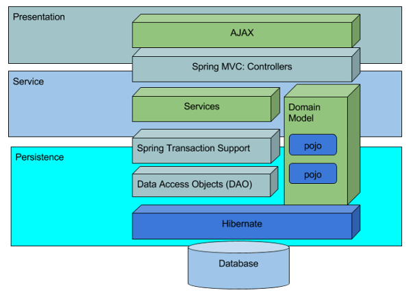
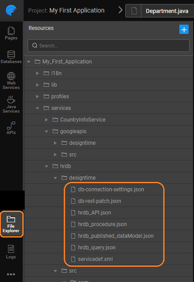
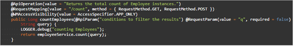
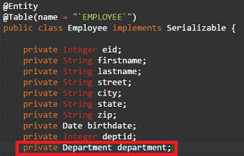

of WaveMaker app with database generates few files, services, and APIs. These are used internally by WaveMaker to achieve the seamless integration. This information is for advanced developers who want more control or need more information for academic interests.

## Architecture

a database is integrated into a WaveMaker app, it generates the source code for CRUD operations for each entity within the database. In addition to the CRUD APIs, the filter, count, and export APIs are also generated. Associated APIs in the case of related tables are also generated.

The source code is generated with the ORM, Service Layer & REST APIs with each layer having a specific responsibility:

- **1: REST Controller** is responsible for transporting the data between client and server, authorization of APIs & marshaling and unmarshaling of the model to JSON etc.
- **2: Service Layer** is responsible for validating the inputs and transaction management
- **3: DAO Layer** is responsible for interacting with the underlying database

The following diagram depicts the Layered Architecture mentioned above: 

## Files

The folder structure for the generated code is as follows:

1. generated for entities (one for each entity), queries and procedures: 
2. Access Objects (DAO) for each of the entities: 
3. Interfaces and Service Implementations for entities, queries, and procedures 
4. for each entity 

Each of the layers performs its function and delegates the call to the next layer in the chain. For example, after the unmarshaling of the JSON data to the model, and authorization checks, the REST layer delegates the call to the service layer etc. **time Configuration Files**: It contains files required for designing database.

- _\-connection-settings.json_: it contains connection properties.
- _\_API.json_: Generated API specification (swagger) of given service.
- _\_procedure.json_: contains information regarding procedures for that service.
- _\_query.json_: contains information regarding query for that service.
- _\_published\_datamodel.json_: contains database schema information. It plays a major role while updating DB changes. Whenever you do manual changes in the database you have to re-import to update this file.
- _\_draft\_datamodel.json_: Contains user modifications. It’ll delete when we do update/re-import database.
- : contains types information for this service.

# APIs for Database Services

or creation of database within a WaveMaker app results in the auto-generation of ORM artifacts from the Database Schema and as such each Schema needs to have a Primary key either single or composite. In case your external database schema comes without a primary key, you need to assign a column(s) as virtual primary key else all the columns are treated as part of a composite primary key. For each entity imported, a REST API is generated for each of the CRUD operations, Filter and Count functionalities. These REST APIs are exposed via the API Designer and can be tested and reconfigured as per the application needs.

 an example, we are using the following Employee-Department Database Schema (Sample hrdb that can be imported into Studio) with a unique constraint for Dept\_code on the department table:

**Mapping:** _\[PROJECT\_ID\]/\[PROJECT\_NAME\]/services/\[SERVICE\_NAME\]/\[ENTITY\_NAME\]/_

**:**

### APIs

1. Inserts a record into the table : / _Type_: POST _Variables_: None _Parameter_: None _Body_: object in JSON format _Name Example_: createEmployee 
2. **(primary key based)** Retrieves the data associated with given ID value : /{id} _Type_: GET _Variables_: primary key column value _Parameter_: None _Body_: none _Name Example_: getEmployee 
3. **(unique key based)** Retrieves the data associated with given unique key value : /\[UNIQUE\_KEY\]/{unique\_key\_value} _Type_: GET _Variables_: unique key column value _Parameter_: None _Body_: none _Name Example_: getByDeptCode (unique key for department entity) 
4. **(foreign key based)** Retrieves the data associated with given ID value from the related table : /{id..+}/\[relation\_field\] _Type_: GET _Variables_: primary key column value _Parameter_:
    
    - ,
    - ,
    
    _Body_: none _Name_: findAssociatedEmployees (employee foreign key for department entity) 
5. **(foreign key based - self-referential)** Retrieves the data associated with given ID value : /{id..+}/\[relation\_field\] _Type_: GET _Variables_: primary key column value _Parameter_:
    
    - ,
    - ,
    
    _Body_: none _Name_: findAssociatedEmployeesForManagerId (foreign key) 
6. Updates entity record associated with the given id value : /{id} _Type_: PUT _Variables_: primary key column value _Parameter_: None _Body_: object in JSON format _Name Example_: editEmployee 
7. Deletes entity record associated with the given id : /{id} _Type_: DELETE _Variables_: primary key column value _Parameter_: None _Body_: None _Name Example_: deleteEmployee 

### APIs

: Though the following APIs are available in POST and GET type, GET APIs might fail if the request URL is longer than 2048. It is advisable to use POST request type.

1. Returns the list of entity instances matching the filter criteria (all values if query is not given) : / _Type_: POST/GET _Variables_: None _Parameter_:
    
    - query (optional, see here for [syntax](#custom-query-syntax)),
    - ,
    - ,
    
    _Body_: none _Name_: findEmployees 
2. Returns the count of filtered entity instances (total count if query not given) : /count _Type_: POST/GET _Variables_: none _Parameter_: custom query (optional, see here for [syntax](#custom-query-syntax)) _Body_: none _Name_: countEmployees 
3. Returns the downloadable file url for the filtered data : /export _Type_: POST _Parameter_:
    
    - \- pagination and sorting options, [here for more](http://docs.spring.io/spring-data/commons/docs/current/api/org/springframework/data/domain/Pageable.html),
        - ,
        
    
    _Body_:
    
    - (Body)
        - query (optional, see here for [syntax](#custom-query-syntax)),
        - list (optional): \[{ “header”:”<column\_display\_name>”, “field”:”<entity\_field\_name>”, “expression”:”<custom\_expression>” (eg: (${field\_name} (or) <any string>)) }\]
        - \- data format for export can be EXCEL or CSV
        - : exported file name.
    
    _Name Example_: exportEmployees 

### Query Syntax

APIs generated by WaveMaker for all the imported tables will have methods that take a query as input. Here we will look at the usage of such query in APIs.

**that use HQL Queries**: The Filter, Count and Export API in every Table Controller will use the HQL query, which is an optional parameter, for retrieving the data. These APIs can be found in respective tables’ controller class file.

1. **API** This API returns the list of Entity objects that matches the given filter conditions in the query. If query param is empty, API returns all the Entity objects.
2. **API** Returns the count of Entities that matches the given filter conditions in the query. For an empty query, it returns the count of all Entity objects.
3. **API** Returns a downloadable file with the list of Entities that matches the given filter conditions in the query. For an empty query, we get all the Entity objects.

**Composition**: The HQL query mainly consists of four types of parameters.

- Name
- Expression

- Expression

: Aggregate functions (avg(), sum(), min(), max()) in HQL query are currently not supported with these APIs.

**parameter**

- fieldName refers to the name of the field associated with the column in the respective table. The field name is derived from the column name in the table and usually camelCased. 
- name of the field for a given column can be seen from DB Designer or the respectively generated model class. Field Name of a column can be found in DB designer on the selection of respective column in the properties panel. 
- field names - In order to filter values with respect to an entity in relation, fieldname must be given as This is applicable only for ManyToOne and OneToOne Relations. Eg: department.name = ‘Engineering’, the name is the fieldname of Department.java 

**Expression parameter** Supported value expression types are listed in below table

**Value Types**

\=

or String

that equals to given value

- \=1
- \=’Eric’

equals

!= (or) < >

or String

that are not equal to given value

- !=02127
- < >‘Engineer’

or Number

between given range

- between '1973-10-21' and '1986-06-18' (using date format - YYYY-MM-DD)
- between 14231 and 15922

than

<

less than given value

- <6

than

\>

greater than given value

- \>10

than or equal to

<=

less or equal to given value

- <=4

than or equal to

\>=

greater than or equal to given value

- \>=11

matching

matching the given pattern

- like ‘4%Houston%’

with

starting with the given string

- like ‘E%’

with

ending with the given string

- like ‘%e’

containing the given string

- like ‘%e%’

or Date or String

in the given set

- in (‘14231’, ‘02127’, ‘11212’)
- in ('1973-10-21' ,'1986-06-18')
- in ( 'Sally' , 'William' , ‘Amanda’ )

null

satisfying given condition

- is null

null

not null

satisfying given condition

- is not null

\=

satisfying given condition

- \= ‘’

empty

!= (or) <>

satisfying given condition

- <> ‘’
- != ‘’

**parameter** The “Value” parameter is the comparison value for the given field name. The value should be single quoted for non-numeric types. The format for the value of type date is ‘YYYY-MM-DD’.

**Expressions**

- logical expression in HQL does one of the following:
    - two or more conditions to form a complex query
    - the logic of the conditions
- logical expressions with examples are listed below
- of execution of conditions can be controlled using parenthesis. Eg: (empId=4 AND zip=02127 ) OR (city like 'New York%' OR birthdate between '1991-01-01' and '1999-12-31' )

**Expression**

/and

set satisfying both conditions

\>5 AND firstname like ‘A%’

/or

set satisfying either of the conditions

\=5 OR deptId=1

/not

set satisfying negation of the conditions

( firstname like ‘A%’ AND empId=4)

For further reference to HQL query [://docs.jboss.org/hibernate/orm/4.3/manual/en-US/html/ch16.html](http://docs.jboss.org/hibernate/orm/4.3/manual/en-US/html/ch16.html)

< DB Access

5\. Creating Backend Services

- 5.1 Overview
    - [Accessing Data](/learn/app-development/services/creating-backend-services/#accessing-data)
        - [Life-cycle of data](/learn/app-development/services/creating-backend-services/#life-cycle)
    - [Manipulating Data](/learn/app-development/services/creating-backend-services/#manipulating-data)
        - [Life-cycle of Events](/learn/app-development/services/creating-backend-services/#life-cycle-events)
    - [REST APIs](/learn/app-development/services/creating-backend-services/#rest-apis)
- 5.2 Web Services
    - [Overview](/learn/services/web-services/web-services/#overview)
    - [Variables for Invocation](/learn/services/web-services/web-services/#service-variable)
    - iii. Working with SOAP Services
        - [Overview](/learn/app-development/services/web-services/web-services/working-with-soap-services/#SOAP-service-setup)
        - [SOAP Service Setup](/learn/app-development/services/web-services/working-with-soap-services/#SOAP-service-setup)
        - [SOAP Service Settings](/learn/app-development/services/web-services/working-with-soap-services/#SOAP-service-settings)
        - [Generated REST APIs](/learn/app-development/services/web-services/working-with-soap-services/#generated-rest-apis)
        - [SOAP Service Usage](/learn/app-development/services/web-services/working-with-soap-services/#SOAP-service-usage)
    - iv. Working with REST Services
        - [ Overview](/learn/app-development/services/web-services/rest-services/)
        - [ Test REST Service](/learn/app-development/services/web-services/rest-services/#test-API)
        - [ Configure REST Service](/learn/app-development/services/web-services/rest-services/#configure-REST-service)
        - [REST Service Usage](/learn/app-development/services/web-services/rest-services/#REST-service-usage)
    - v. Working with Web Sockets
        - [Overview](/learn/app-development/services/web-services/working-with-websockets/)
        - [Service Integration](/learn/app-development/services/web-services/working-with-websockets/#import)
        - [Service Consumption](/learn/app-development/services/web-services/working-with-websockets/#variable)
        - [Use Cases](/learn/app-development/services/web-services/working-with-websockets/#use-cases)
- 5.3 Model Designer
    - [Overview](/learn/app-development/services/model-designer/)
- [5.4 Database Services](/learn/app-development/services/database-services/database-services/)
    - [Overview](/learn/app-development/services/database-services/database-services/#)
    - [Supported Databases](/learn/app-development/services/database-services/database-services/#supported-databases)
    - iii. Working with Databases
        - [Overview](/learn/app-development/services/database-services/working-with-databases/#)
        - [Adding Database](/learn/app-development/services/database-services/working-with-databases/#integrating-database)
        - [Database Actions](/learn/app-development/services/database-services/working-with-databases/#database-actions)
    - iv. Data Modelling
        - [Overview](/learn/app-development/services/database-services/data-modelling/#)
        - [Configuration Settings](/learn/app-development/services/database-services/data-modelling/#configuration-settings)
        - [Database Designer](/learn/app-development/services/database-services/data-modelling/#database-designer)
            - [Schema Import Modes](/learn/app-development/services/database-services/database-schema-import-modes/)
        - ○ Working with Database Schema
            - [Overview](/learn/app-development/services/database-services/working-database-schema/)
            - [Adding Tables and Columns](/learn/app-development/services/database-services/working-database-schema/#add-tables-columns)
            - [Working with Relationships](/learn/app-development/services/database-services/working-database-schema/#database-relationships)
            - [Identity Generators for Primary Key Column](/learn/app-development/services/database-services/working-database-schema/#identity-generators)
            - [Column Metadata Configuration](/learn/app-development/services/database-services/working-database-schema/#column-metadata-configuration)
            - [Virtual Primary Keys and Relations](/learn/app-development/services/database-services/working-database-schema/#virtual-primary-keys)
            - [Temporal Support](/learn/app-development/services/database-services/temporal-support/)
    - v. Databases Access
        - [Overview](/learn/app-development/services/database-access/)
        - ○ Working with Queries
            - [Overview](/learn/app-development/services/database-services/working-with-queries/)
            - [Query Editor](/learn/app-development/services/database-services/working-with-queries/#query-editor)
            - [Types of Queries](/learn/app-development/services/database-services/working-with-queries/#query-types)
            - [Query Creation](/learn/app-development/services/database-services/working-with-queries/#query-creation)
            - [Query Usage](/learn/app-development/services/database-services/working-with-queries/#query-usage)
            - [Parameterised Query Creation](/learn/app-development/services/database-services/working-with-queries/#query-creation-parameterised)
            - [Query Operation Type](/learn/app-development/services/database-services/working-with-queries/#query-op-types)
            - [Query Architecture](/learn/app-development/services/database-services/working-with-queries/#query-architecture)
        - ○ Working with Stored Procedures
            - [Overview](/learn/app-development/services/db-services/working-stored-procedures/)
            - [Procedure Creation](/learn/app-development/services/db-services/working-stored-procedures/#procedure-creation)
            - [Procedure Parameters](/learn/app-development/services/db-services/working-stored-procedures/#proc-params)
            - [Procedure Invocation](/learn/app-development/services/db-services/working-stored-procedures/#procedure-invocation)
            - [Procedure Architecture](/learn/app-development/services/db-services/working-stored-procedures/#procedure-architecture)
        - [Versioning of Queries and Procedures](/learn/app-development/services/database-services/versioning-queries-procedures/)
        - [ Blob Support for Queries and Procedures](/learn/app-development/services/database-services/blob-support-queries-procedures/)
        - [Invoking Queries & Procedures from Java Service](/learn/app-development/services/database-services/invoking-queriesprocedures-java-services/)
        - [ Database Views](/learn/app-development/services/db-services/database-views/)
        - ○ Database Tools
            - [Overview](/learn/app-development/services/database-tools/)
            - [DB Shell](/learn/app-development/services/database-tools/#db-shell)
            - [DB Scripts](/learn/app-development/services/database-tools/#db-scripts)
                - [Import DB](/learn/app-development/services/database-tools/#import-db)
                - [Export DB](/learn/app-development/services/database-tools/#export-db)
    - [ORM Artifacts](#)
        - [Layered Architecture](#layered-architecture)
        - [Generated Files](#generated-files)
        - [Generated APIs](#generated-apis)
            - [CRUD APIs](#crud-apis)
            - [Query APIs](#query-apis)
            - [Custom Query Syntax](#custom-query-syntax)
- 5.5 Java Services
    - [ Overview](/learn/app-development/services/java-services/java-service/#overview)
    - [Java Services Framework](/learn/app-development/services/java-services/java-service/#java-services-framework)
    - iii. Integration Services
        - [Current Loggedin User](/learn/app-development/services/java-services/java-integration-services/#loggedin-user)
        - [External Java Libraries](/learn/app-development/services/java-services/java-integration-services/#external-java-libraries)
        - [Database Entities](/learn/app-development/services/java-services/java-integration-services/#db-services)
        - [Named Queries](/learn/app-development/services/java-services/java-integration-services/#query-service)
        - [Imported Web Services](/learn/app-development/services/java-services/java-integration-services/#web-services)
    - [Variables for Invocation](/learn/app-development/services/java-services/variables/)
    - [ Generated REST APIs](/learn/app-development/services/java-services/generated-rest-apis-api-designer/)
- 5.6 API Designer
    - [Overview](/learn/app-development/services/api-designer/api/)
    - [Database Services APIs](/learn/app-development/services/api-designer/database-service-apis/)
    - [Web Services APIs](/learn/app-development/services/api-designer/web-service-apis/)
    - [Java Services APIs](/learn/app-development/services/api-designer/java-service-apis/)
    - [Security Services APIs](/learn/app-development/services/api-designer/security-service-apis/)
- 5.7 3rd Party Libraries
    - [Overview](/learn/app-development/services/3rd-party-libraries/)
    - [Including resource files](/learn/app-development/services/3rd-party-libraries/#resource-files)
    - [Using third-party JavaScript file](/learn/app-development/services/3rd-party-libraries/using-3rd-party-javascript-files/)
    - [Using third-party jar file](/learn/app-development/services/3rd-party-libraries/using-3rd-party-jar-files/)
