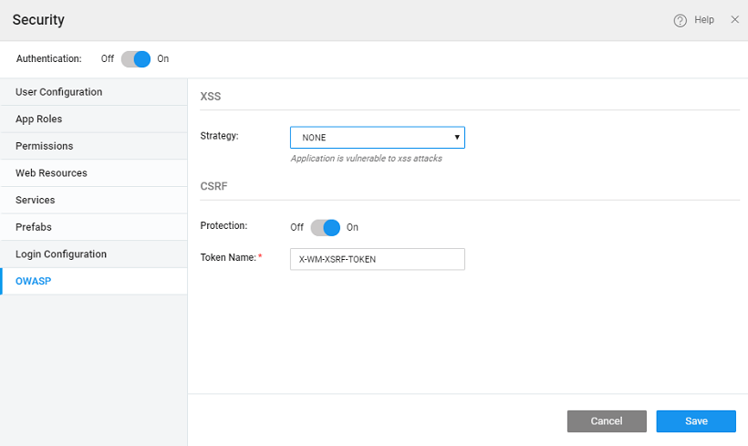

is an open community dedicated to enabling organizations to conceive, develop, acquire, operate, and maintain applications that can be trusted. The OWASP Top 10 provides a list of the [10 Most Critical Web Application Security Risks](https://www.owasp.org/index.php/Category:OWASP_Top_Ten_Project)

(Cross-site scripting) and CSRF (Cross-Site Request Forgery) attacks are listed in the OWASP top 10 security.

)flaws occur whenever an application takes untrusted data and sends it to a web browser without proper validation or escaping. XSS allows attackers to execute scripts in the victim’s browser which can hijack user sessions, deface web sites, or redirect the user to malicious sites.

)attack forces a logged-on victim’s browser to send a forged HTTP request, including the victim’s session cookie and any other automatically included authentication information, to a vulnerable web application. This allows the attacker to force the victim’s browser to generate requests which the vulnerable application thinks are legitimate requests from the victim.

same-origin policy is an important security concept implemented by web browsers to prevent Javascript code from making requests against a different origin (e.g., different domain) than the one from which it was served. Although the same-origin policy is effective in preventing resources from different origins, it also prevents legitimate interactions between a server and clients of a known and trusted origin. [\-Origin Resource Sharing (CORS)](https://spring.io/understanding/CORS) is a technique for relaxing the same-origin policy, allowing Javascript on a web page to consume a REST API served from a different origin.

### XSS Attacks

attacks occur when an attacker uses a web application to send malicious code, generally in the form of a browser side script, to a different end-user. For example, attacker can write the following script in a text box  which gets executed.

 In WaveMaker Security dialog provides three strategies to handle XSS:

1. : In this case, all the scripts will be executed, this is the default setting
2. : In this case, the scripts will be encoded so that they cannot be executed in data access. For example, the script code: will be converted to _&lt ; script &gt ; alert(document.cookie) &lt ; /script &gt ;_, thus rendering the script invalid.
3. **LIST**: In this case, the scripts will be filtered based on
    - _file_: this will implement XSS protection based on the rules defined in _/src/main/webapp/WEB-INF/wm-xss-policies.xml_  default policy file is _\-xss-policies.xml_ According to this default policy file, script tags will be removed. However, you can upload your own policy file which will be uploaded to WEB-INF folder. Clicking on to the file name will open it in the editor. Go through the more descriptions on AntiSamy rules. 
    - _tags_: Custom tag rules can be specified in terms of HTML tags which are categorized based on their actions. The possible actions are Validate, Remove, Truncate and Filter. These rules are used while handling the tags in the XSS attacks. You can add or delete tags against an action. We can specify the action for all Unknown tags also. 

### CSRF Attacks

is an attack that tricks the victim into submitting a malicious request. This security attack exploits the trust a user has for a particular site. Attacks are launched by placing malicious actions on their site so that browsers of people visiting these pages would open them with/without user action.

provides a mechanism to counter CSRF. When performing XHR requests, the _$http_ service reads a token from a cookie (by default, XSRF-TOKEN) and sets it as an HTTP header (X-XSRF-TOKEN). Since the only JavaScript that runs on your domain can read the cookie, your server can be assured that the XHR came from JavaScript running on your domain. The header will not be set for cross-domain requests.

WaveMaker Defaults: Cookie Name: wm\_xsrf\_token. This cookie gets set at run-time during the Login process. Header Name: X-WM-XSRF-TOKEN (User can customize it through security dialog)

### CORS

\-origin resource sharing (CORS) is a mechanism that allows restricted resources (e.g. fonts) on a web page to be requested from another domain outside the domain from which the first resource was served. A web page may freely embed cross-origin images, stylesheets, scripts, iframes, and videos.

CORS defines a way in which a browser and server can interact to determine whether or not it is safe to allow the cross-origin request. When CORS is enabled, following options are provided to configure:

1. **Credentials**: This option is to allow users to include credentials (including cookies and auth data) to be sent with the XHR requests.
2. **Age**: This option is used to set the validity, in seconds, of the pre-flight request response.
3. : Only the resources (in the WaveMaker app) in the mentioned path can be exposed.
4. : WaveMaker app resources can be exposed only to these origins.

< SSL Encryption

7\. Security

- 7.1 App Security Overview
    - [Overview](/learn/app-security/app-security/#)
    - [How Security Works](/learn/app-security/app-security/#working)
    - [How Security is Implemented](/learn/app-security/app-security/#implementation)
    - [Security Terminology](/learn/app-security/app-security/#terminology)
- 7.2 Authentication
    - [Overview](/learn/app-security/authentication/)
    - [Security Providers](/learn/app-security/authentication/#security-providers)
        - [Demo](/learn/app-security/authentication/#demo)
        - [Database](/learn/app-security/authentication/#database)
        - [LDAP](/learn/app-security/authentication/#ldap)
        - [Active Directory](/learn/app-security/authentication/#ad)
        - [CAS](/learn/app-security/authentication/#cas)
        - [SAML](/learn/app-security/authentication/#saml)
        - [Custom](/learn/app-security/authentication/#custom)
- 7.3 Authorization
    - [Overview](/learn/app-security/authorization/)
    - [User Onboarding](/learn/app-security/authorization/#user-onboarding)
    - [App Roles](/learn/app-security/authorization/#app-roles)
- 7.4 Access Levels & Permissions
    - [Overview](/learn/app-security/access-levels-permissions/)
    - [Setting Permissions](/learn/app-security/access-levels-permissions/#setting-permissions)
    - [Role Based Access to Widgets](/learn/app-security/access-levels-permissions/#role-based-access)
- 7.5 Login Configuration
    - [Overview](/learn/app-security/login-configuration/)
    - [Login Page](/learn/app-security/login-configuration/#login-page)
    - [Landing Page](/learn/app-security/login-configuration/#landing-page)
    - [Session Timeout](/learn/app-security/login-configuration/#session-timeout)
- 7.6 Security Related Variables
    - [Overview](/learn/app-security/security-variables)
- 7.7 SSL Encryption
    - [Overview](/learn/app-security/ssl-encryption/)
- [7.8 OWASP](#)
    - [Overview](#)
    - [Preventing XSS Attacks](#xss)
    - [Preventing CSRF Attacks](#csrf)
    - [Enabling CORS](#cors)
- 7.9 Single Sign-On (CAS)
    - [Overview](/learn/app-security/central-authentication-system/)
- 7.10 Token Based Authentication
    - [Overview](/learn/app-security/token-based-authentication/)
    - [How Token Based Authentication Works](/learn/app-security/token-based-authentication/#working)
    - [What is Token](/learn/app-security/token-based-authentication/#token)
    - [Token Repository](/learn/app-security/token-based-authentication/#token-repository)
    - [Token Request](/learn/app-security/token-based-authentication/#token-request)
    - [API Invocation](/learn/app-security/token-based-authentication/#api-invocation)
    - [Token Validity](/learn/app-security/token-based-authentication/#token-validity)
- 7.11 SAML Integration
    - [Overview](/learn/app-development/app-security/saml-integration/)
    - [Profiles](/learn/app-development/app-security/saml-integration/#profiles)
    - [Integration](/learn/app-development/app-security/saml-integration/#integration)
    - [Configuration Files](/learn/app-development/app-security/saml-integration/#files)
    - [Deployment](/learn/app-development/app-security/saml-integration/#deployment)
    - [Troubleshooting](/learn/app-development/app-security/saml-integration/#troubleshooting)
    - [Use Cases](/learn/app-development/app-security/saml-integration/#use-cases)
