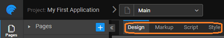

would have witnessed by now that you can accomplish most of the tasks of creating an application in the mode itself - using intuitive drag and drop options and properties. However, some situations may require you to edit the code of your application pages. Also, some advanced users and experienced developers may prefer to code. Thus, WaveMaker provides different **Modes** - , , and \- apart from the default mode. We will look at each of these modes separately.

# Markup

the mode, you can view a set of tags assigned to the elements of the page. Markup may also include attributes and other details of the elements. These details and attributes can also be set in the mode.

mode gives the user an option to add widgets and customize the widget behavior programmatically. While building custom apps, it may be noted that WaveMaker generates custom markup automatically. This markup can be accessed via the “Markup” tab in the toolbar. The markup would make much more sense if you have an idea of “directives” in AngularJS. (In short, AngularJS is a JavaScript framework that helps in building Single Page Applications (SPA)).

of the directives represents an element that has to exist at that point of time in the canvas. So for example, if you select a 3-column layout for your App, you will notice the following directives under the Markup tab - wm-page, wm-header, wm-top-nav, wm-content, wm-left-panel, wm-page-content, wm-right-panel, wm-footer.

markup can be added as needed directly in the code (if you are familiar with it). If not, WaveMaker automatically generates code when the elements are dragged on the canvas. This mode shows the styles that are associated with the particular widget. For instance, consider the  widget. In the mode, drag and drop a widget and name it  Set some of the properties of the , say **Margin**, **Margin** and **Margin**, using the **Panel**

, switch to mode. You can see the corresponding markup for the  shown below.

 <wm-button class="btn-default" caption="Button" type="button" margin="unset 0.5em" 
name="formSubmitButton" on-click="formSubmitButtonClick($event, widget)"></wm-button>

widget is identified by \="formSubmitButton"  and some of the properties are \="unset 0.5em" and \="Button" . These properties can be modified in the markup. After saving the changes, the respective widget would get updated with the properties and values defined in the markup.

# Script

the , you can define JavaScript functions that can be executed on specific events of user interaction. You can use JavaScript to further customize your WaveMaker application. The various methods and properties associated with each of the WaveMaker elements can be found in the [Documentation](/studio/docs/index.html) The various ways to access the variables, widgets etc. within an application can be [here](/learn/app-development/variables/accessing-elements-via-javascript/ "Script Access to Widgets, Variables and more")

instance, to call a JavaScript function for a widget event, choose the  in the section of **Panel** WaveMaker automatically switches to mode.

is an example to illustrate the process. Suppose you have a button named  you want to create custom JavaScript to execute when the user clicks this button. To set up the JavaScript you follow these steps

- the mode, select the button named
- the **Panel**, click on
- from the **Click** drop-down menu.
- will switch to mode with the function that will be called when the button is clicked.
- the function to display an alert when the user clicks shown below.
    
     = function($event, widget) {
        alert('Here is an alert from JavaScript');
    };
    

you have saved these changes and run the application, clicking on the button will display an alert box with the above message.

# Style

There are four ways in which you can apply a custom style to your app:

1. **Styling**: This is the locally applied style for individual widget or container, used for alignment (padding, margin, border etc.) and applying custom style such as h2, btn-info etc. The class property for widgets is rendered as a **picker** This is a multi select drop down list with various classes that are contextual to the widget displayed. You can select classes and see the effect of those applied classes on the canvas with immediate effect.  A comprehensive list of the available classes can be [\-widgets](../assets/wm-widgets.pdf) In addition to the list, you can create your own classes and use them, as mentioned below.
2. **editor**: In the mode, you can create and edit styles for the page using CSS. Let us create a CSS class for a button 
    
    - the mode, select the button named 
    - the **Panel** on the right side, click on
    - the class name, say , for the property This property defines the CSS class that is supposed to be associated
    - to  mode and enter the following:
        
        \-app .buttonSample {
            color: red
        };
        
    - would make the appear red due to the properties mentioned in the  CSS class.
    
    These style changes can be made at two levels:
    1. **Styling**: Page-only overrides can be applied by making entries to the corresponding file. This option can be used mostly for alignment and custom styles localized to the page.
    2. **Styling**: Styles over all pages of the App can be applied by making entries in the corresponding file. This can be used to override theme to apply a custom style to widgets.
    3. : These can be used across all widgets of the app. These can be reused over multiple apps for a standard look-n-feel. [about Themes](/learn/app-development/ui-design/themes/)

In this document, we have seen how Markup, Style and Script mode for a page can be used to customize the page components of your app. Be aware that this needs to be done with caution and it might result in breaking of the page if you are not well versed with HTML and CSS.

< Project Shells

\>

2\. Design UI

- 2.1 Overview
    - [App UI Design](/learn/app-development/ui-design/design-overview/#app-ui-design)
    - [Responsive Design](/learn/app-development/ui-design/design-overview/#responsive-design)
    - [UI Development](/learn/app-development/ui-design/design-overview/#ui-development)
- 2.2 Page Concepts
    - [Single Page Apps](/learn/app-development/ui-design/page-concepts/)
    - [Page Life Cycle](/learn/app-development/ui-design/page-concepts/#page-lifecycle)
    - [Page Creation](/learn/app-development/ui-design/page-creation/)
    - [Parameter Passing](/learn/app-development/ui-design/page-creation/#page-parameters)
    - [Partial Pages](/learn/app-development/ui-design/page-concepts/partial-pages/)
    - vi. Page Basics
        - [Page Layouts](/learn/app-development/ui-design/page-concepts/page-layouts/#page-layouts)
        - [Page Navigation](/learn/app-development/ui-design/page-concepts/page-layouts/#page-navigation)
        - [Events](/learn/app-development/ui-design/page-concepts/page-layouts/#events)
            - [Event Categorization](/learn/app-development/ui-design/page-concepts/page-layouts/#event-categorization)
            - [Multiple Event Handling](/learn/app-development/ui-design/page-concepts/page-layouts/#multiple-events)
    - [Page Templates](/learn/app-development/ui-design/page-concepts/page-templates/)
        - [ Custom Page Templates](/learn/app-development/ui-design/page-concepts/page-templates/#creating-page-templates)
    - [Use Cases](/learn/app-development/ui-design/use-cases-ui-design/)
- [2.3 Project Shell](/learn/app-development/ui-design/project-shells/)
- [2.4 Page Artefacts](#)
    - [Overview](#)
    - [Markup](#page-markup)
    - [Script](#page-script)
    - [Style](#page-style)
- 2.5 Themes
    - [Overview](/learn/app-development/ui-design/themes/)
    - [Applying Theme](/learn/app-development/ui-design/themes/#apply-theme)
    - [Importing Theme](/learn/app-development/ui-design/themes/#import-theme)
    - [Creating Themes](/learn/app-development/ui-design/themes/#create-theme)
        - [Creating Web Theme](/learn/app-development/ui-design/themes/#create-theme-web)
        - [Creating Web Theme using Bootswatch](/learn/app-development/ui-design/themes/#create-theme-bootswatch)
        - [Creating Mobile Theme](/learn/app-development/ui-design/themes/#create-theme-mobile)
    - [Building Theme](/learn/app-development/ui-design/themes/#build-theme)
    - [Testing Theme](/learn/app-development/ui-design/themes/#test-theme)
