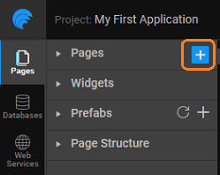

When you create an app within WaveMaker, by default the Main Page is generated. In the process of app development, you will be adding pages and linking them as per the app workflow.

In this document, we will be seeing:

- the [Page](#main-page) can be customized,
- [pages](#page-creation) can be created,
- [of pages](#page-types) available,
- [operations](#page-operations), and
- information can be passed to the pages using [Parameters](#page-parameters)

Main page comes with header, footer, top nav, left nav and right nav layout. This layout can be changed as per your needs ( [on layouts](/learn/app-development/ui-design/page-concepts/page-layouts/#page-layouts)). Wavemaker generates the HTML code which can be accessed from the markup tab.

Each element of the page layout - header, footer, topnav, leftnav and rightnav, which can be edited and customized. The change will be reflected in all pages using that element. Thus, giving a unified look and feel across multiple pages within the app. 

## Creation - why and how

are app components which allow you to organize data display by widget placement and help define the workflow. Following naming conventions have to be used when creating a page:

1. page name should contain at least one character and it cannot be a number.
2. page name should not contain special characters.
3. page name should not start with a number.

New pages can be created to segregate the functionality of the app. Ideally, each page would cater to one business need of the app. New pages can use pre-built templates and layout. 

## of Pages

There are two types of pages that can be created in an application:

1. – which can be loaded independently in the application. These act as a route within the application when associated with navigation events.
2. \- these have to be associated with a component within a page. Usually, a part of the page which is common across the app like a header or a left navigation, are implemented as a single partial and used across all app pages.

## Title

By default, WaveMaker provides the Main Page and any additional pages added are titled Page1, Page2 etc.. You can use the Page Title property to set the Page Title.  You can use  to change and access the page title. You can set the Page Title from Script tab using:  = 'Profile' Once set through Script any binding from the properties will be invalidated.

## Operations

You can duplicate, rename and delete a page using the page operations. These can be accessed from the more options against a given page or a partial page. 

- a page or a partial page leads to the page name being renamed, with the new name given by you. All the references are also renamed.
- a page leads to a copy of the page or partial page being created, with the new name given by you. A new goTo action for that page is also created.
- a page removes all references to the selected page from the project.

## Parameters

Data can be passed from one page to another within an app by defining  **Params** for pages and partial pages. There are many scenarios where one needs to pass data to a particular page. For example:

- the employee details working in a selected department,
- profile for a specific user based upon some dynamic constraint, or
- a personalized page like for activation links etc..

### parameters work

A typical page URL for a given app would be like this: ://www.app.com/#pagename Once the Page Param has been defined the URL changes to ://www.app.com/#pagename?param1=1&param2=abc This URL format will allow the data to be retained on browser refresh and reload. As is evident from the above example, multiple parameters are also supported.

### to adding Page Params

There are two aspects to adding Page Params:

1. Page: Page needing input to render the data on the page needs to page-level parameters to hold this input and the param value within the page
2. calling the above parameterized-page needs a way to _the value_ to the parameter

Let us say that test\_page needs an id to render the data and it has to be invoked from Main Page with the needed value for id.

1. Page:
    - the parameter fields to the parameterized page (in this case, _\_page_) by giving it a Name and specifying the Type. Currently, the supported types for page param are string, integer, boolean and date.⁣ 
    - Params are available on the page/partial scope and can be used in the same. These parameters can be accessed from the Page Param tab on the binding dialog. 
2. Page:
    - Application-scoped Navigation Action generated by default by WaveMaker for test\_page can be used to bind a value for the id field from the Main Page. The param will be available in the data tab of the Actions (goToPage\_test\_page). You can also create another Navigation Action and use it in a different navigation flow. 

We have seen how a page can be added to WaveMaker app, it's title and layout set. We also saw how page parameters can be used to pass information to pages. Learn more about [Pages](/learn/app-development/ui-design/page-concepts/partial-pages/),  [Layouts](/learn/app-development/ui-design/page-concepts/page-layouts/), and [Templates](/learn/app-development/ui-design/page-concepts/page-templates/)

< Page Concepts

Pages >

2\. Design UI

- 2.1 Overview
    - [App UI Design](/learn/app-development/ui-design/design-overview/#app-ui-design)
    - [Responsive Design](/learn/app-development/ui-design/design-overview/#responsive-design)
    - [UI Development](/learn/app-development/ui-design/design-overview/#ui-development)
- [2.2 Page Concepts](#)
    - [Single Page Apps](/learn/app-development/ui-design/page-concepts/)
    - [Page Life Cycle](/learn/app-development/ui-design/page-concepts/#page-lifecycle)
    - [Page Creation](#)
    - [Parameter Passing](#page-parameters)
    - [Partial Pages](/learn/app-development/ui-design/page-concepts/partial-pages/)
    - vi. Page Basics
        - [Page Layouts](/learn/app-development/ui-design/page-concepts/page-layouts/#page-layouts)
        - [Page Navigation](/learn/app-development/ui-design/page-concepts/page-layouts/#page-navigation)
        - [Events](/learn/app-development/ui-design/page-concepts/page-layouts/#events)
            - [Event Categorization](/learn/app-development/ui-design/page-concepts/page-layouts/#event-categorization)
            - [Multiple Event Handling](/learn/app-development/ui-design/page-concepts/page-layouts/#multiple-events)
    - [Page Templates](/learn/app-development/ui-design/page-concepts/page-templates/)
        - [ Custom Page Templates](/learn/app-development/ui-design/page-concepts/page-templates/#creating-page-templates)
    - [Use Cases](/learn/app-development/ui-design/use-cases-ui-design/)
    - [2.3 Project Shell](/learn/app-development/ui-design/project-shells/)
    - 2.4 Page Artefacts
        - [Overview](/learn/app-development/ui-design/page-artefacts/)
        - [Markup](/learn/app-development/ui-design/page-artefacts/#page-markup)
        - [Script](/learn/app-development/ui-design/page-artefacts/#page-script)
        - [Style](/learn/app-development/ui-design/page-artefacts/#page-style)
    - 2.5 Themes
        - [Overview](/learn/app-development/ui-design/themes/)
        - [Applying Theme](/learn/app-development/ui-design/themes/#apply-theme)
        - [Importing Theme](/learn/app-development/ui-design/themes/#import-theme)
        - [Creating Themes](/learn/app-development/ui-design/themes/#create-theme)
            - [Creating Web Theme](/learn/app-development/ui-design/themes/#create-theme-web)
            - [Creating Web Theme using Bootswatch](/learn/app-development/ui-design/themes/#create-theme-bootswatch)
            - [Creating Mobile Theme](/learn/app-development/ui-design/themes/#create-theme-mobile)
        - [Building Theme](/learn/app-development/ui-design/themes/#build-theme)
        - [Testing Theme](/learn/app-development/ui-design/themes/#test-theme)
