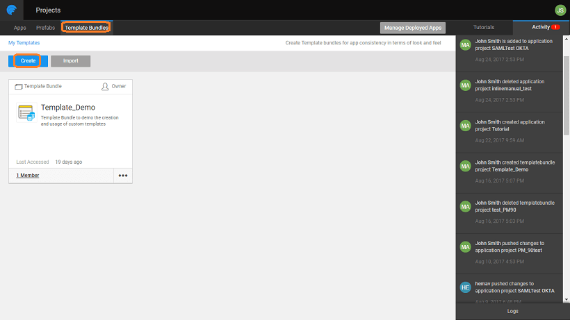
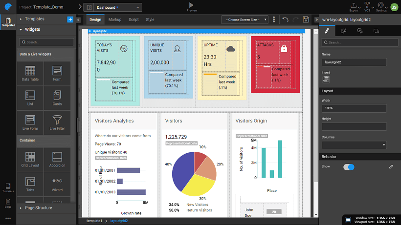
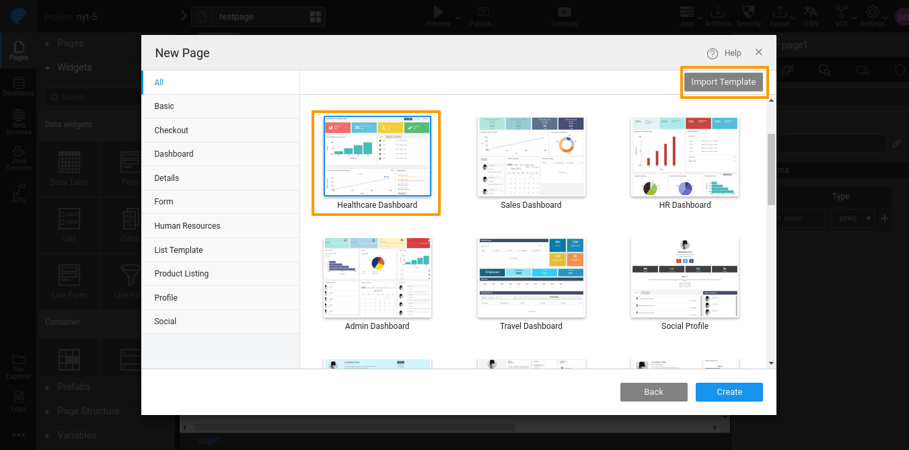
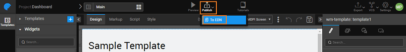

are editable pages with the layout and content defined. These can be used by the developer as a foundation on which the application pages can be built. Here we will be talking about:

- [default templates](#default-page-templates) provided by WaveMaker platform,
- [you can build](#creating-page-templates) your own custom templates, and
- [you can publish](#publishing-page-templates) your own custom templates (only for Enterprise versions).

## Page Templates

provides some default Templates for the ease of app development process. The templates are categorized under various heads like Travel, Sales, Healthcare, Finance, Human Resources etc.. Binding the various widgets on these templates to the various data sources will provide the required functionality. For Hybrid Mobile Apps these templates are categorized as a card, chart, dashboard, menu etc.

- Templates are available for when adding a new page to an application.
- of each template can be seen by hovering over the template and clicking on the button.
- developer convenience, the Templates are as Travel, Basic, Sales, Healthcare, General, Finance, Human Resources, Social, Admin, and E-Commerce. For Hybrid Mobile Apps these templates are categorized as a card, chart, dashboard, menu etc.
- of the Templates has default values set, so the developer can get an idea of how the page would look like. Each of the content and widgets on the canvas _to be bound_ to live data for actual rendering of the page.

Web ResponsiveHybrid Mobile

## Template Bundles

Template Bundles let you create and use templates across all applications in your enterprise. You can get a UI designer to design the Template Bundle. This document lists the steps in the creation of a Template Bundle.

1. **Bundles** tab and select the Create option 
2. bundle can be used on the web or mobile platform. **platform** accordingly.
3. the and for the Template Bundle
4. **Page** is created which will be used as a landing page for the Template Bundle and will not be published as part of the Template. You can choose to publish the main page by changing the settings or create a new page for the Template for publishing, from Config Settings as shown in the later steps.
5. can create and design a new page like any other page of an application. You can use an existing template and make changes. Here we have created a Dashboard page and are making changes to the existing Sales Dashboard template. 
6. the _Actions_ select and then **Templates** to open the Template Configuration dialog 
7. the page you want to publish. You can:
    1. the and
    2. the to which the Template belongs, you a can leave it blank
    3. for
    4. used for search discovery
    5. a to be displayed on the Templates selection dialog, and
    6. to be shown under Preview. 
8. can see the Template Bundle in action using the option
9. the Template Bundle as a zip file (Enterprise version users, refer to the [section](#publishing-page-templates))
10. /Open an application to use this Template
11. the New Page Dialog, you can **Template** and apply it to the page. You can see the Thumbnail and Preview the Template. 

## Template Bundles

##### Enterprise Version post 10.0 release

In order for the Template to be available for all developers within the enterprise, it needs to be published to the EDN and approved by the EDN Admin.  Refer to [ Publishing Mechanism](/learn/app-development/wavemaker-overview/artifacts-repository/#publishing) for more details.  After Admin's approval, the Template Bundle is listed in the artifact repository listing. To use the Template, the app developer needs to select it from the Template Dialog while adding a Page to the app, or by using the Change Template option for an existing app.  this document, we have seen how Page Templates ease page design and how you can create your own templates.

< Page Basics

Shells >

Design Use Cases >

2\. Design UI

- 2.1 Overview
    - [App UI Design](/learn/app-development/ui-design/design-overview/#app-ui-design)
    - [Responsive Design](/learn/app-development/ui-design/design-overview/#responsive-design)
    - [UI Development](/learn/app-development/ui-design/design-overview/#ui-development)
- [2.2 Page Concepts](/learn/app-development/ui-design/page-concepts/)
    - [Single Page Apps](/learn/app-development/ui-design/page-concepts/)
    - [Page Life Cycle](/learn/app-development/ui-design/page-concepts/#page-lifecycle)
    - [Page Creation](/learn/app-development/ui-design/page-creation/)
    - [Parameter Passing](/learn/app-development/ui-design/page-creation/#page-parameters)
    - [Partial Pages](/learn/app-development/ui-design/page-concepts/partial-pages/)
    - vi. Page Basics
        - [Page Layouts](/learn/app-development/ui-design/page-concepts/page-layouts/#page-layouts)
        - [Page Navigation](/learn/app-development/ui-design/page-concepts/page-layouts/#page-navigation)
        - [Events](/learn/app-development/ui-design/page-concepts/page-layouts/#events)
            - [Event Categorization](/learn/app-development/ui-design/page-concepts/page-layouts/#event-categorization)
            - [Multiple Event Handling](/learn/app-development/ui-design/page-concepts/page-layouts/#multiple-events)
    - [Page Templates](#)
        - [ Custom Page Templates](#creating-page-templates)
    - [Use Cases](/learn/app-development/ui-design/use-cases-ui-design/)
- [2.3 Project Shell](/learn/app-development/ui-design/project-shells/)
- 2.4 Page Artefacts
    - [Overview](/learn/app-development/ui-design/page-artefacts/)
    - [Markup](/learn/app-development/ui-design/page-artefacts/#page-markup)
    - [Script](/learn/app-development/ui-design/page-artefacts/#page-script)
    - [Style](/learn/app-development/ui-design/page-artefacts/#page-style)
- 2.5 Themes
    - [Overview](/learn/app-development/ui-design/themes/)
    - [Applying Theme](/learn/app-development/ui-design/themes/#apply-theme)
    - [Importing Theme](/learn/app-development/ui-design/themes/#import-theme)
    - [Creating Themes](/learn/app-development/ui-design/themes/#create-theme)
        - [Creating Web Theme](/learn/app-development/ui-design/themes/#create-theme-web)
        - [Creating Web Theme using Bootswatch](/learn/app-development/ui-design/themes/#create-theme-bootswatch)
        - [Creating Mobile Theme](/learn/app-development/ui-design/themes/#create-theme-mobile)
    - [Building Theme](/learn/app-development/ui-design/themes/#build-theme)
    - [Testing Theme](/learn/app-development/ui-design/themes/#test-theme)
