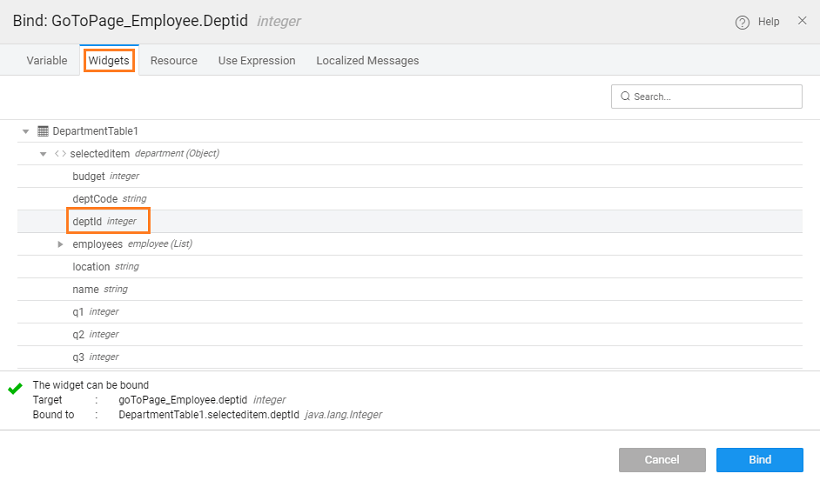
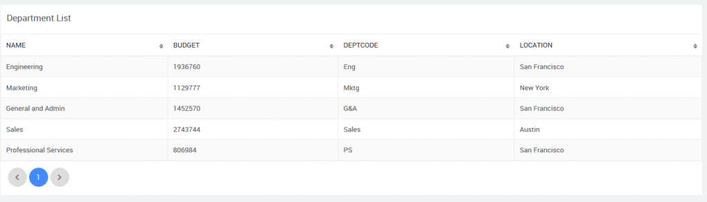

We will see how page params can be used to pass data between pages. We will be using the Department and Employee datasets from the sample hrdb that has been imported.

## Use Case

The app should consist of two pages:

1. **Department page** listing the departments in a Data Table,
2. **Employee page** listing the employees from a given department in a List,
3. Click event of the Department Data Table will trigger a call to the Employee page passing the deptid, which will be used to filter the employee details in the Employee page.

## Solution

The solution includes the following steps:

1. Create the two pages - Employee and Department.
2. Use Data Table widget for Department details and List for Employee details.
3. Since Employee details have to be filtered based upon the selected Department, create a page parameter for the Employee page. Use this parameter to filter the list items.
4. From the Department details page, call the Employee page along with the selected department details.

## Implementation

1. Create a page called Employee
2. Drag and drop a List widget:
    - set the source of data to variable created from Employee entity
    - select any template and pagination of your choice. We have used the Contact List template  with Basic pagination
    - bind the fields by setting the Picture widget to picurl, and Name to firstname
3. From the canvas, we have made some changes to the List widget (these changes are optional):
    - select the Name label and bind it to firstname+lastname (from Use Expressions tab) and
    - add another label and bind to jobtitle
4. **Adding Parameter**: Select the page node from the Files resources or from the widgets breadcrumb at the bottom of the canvas, under Properties add page param - deptid of type integer. 
5. **Filter Employees**: Next, we need to set the filter on List to display employee details for the department passed to this page. Select the List and locate the Value property under Dataset, click it to open the Employee Variable dialog. (You can also access the Variable from the Variables dialog). Under Filter Criteria tab add deptid, set the condition to Is equal to and click the bind icon for the value 
6. From the Page Params tab, select deptid to be set as the department filter. Notice the deptid being passed to the page as parameter. 
7. Create a page called Department
8. Drag and drop Data Table widget, and set the source of data to variable created from department entity. We have chosen Read-only Simple View template for this example
9. **Page Navigation**: From the Events tab, set the On Row Click event to goToPage\_Employee 
10. **Pass Parameter**: Now we need to pass the selected row deptid to the Employee page. Select the goToPage\_Employee from the Actions dialog and select the Data tab. Click the bind icon next to the deptid 
11. From the Widgets tab, select the deptid from the selectedItem of the grid 
12. **Preview**: Preview the app and see the Department listing 
13. Click on any department and see the employees from that department being displayed. Remove Toolbar to see how the parameter is passed. 

[Design UI Cases](/learn/app-development/ui-design/use-cases-ui-design/)

- 1\. How to Navigate between Pages in
    - [i. Web Responsive Apps](/learn/responsive-web/web-ui-design/#page-navigation)
    - [ii. Mobile Apps](/learn/hybrid-mobile/mobile-page-concepts/#page-navigation-actions)
- [2\. How to pass parameters to pages](/learn/how-tos/passing-parameters-pages/)
- [3\. How to pass parameters to partial pages](/learn/how-tos/passing-parameters-partial-page/)
- [4\. How to use static variable to pass data between pages](/learn/how-tos/use-static-variable-pass-data-pages/)
- [5\. How to set home page, language and date/time format](/learn/how-tos/setting-language-date-format/)
- [6\. How to change the default app favicon](/learn/how-tos/changing-default-favicon/)
- [7\. How to set the app logo](/learn/how-tos/changing-app-logo/)
- [8\. How to incorporate additional icons](/learn/how-tos/incorporating-additional-icons/)
- [9\. How to conditionally change the color of icons](/learn/how-tos/displaying-icon-color-based-upon-condition/)
- [10\. How to change the page title](/learn/how-tos/changing-page-title/)
- [11\. How to customise app styling](/learn/how-tos/customise-app-style/)
- [12\. How to customise the app login page](/learn/how-tos/customise-login-page/)
