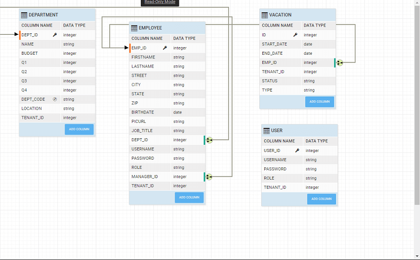

This document will go through the steps in adding Pre and Post processing for generated APIs in an imported Database service.

# **\- requisites**

- a WaveMaker Project (UserManagementApp)
- [a database service](http://[supsystic-show-popup id=106]): (we are using the sample HRDB) 
- [Security to On](http://[supsystic-show-popup id=111]) Use Database as Security Provider and Configure Security with user table of HRDB.

When a database is imported into a WaveMaker app, it generates the source code with the ORM, Service Layer & REST APIs for all CRUD operations for each entity within the database. In addition to the CRUD APIs, it also generates the search (filter), count and export APIs. WaveMaker also understands the relations across the tables and generates the associated apis as well.

There are 3 layers in the generated source code:

- **1 : REST Controller** responsible for transporting the data between client and server, authorization of APIs & marshalling and unmarshalling of model to JSON etc.
- **2: Service Layer** \- responsible for validating the inputs and transaction management
- **3: DAO Layer** - responsible for interacting with the underlying database

The diagram below depicts the Layered Architecture mentioned above:

The screenshots below show the folder structure of the generated code.

1. are generated for entities, queries and procedures 
2. Access Objects (DAO) for each of the entities 
3. Interfaces and Service Implementations for entities, queries and procedures 
4. for each entity 

Each of the layers performs its responsibilities and delegates the call to the next layer in the chain. For example, after the unmarshaling of the JSON data to model, and authorization checks, the REST layer delegates the call to the service layer etc.

# \-Post Processing

Since the code gets generated every time any Database operation like Re-Import or Update, etc. are performed, any custom code within the generated code will be overwritten. Hence, we will create a new Java class to extend the service implementation class and override the required method.

The service layer is the entry point for writing custom/pre-post processing for any additional business logic when an API is invoked from the browser/UI.

The service layer itself is provided with a Java interface & default implementation generated.

To write a pre-post processing of service implement the following steps:

## 1: Service implementation class

Write a new service implementation class by extending the existing Service Impl

- a service in user src/main/java folder of the project Example: UserManagementApp/src/main/java/com/hrdb/service/PreProcessUserService.java  Please refer the  to add the files in project.

## 2: Extend service impl class and override method

Extend the UserServiceImpl to preprocess the service 

You can Override only those methods which need extra processing in one of the following ways

- after the pre-processing to the superclass
- invoke directly the DAO layer
- throw exceptions it appropriate
- can also inject multiple other services into this new class & perform multiple actions in it, say inject SecurityService & perform additional security checks etc.

In this example we have implemented the first way, i.e. delegate to superclass. A service is written to check if the login user is an admin and if the user is admin then the user details are fetched. Find below the code for both PreProcessService and PostProcessService classes Note : Please create these classes in an IDE and copy it in path specified in the following screenshot, [here to know how to work with IDE](/learn/app-development/dev-integration/extending-application-using-ides/)   :

 com.hrdb.User;
import com.wavemaker.commons.WMRuntimeException;
import com.wavemaker.runtime.security.SecurityService;
import org.slf4j.Logger;
import org.slf4j.LoggerFactory;
import org.springframework.beans.factory.annotation.Autowired;
import org.springframework.data.domain.Page;
import org.springframework.data.domain.Pageable;
import java.util.Arrays;
import java.util.List;

_Definition_

 class PreProcessUserService extends UserServiceImpl {
    private static final Logger LOGGER = LoggerFactory.getLogger(PreProcessUserService.class);

    @Autowired
    SecurityService securityService;

    @Override
    public Page findAll(final String query, final Pageable pageable) {
        LOGGER.info("---------Pre Processing-----------");
        final List userRoles = (List) Arrays.asList(securityService.getUserRoles());
        if (!userRoles.contains("admin")) {
            LOGGER.error("The logged in user does not have enough permissions");
            throw new WMRuntimeException("You do not have enough permissions");
        } else {
            Page persistedUsers = super.findAll(query, pageable);
            LOGGER.info("-----------Post Processing Service --------------");
            PostProcessService postProcessService = new PostProcessService();
            return postProcessService.process(persistedUsers);
        }

    }
}

:

 com.hrdb.User;
import org.springframework.data.domain.Page;

_Definition_

 class PostProcessService {
    public Page process(Page users) {
        return users;
    }
}

## 3: Override the bean class

- the REST layer use your implementation rather than using the default service impl by overriding the bean-class in the user-spring xml.
- in **\-user-spring.xml** the bean to declare the Service which user has defined.

At run-time, data is fetched for admin: 

For other users an error is thrown as follows: 

Service Use Cases

- [1\. How to send emails using Java Service](/learn/how-tos/sending-email-using-java-service/)
- [2\. How to implement forgot password feature using Java Service](/learn/how-tos/implementing-forgot-password-feature-using-java-service/)
- [3\. How to access REST APIs from Java Service](/learn/how-tos/accessing-rest-apis-java-service/)
- [4\. How to schedule a Java Service](/learn/how-tos/scheduling-java-service/)
- [5\. How to accomplish Pre-Post Processing for a DB Service APIs](/learn/how-tos/pre-post-processing-db-service-apis/)
    - [Introduction](#post-15541-_yhcaftcsao2l)
    - [Pre- requisites](#post-15541-_o3zunah3x1k6)
    - [Background](#post-15541-_gqy1z71bvxg0)
    - [Pre-Post Processing](#post-15541-_3waubt1z9n6d)
    - [Step 1: Service implementation class](#post-15541-_vkamxnxfo5yn)
    - [Step 2: Extend service impl class](#post-15541-_3ah5wvvmf3pa)
    - [Step 3: Override the bean class](#post-15541-_4lxw8svzi5oz)
