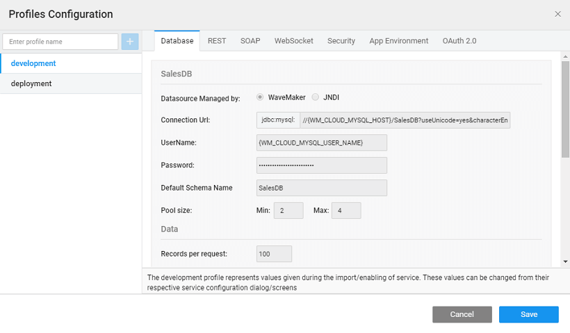
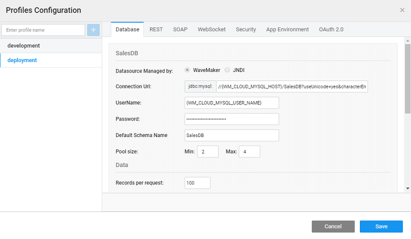

WaveMaker is a RAD platform to develop and deploy web and mobile applications. This document is intended to be a walkthrough of the WaveMaker RAD platform. It includes:

- [Terminology](#terminology),
- [Dashboard](#project-dashboard),
- [Workspace](#workspace),
- [Canvas](#canvas),
- [Settings](#settings),
- [Profile](#profiles)

# Started

Online(WMO) is a platform for users to access Studio for app development and deploy them on Cloud. Once you sign-up on WMO, you are on a 30 day trial period. During this period your developer team can develop, test-run and collaborate applications. They can also deploy the apps to Amazon Web Service or WaveMaker Demo Cloud. At the end of the 30-day trial, you get the option to buy and continue working on the app. There are various affordable purchase options - monthly or annual. Once you purchase the app, you can continue app development and deployment.

To start on the trial version of WaveMaker Online, visit and sign-up using your email id. You will get a confirmation mail with a link to activate your account. Once activated, log in to WMO  to access Studio.

You will be directed to the  **Dashboard** page, enabling you to create a new project or take an overview of sample apps.

[our jumpstart to know about app building process and create a simple app](/learn/jump-start/jump-start-app-essentials/)

# Terminology

starting with product walkthrough, let us get familiarized with some of the terms commonly used in Studio parlance.

components to organize data display using widgets and to define the workflow through interlinking.

fully finished page has a Layout and Content.  Content is based on the placement of widgets or from a Template chosen by you. Layout is used to define the common areas across pages.

Ideally, new pages should be created for separate business rules. For example, a page can be used to display the employee listing, another for the department details and yet another for department expenditure details.

- [Creation](/learn/app-development/ui-design/page-creation/)

the page into components.

layout is HTML Markup defining placeholders for page components such as header, footer, top navigation, left and right panels, and main area. You can choose from the pre-defined set of layout options. The content for each of these components can be defined using partial pages.

\-usable arrangement of one or more widgets in the page content that together capture the purpose of the page.

template is the structural composition of a page with widgets containing HTML markup and the CSS styles. The widgets within a Template do not have data binding with services, allowing the usage of these templates for different use cases on different pages. You can choose from a list of default templates provided by the platform or create your own template bundle as a collection of templates.

For example, a dashboard template is typically created with charts, data table, and other widgets. When a page is created using this dashboard template, these widgets can be bound to Sales or Healthcare database services based on use cases like Sales dashboard or Healthcare dashboard.

**Bundle**

templates built into a bundle.

template bundle is a collection of templates. Template Bundle can be built like an application sans data binding. Import of the Template Bundle to the Studio workspace ensures that all the templates within the bundle are available across the apps for selection at the time of page creation just like the default templates.

components for user interaction and responsive design.

are HTML/Bootstrap based UI Components to enable user interaction. Widgets get their data from backend Services through binding to Variables. Widgets can be customized in terms of appearance and behavior as per your use case using the attributes of properties, style, events, and security.

For example Button, Text, Label, Data Table, List, Charts etc.

- [Basics](/learn/app-development/widgets/ui-elements/)
- [Library](/learn/app-development/widgets/widget-library/)

of one or more widgets that are bound to API or services.

is a reusable, API-integrated component that can be used across apps. It encapsulates functionality, interaction & data and as such can be used to build custom widgets.

For example, GoogleMap Prefab, QRCode reader or Youtube Prefab.

- [Basics](/learn/app-development/custom-widgets/custom-widgets/)
- [Prefabs](/learn/app-development/widgets/widget-library/#prefabs)
- [Prefabs](/learn/app-development/custom-widgets/creating-prefabs/)

**Shell**

for multiple apps in an enterprise.

Shell is an app with functionality that is common to multiple apps across the enterprise. This can be used as a starting point in app development.

For example, multiple apps in an organization could be using the same database or the same security mechanism. Shell will ensure uniformity and reduce the app development time and effort.

, fonts, and branding elements (CSS & images) that is applied to all pages within an app.

are style elements which work at the widget or UI component level. Themes help provide a consistent look and feel to your application. Themes can be selected from existing default list or custom built to suit the app needs.

- [Overview](/learn/app-development/ui-design/themes/)
- [Themes](/learn/app-development/ui-design/themes/#create-theme)

data integration for the widgets

holds the actual data to be rendered by the widgets. It is based on a data model obtained from the API source (from services like database and web-based) and renders the same in the form of a data structure used for binding, with attributes and related objects.

**Types**

of Variables based on the source and purpose.

**CRUD** for the basic insert, read and update operation on the Database tables.

**API** for accessing the queries and procedures and additional Database functionality.

**API** from Web, Java, Security for the service APIs exposed by the Web, Java and Security services.

- [Service](/learn/app-development/variables/web-service/)
- [Service](/learn/app-development/variables/java-services/)
- [Service](/learn/app-development/variables/security-service/)

**Variable** can be used as storage model to store data on the client.

**Variable** to access device features in case of mobile applications.

the business logic, rules and data flow

assist in invoking a backend API, Database operation or navigation to another page when a UI event occurs. Events can be either user-initiated, notification response or as a result of another task being performed.

variables and widgets

of the Variables to Widgets helps in capturing the data from the user or fetching data from the backend services.

# Dashboard

Once you have created projects, the **Dashboard** page displays all your Projects, Prefabs and Template Bundles along with the latest activity updates. You have the option to create/import project, prefab or template bundle. 

- _Banner_ can be used to:
    - what you want to create/work on - Apps, Prefabs or Template Bundles. From Apps tab, you can access Sample Apps, which can be accessed from your account and tinkered with.
    - **Deployed Apps** open the Cloud Portal for managing release pipeline for deployed apps. [more](/learn/app-development/deployment/release-management/)
    - **Access** allows you to view the following details:
        
        -  details allow you to manage the subscriptions. It gives the details of each application in your account, the plan they are under, the status of the plan and option to renew the subscription.
        - option.
    - **/Activity Panel** gives
        - to various tutorials
        - project activity
    - give access to server logs which can be downloaded.
    - **Listing** will list all the apps, Prefabs, and template bundles, depending upon the tab you select. Hovering on a given app/prefab/template bundle will allow you to open the same in Studio designer.
    - each project or Prefab the following information is displayed: 
        - or project avatar, to give a visual image of the type of project. It can be set at the time of project creation by selecting an image from the drop down list.
        - **type** of project - web, mobile, prefab, or template bundle
        - **Name** provided while creating a project or Prefab.
        - **Description**: The description that you provided while creating a project or Prefab.
        - **Timestamp** date and time of the last update.
        - **role** on the project - owner or contributor
        - : Ability to restore a project from the VCS. [here for project recovery options](/learn/app-development/dev-integration/import-export-update-apps/#project-recovery)
        - **:** Ability to export a project as a zip file without opening the project.
        - : As an owner/admin of the project, you can delete the same. In case there are multiple Project Admins, each of them has the option to **Project**
        - **project:** a member of the project, you have the option to Leave the project, instead of delete.
        - **Member Details** gives the number of Members working on the project with an option to open the Member details dialog on click.  This dialog allows you to:
            
            - the project members and their roles;
            - owner of the project can add or remove members and change the role
            
            For more on Project roles [here](/learn/app-development/wavemaker-overview/project-user-management/) For Enterprise version refer to [Support](/learn/app-development/wavemaker-overview/rapid-rbac-support/#project_roles)

# Workspace

a project from the Project Dashboard is opened, it opens in the Project Workspace. This space is the designer pallet for your app. The various sections of the Project Workspace assist you in building the app.

- **Actions ** a quick access to recently used resources, preview and deploy the app
- **Configurations** helps secure, export, internationalize and version control the app. Also, the Configuration Profiles, Project Settings, and Studio Settings can be accessed from here.
- are building blocks of an App like Page, Database, APIs etc.
    - **Panel** gives access to various resources categories - a group or category of resources of the same type such as Pages, Databases, Web Services, Java Services, and APIs.
    - **Explorer ** all the resources of the selected resource category
    - Elements constituting a selected a resource can be viewed within the  along with the appropriate **Toolbar**
    - the **Category **
        - Resource Explorer includes , **, Page Structure** and **Variables** which aid in designing and building the Page
        - **Toolbar** helps in defining runtime functionality of the Page in terms of Variables, Themes, Layout etc..
        - **Breadcrumb** giving the relative path to the selected element on the Page
    - **Panel** gives the settings for the selected Resource Element
- **Utilities** gives access to the
    - generated for the app through **Explorer**,
    - \- server and client with download option and
    - functions like:
        - various project artefacts like Templates, Themes, Prefabs etc.,
        - project shell,
        - project source,
        - access to frequently used files like app.css and app.js.

# Canvas

you create a project, the Main Page is created by default. You can add pages to the app, by using the **+** button next to the Page on Resource Explorer. On selection of a page, Canvas is provided:

1. can select the page to design/edit from the Pages resource category
2. selected page UI is displayed in the Canvas
3. Properties Panel displays the properties of the Page 
4. the Page Structure section, you can see the various elements placed on the Page and their hierarchy
5. can select the widget from the Page structure
6. widget is highlighted on the Canvas
7. widget properties like data source, styles, events, device, and security can be set from the Properties Panel
8. hierarchy shows the widget construct and allows you to traverse to the parent container. 

# Settings

can view and change project details and settings from the **Settings** dialog.

Settings can be accessed from the option of the **Actions**

- indicates whether it is an application - web or mobile; or a prefab. For Prefabs, an additional [Settings](/learn/app-development/custom-widgets/creating-prefabs/ "Projects and Templates") tab is displayed.
- **Name** non-editable field giving the name of the project.
- giving a brief description of the project as entered at the time of project creation which can be modified.
- **prefix** defines the default package for the generated code across all services. The package prefix is generated by concatenating the and _name_ This can be modified as per your requirements.
- information is generated by default, which can be modified.
- or project avatar is an icon depicting the nature of the project, editable set from the selection from the drop-down menu.
- number can take any format as per your company standards.
- **Language** can be set for the project. This works in conjunction with the The developer has to provide the Language Bundle via the App Messages, translation facility is not provided by this feature. In case the Language Bundle is not provided the application will run in English, which is the default language. The browser language preference of the user can be captured. If the user running the WaveMaker app has language preference set in their browser and that language is supported by the app (i.e. available in the language bundle) then the app will be rendered in that language instead of the default language of the app.
- **Page** defines the initial or the first page for the app at run-time. It is set to the Main page by default. : Few things that you need to be aware of regarding the Home Page
    - case the app is not secure, the user is redirected to the Home page configured in the project settings
    - case the [is secure](http://[supsystic-show-popup id=111]) but the Home Page is not ( [set to everyone](/learn/app-development/app-security/access-levels-permissions/#setting-permissions)), the user is redirected to the Home page configured in the project settings
    - case the app and Home Page are secure( [set to specific user role](/learn/app-development/app-security/access-levels-permissions/#setting-permissions)), the user is redirected to the [login page](/learn/app-development/app-security/login-configuration/#login-page#login) as per the user role
- **Format** can be used to set the display format for all the date/time fields in the app. The Configure Formats link directs you to the localization dialog where the date and time formats can be set. ( [here to know more](/learn/app-development/widgets/form-widgets/select-locale-usage/))
- **Shell** used in building the app, non-editable
- **date** is the project creation timestamp, non-editable.
- **Accessed ** is the timestamp of last project modification, non-editable.

# Profiles

App Configuration is externalized at each service through configuration profiles. Configuration for DB, REST, SOAP, WebSocket servers, Security etc. can be separated for Dev and Deploy environments through Profiles.

**Profiles** can be accessed from the option of the **Actions**

Configuration Profiles allows one to run the same application under different environments with different configurations. This is in line with _[Configuration Profiles](https://maven.apache.org/guides/mini/guide-building-for-different-environments.html)_ Services used by a Prefab within the app can also be configured.

[more about Configuration Profiles from here](/learn/app-development/deployment/configuration-profiles/)

< Platform Overview

Technologies >

1\. WaveMaker Overview

- 1.1 Platform Overview
    - [Modern Web Apps](/learn/app-development/wavemaker-overview/platform-overview/#modern-web-apps)
    - [App Architecture](/learn/app-development/wavemaker-overview/platform-overview/#app-architecture)
    - [App Building Process](/learn/app-development/wavemaker-overview/platform-overview/#app-building-process)
    - [Technology Stack](/learn/app-development/wavemaker-overview/platform-overview/#technology-stack)
    - [Material Design](/learn/app-development/wavemaker-overview/platform-overview/#material-design)
    - [Hybrid Mobile Apps](/learn/app-development/wavemaker-overview/platform-overview/#mobile-apps)
- [1.2 Product walk-through](#)
    - [Getting Started](#getting-started)
    - [Product Terminology](#terminology)
    - [Project Dashboard ](#project-dashboard)
    - [ Project Workspace](#workspace)
    - [Canvas](#canvas)
    - [Project Settings](#settings)
    - [Configuration Profiles](#profiles)
- [1.3 Supported Technologies](/learn/app-development/wavemaker-overview/supported-technologies/)
- [1.4  Pre-requisites](/learn/app-development/wavemaker-overview/pre-requisites/)
- 1.5 Artifacts Repository
    - [Overview](/learn/app-development/wavemaker-overview/artifacts-repository/#)
    - [Publishing Mechanism](/learn/app-development/wavemaker-overview/artifacts-repository/#publishing)
    - [Flow (Enterpise version)](/learn/app-development/wavemaker-overview/artifacts-repository/#enterprise)
- 1.6 WaveMaker Localization
    - [Platform Localization](/learn/app-development/wavemaker-overview/localization/#platform_locale)
    - [Setting Language Preference](/learn/app-development/wavemaker-overview/localization/#setting)
    - [Adding Language Bundles](/learn/app-development/wavemaker-overview/localization/#adding)
    - [Build Platform](/learn/app-development/wavemaker-overview/localization/#build)
- 1.7 User Management
    - [Overview](/learn/app-development/wavemaker-overview/project-user-management/#roles)
    - [Member Roles](/learn/app-development/wavemaker-overview/project-user-management/#roles)
    - [Add Members](/learn/app-development/wavemaker-overview/project-user-management/#add)
    - [Permissions](/learn/app-development/wavemaker-overview/project-user-management/#permissions)
