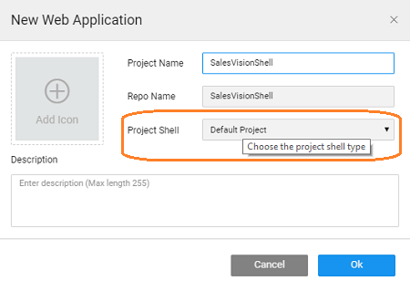
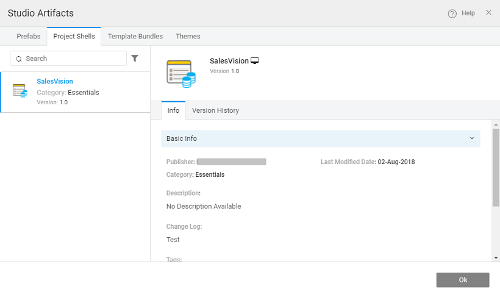

**Shells** can be used as a starting point in app development and used as a foundation for multiple apps within an enterprise. In this document, we will be talking about:

- benefits of using a project shells,
- [project shell](#default-shell),
- to [a project shell](#creating-shell), and
- to [a project shell](#publishing-shell)

Basically, a Project Shell is an app with functionality included. This functionality can be used as is or with some changes/enhancements, across multiple apps.

For example, multiple apps in an organization could be using the same database or the same security mechanism. You can create an app with the database imported or the security applied and save as shell. Use this shell when you develop other apps, use this shell. Project Shell will ensure uniformity at the same time reducing the app development time and effort.

You can select the project shell to apply when you create an application. : You will not be given an option to select a project shell unless you create and save (or publish to EDN for Enterprise Edition) a project as a shell within your workspace. The default project shell that comes with the platform will be applied.

## Page Shell

you create an app using WaveMaker it is based out of a default project shell. This shell contains the following components:

- Main page,
- Login page, and
- for
    - , footer,
    - , rightnav, topnav and
    - dialogs for login, alert and confirm.

##  Project Shell

Like mentioned above, you can create and use your own project shells as per your app development needs. For this follow these steps:

1. an app with the functionality, theme, and styles that you want to be applied in common to multiple apps.
2. you have created the app, Export it as Project Shell. 
3. shell will be available for selection when you create an app from your workspace. 

## Project Shell

##### Enterprise Version post 10.0 release

In order for the Project Shell to be available for all developers within the enterprise, it needs to be published to the EDN and approved by the EDN Admin. Refer to [Publishing Mechanism](/learn/app-development/wavemaker-overview/artifacts-repository/#publishing) for more details. 

Export as Shell to EDN will prompt you to enter the following details:

- : this will be used for grouping purpose. Categories are typically defined by EDN Admin and developers associate the artifact with a given category at the time of publishing.
- **Number**: Each artifact is associated with a version (automatic versioning) at the time of the publishing process.
- **Log**: These include the comments that the developer needs to add before publishing the artifact.
- : this will be useful for searching, each artifact can have multiple tags.

- Admin's approval, the Shell is listed in the artifact repository listing. 
- use the Shell, the app developer needs to select the Shell at the time of App creation. 

In this document, we have seen how Project Shell can be used as a foundation for multiple applications without replicating the effort.

< Page Templates

Artefacts >

2\. Design UI

- 2.1 Overview
    - [App UI Design](/learn/app-development/ui-design/design-overview/#app-ui-design)
    - [Responsive Design](/learn/app-development/ui-design/design-overview/#responsive-design)
    - [UI Development](/learn/app-development/ui-design/design-overview/#ui-development)
- 2.2 Page Concepts
    - [Single Page Apps](/learn/app-development/ui-design/page-concepts/)
    - [Page Life Cycle](/learn/app-development/ui-design/page-concepts/#page-lifecycle)
    - [Page Creation](/learn/app-development/ui-design/page-creation/)
    - [Parameter Passing](/learn/app-development/ui-design/page-creation/#page-parameters)
    - [Partial Pages](/learn/app-development/ui-design/page-concepts/partial-pages/)
    - vi. Page Basics
        - [Page Layouts](/learn/app-development/ui-design/page-concepts/page-layouts/#page-layouts)
        - [Page Navigation](/learn/app-development/ui-design/page-concepts/page-layouts/#page-navigation)
        - [Events](/learn/app-development/ui-design/page-concepts/page-layouts/#events)
            - [Event Categorization](/learn/app-development/ui-design/page-concepts/page-layouts/#event-categorization)
            - [Multiple Event Handling](/learn/app-development/ui-design/page-concepts/page-layouts/#multiple-events)
    - [Page Templates](/learn/app-development/ui-design/page-concepts/page-templates/#)
        - [ Custom Page Templates](/learn/app-development/ui-design/page-concepts/page-templates/#creating-page-templates)
    - [Use Cases](/learn/app-development/ui-design/use-cases-ui-design/)
- [2.3. Project Shell](#)
    - [ Creating Project Shell](#creating-shell)
- 2.4 Page Artefacts
    - [Overview](/learn/app-development/ui-design/page-artefacts/)
    - [Markup](/learn/app-development/ui-design/page-artefacts/#page-markup)
    - [Script](/learn/app-development/ui-design/page-artefacts/#page-script)
    - [Style](/learn/app-development/ui-design/page-artefacts/#page-style)
- 2.5 Themes
    - [Overview](/learn/app-development/ui-design/themes/)
    - [Applying Theme](/learn/app-development/ui-design/themes/#apply-theme)
    - [Importing Theme](/learn/app-development/ui-design/themes/#import-theme)
    - [Creating Themes](/learn/app-development/ui-design/themes/#create-theme)
        - [Creating Web Theme](/learn/app-development/ui-design/themes/#create-theme-web)
        - [Creating Web Theme using Bootswatch](/learn/app-development/ui-design/themes/#create-theme-bootswatch)
        - [Creating Mobile Theme](/learn/app-development/ui-design/themes/#create-theme-mobile)
    - [Building Theme](/learn/app-development/ui-design/themes/#build-theme)
    - [Testing Theme](/learn/app-development/ui-design/themes/#test-theme)
