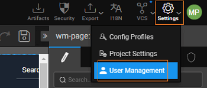

Collaboration is allowed for WaveMaker project development. The owner of a project can add new members  (already registered with WaveMaker) to the project and assign roles to them. This document walks through the various roles and permissions allowed for the members of a project.

NOTE: Enterprise version handles RBAC support differently,  [refer here](/learn/app-development/wavemaker-overview/rapid-rbac-support/) for more details.

## Member Roles

The following roles are provided by default and cannot be customized:

- **Project Admin**: Project Admin is the actual owner of a specific Project and takes responsibility for the entire app development.
- **Default**: This is the default role when a user is assigned to a Project. This includes only view privileges.
- **Contributor:** Contributor is the co-developer of the specified Project. They have full access to app development functionality, with the following exceptions:
    - cannot deploy the project,
    - cannot delete the project,
    - cannot add members to the project,
    - cannot remove existing users, and
    - cannot push the project to an external Repo.

## Add Members

As the creator of a project, you are assigned the role of a Project Admin. You can assign users to the project using the **Add Member Details** option from the Project Listing. 

Project Roles can also be assigned or updated from the Project Workspace using the User Management dialog under Settings option.  

## Permissions

Here is the list of roles and permissions that are provided:

| Role | Permissions |
| --- | --- |
| Project Admin | 
- Pages - Create, Edit, Delete, and View
- REST Services - Import, Edit, Delete, and View
- SOAP Services - Import, Edit, Delete, and View
- Websocket Services - Import, Edit, Delete, and View
- Java Services - Import, Edit, Delete, and View
- Database Services - Create or Import, Edit, Delete, and View; Queries - Create, Edit, Delete, and View; Procedures - Create, Edit, Delete, and View.
- Themes - View, Import, and Change
- Prefabs - Import, and Delete
- Artifacts - View, and Import

 | 

- Security - View, and Configure
- API Designer - View, and Edit API's
- VCS - Pull & View Log, Push to VCS, Push to External Repository, and Sync Workspace
- Profiles - Configure Profiles
- i18n - Configure Languages and Edit messages
- Tools - DB Console, and File Explorer
- Project Management - Release Management
- Project Actions - Export Project as Zip, Export Project as Shell, Export Project as Prefab, Export Project as Template Bundle, Update Sources, Enable Workspace Sync, Export Project as WAR, Deploy Project, Publish Prefab To EDN, Publish Prefab to Workspace, Publish Project Shell To EDN, Publish Project shell to Workspace, Publish Template Bundle To EDN, Publish Template Bundle To Workspace, View Settings, Configure Settings, View User Management, Configures User Permissions, Delete Project, and Publish Theme To EDN

 |
| Default | 

- Pages - View
- Services - View Databases, View Java Services, View REST Services, View SOAP Services, View Websocket Sevices, View API's

 | 

- Project Actions - View Settings, View User Management
- VCS - Pull & View Logs

 |
| Contributor | 

- Pages - Create, Edit, Delete, and View
- REST Services - Import, Edit, Delete, and View
- SOAP Services - Import, Edit, Delete, and View
- Websocket Services - Import, Edit, Delete, and View
- Java Services - Import, Edit, Delete, and View
- Database Services - Create or Import, Edit, Delete, and View; Queries - Create, Edit, Delete, and View; Procedures - Create, Edit, Delete, and View.
- Themes - View, Import, and Change
- Prefabs - Import, and Delete
- Artifacts - View

 | 

- Security - View, and Configure
- API Designer - View, and Edit API's
- VCS - Pull & View Log, Push to VCS, and Sync Workspace
- Profiles - Configure Profiles
- i18n - Configure Languages and Edit messages
- Tools - DB Console, and File Explorer
- Project Actions - View Settings, View User Management, Export Project as Zip, Export Project as Shell, Export Project as Prefab, Export Project as Template Bundle, Update Sources, Enable Workspace Sync, Export Project as WAR, Publish Prefab to Workspace, Publish Project shell to Workspace, Publish Template Bundle To Workspace

 |

< WaveMaker Localization

1\. WaveMaker Overview

- 1.1 Platform Overview
    - [i. Modern Web Apps](/learn/app-development/wavemaker-overview/platform-overview/#modern-web-apps)
    - [ii. App Architecture](/learn/app-development/wavemaker-overview/platform-overview/#app-architecture)
    - [iii. App Building Process](/learn/app-development/wavemaker-overview/platform-overview/#app-building-process)
    - [iv. Technology Stack](/learn/app-development/wavemaker-overview/platform-overview/#technology-stack)
    - [v. Material Design](/learn/app-development/wavemaker-overview/platform-overview/#material-design)
    - [vi. Hybrid Mobile Apps](/learn/app-development/wavemaker-overview/platform-overview/#mobile-apps)
- 1.2 Product walk-through
    - [i. Getting Started](/learn/app-development/wavemaker-overview/product-walkthrough/#getting-started)
    - [ii. Project Dashboard ](/learn/app-development/wavemaker-overview/product-walkthrough/#project-dashboard)
    - [iii. Project Workspace](/learn/app-development/wavemaker-overview/product-walkthrough/#workspace)
    - [iv.Project Canvas](/learn/app-development/wavemaker-overview/product-walkthrough/#canvas)
    - [v. Project Settings](/learn/app-development/wavemaker-overview/product-walkthrough/#settings)
    - [vi. Configuration Profiles](/learn/app-development/wavemaker-overview/product-walkthrough/#profiles)
- [1.3 Supported Technologies](/learn/app-development/wavemaker-overview/supported-technologies/)
- [1.4  Pre-requisites](/learn/app-development/wavemaker-overview/pre-requisites/)
- 1.5 Artifacts Repository
    - [i. Overview](/learn/app-development/wavemaker-overview/artifacts-repository/#)
    - [ii. Publishing Mechanism](/learn/app-development/wavemaker-overview/artifacts-repository/#publishing)
    - [iii. Flow (Enterpise version)](/learn/app-development/wavemaker-overview/artifacts-repository/#enterprise)
- 1.6 WaveMaker Localization
    - [i. Platform Localization](/learn/app-development/wavemaker-overview/localization/#platform_locale)
    - [ii. Setting Language Preference](/learn/app-development/wavemaker-overview/localization/#setting)
    - [iii. Adding Language Bundles](/learn/app-development/wavemaker-overview/localization/#adding)
    - [iv. Build Platform](/learn/app-development/wavemaker-overview/localization/#build)
- [1.7 User Management](#)
    - [i. Member Roles](#roles)
    - [ii. Add Members](#add)
    - [iii. Permissions](#permissions)
