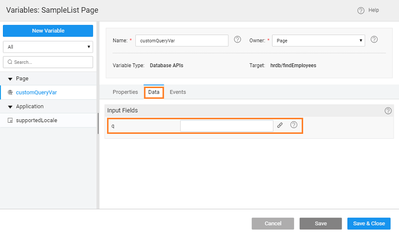

## Case

Constructing a Query Where Clause Dynamically

In some of the business scenarios that are based on Database data, the fields based on which filtering is needed may be available only at Runtime.

**solution** is to construct the query where clause dynamically.

This solution can be used only with a single entity. If you want to use multiple entities use DB views.

## where clause using Javascript

1. are using the _HRDB Database_  [into the app](http://[supsystic-show-popup id=106])
2. a named
3. a **API Variable** named for the page created in previous step and set
    - as
    - **Type** as _APIs_
    - to
    - to 
4. in Data tab of the Service Variable  Input Field. This will be used to construct the dynamic where clause on Employee for findEmployees method. 
5. and Drop a **Table** and bind it to the _Service Variable_ created earlier.
6. and Drop a  with  set as _DATA_
7. the button **Event** write a JavaScript function that will
    - the input for q parameter in the service variable where you can give multiple parameters with conditions,
    - the DB API Variable, and
    - Update on the DB API Variable.
8. that you will be getting the input fields at runtime from a widget in the UI, construct a query by using the field names as literal and field values may be taken from various widgets.
9. should write the script using an if condition to check whether each field is available in the runtime or not and give appropriate value for each of them and construct the value for q field for the service variable.
    
        Page.button2Click = function($event, widget) {
    
            var sv = Page.Variables.customQueryVar;
            sv.setInput("q", "FIRSTNAME like '%J%' and JOB\_TITLE like '%Marketing%'");
            sv.invoke();
            Page.Variables.customQueryVar.update();
    
        };
    
    In the script, the field names have to be literal and the field values can be taken from UI. For example, if a text widget is used for the value, then use the following expression: `1.datavalue` Try from the Use Expression tab in Binding dialog to ensure your expression is syntactically correct.
10. is the outcome of the page when the user clicks on Filter Data button 

## the Use Case Using API Designer

1. the API Designer, select Employee Entity under HRDB and select POST / filter api - Returns the list of Employee instances matching the search criteria.
2. Test tab.
3. Request Parameters
4. q enter the conditions to filter as:
    
     like '%J%' and JOB\_TITLE like '%Market%'
    
5. on TEST.
6. will see the Response as 
