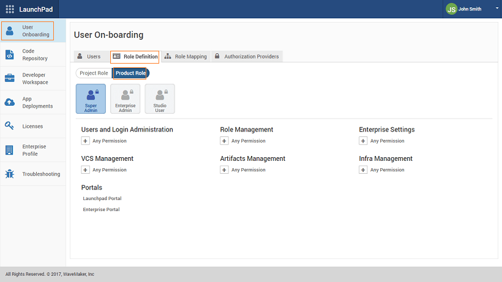
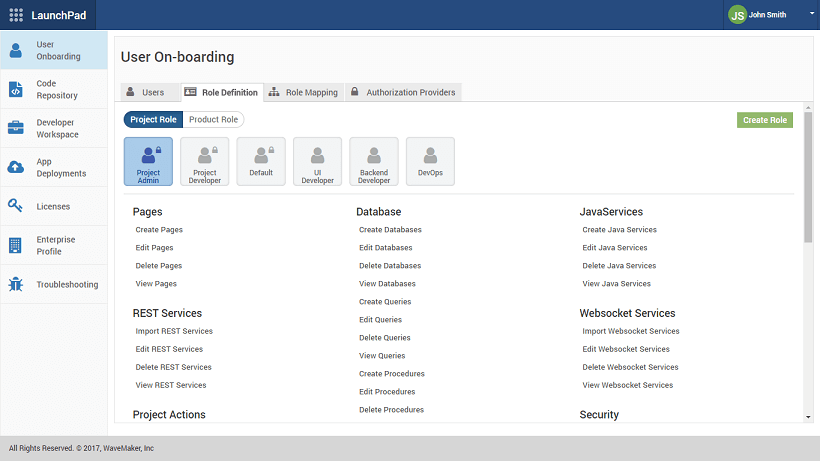
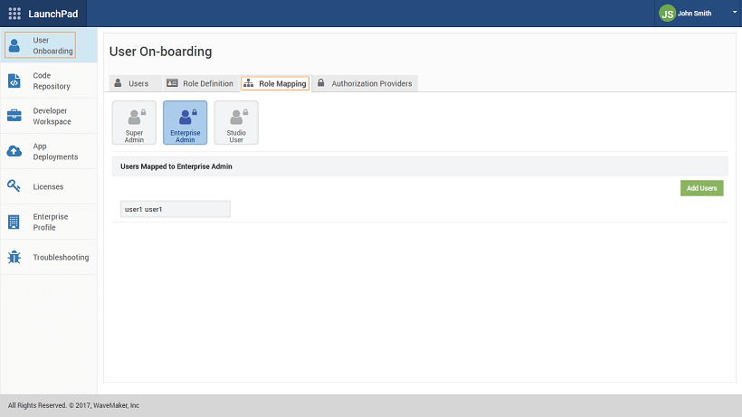

##### Enterprise Version post 10.0 release

multiple developers across the team are collaborating on large development projects, establishing a clear set of access control policies helps in effectively managing the deliverables. RBAC policies safeguard a specific set of project resources from being modified and from any unwanted/unapproved set of changes creeping into the development project.

**\-based access control (RBAC)** for Rapid, enables certain roles to access specific features of the product. WaveMaker Platform when setup within an enterprise is managed by 2 different types of roles:

1. **Roles**: IT-centric roles managing the setup, infrastructure & integrated services required by the platform;
2. **Roles**: Developers & project leaders who are involved in the application development using the platform.

## Roles

**Roles** are defined by the Product for administration and managing the platform functions within an organization. The following are the specific roles that are provided by default under the “Product Roles” category (these roles cannot be modified):

- _Admin_: : This role is the higher-order role in the organization that assumes all the functions that can be performed in the platform after setting up. Has total control over the administration, infrastructure, projects, user and role management.
- _Admin_: This role presides over all the administrative functions related to projects, project membership, artefact approval, etc.
- _User_: User is the developer or the project administrator who works on the development projects and has access to Studio for app building. Product User when given access to a created project, or when added to an existing project can play one of the project roles assigned to. Project roles are specific to the app development life-cycle and are managed by the Project Admin.

Product Role Policies:

- Roles are pre-defined by the product and cannot be customized.
- Admin can create or assign another user to become a Super Admin.
- Admin creates or assigns a user to be the Enterprise Admin and IT Admin.
- can be multiple Enterprise Admins for a given enterprise within the product setup. However, an Enterprise Admin cannot create another Enterprise Admin.
- Admin can do the following role assignments:
    - Project Admin to a project,
    - Admin access to a project for a specific user,
    - membership for a user from a project.
- an Enterprise Admin can create a project and assign a Project Admin.
- Users cannot create projects
- Users can become part of the project with the associated Project Roles assigned by the Project Admin.

## Roles

There are several roles involved in the app development process, each of these roles are categorized based on the functions they perform in the app development lifecycle. The following roles are provided by default and cannot be customized:

- **Admin**: Project Admin is the actual owner of a specific Project and takes responsibility for the entire app development.
- **Default**: This is the default role when a user is assigned to a Project. This includes only view privileges.

Apart from these, roles can be created and defined as per the enterprise needs. These Roles are customizable and custom role definitions can be created with specific permissions by the product roles.

**Types**: There are 3-levels of Permission sets that are provided to manage access control for various roles involved in the development process:

- **permissions**: Studio Permissions are top-level permissions that are not specific to any app or project being developed. These permissions are applicable to the Studio-level actions across all Project types.
- **permissions**: Project Permissions are project-level permissions that are not specific to any resource or resource type. These permissions are applicable to actions that are performed in the workspace of an active project. Project Permissions specific to a Project are configured by the Project Owner.
- **resource permissions**: Project Resource Permissions are resource-level permissions, that are assigned specifically to a resource such as a Page, Database, Web Service etc. These permissions are applicable to all actions performed on the specific resource. Project Resource Permissions are configured within the project workspace by Project Owner.

As mentioned earlier, default roles are set by the Platform. Of these roles, some can be customized. Here is the list of roles and permissions that are provided: The following roles be customized:

Admin

- Studio Permissions

- \- Create, Edit, Delete, and View
- \- View Databases, View Java Services, View REST Services, View SOAP Services, View Websocket Sevices, View API's,
- Settings,
- User Management

## Creation and Assignment

Studio Permissions and Project Permissions across all apps in Studio, are configured in the Launchpad, by the product Admin. Since these are not resource-dependent, they are independently configured for roles available.

Project Resource Permissions are project specific and are configured by the Project Admin for the specific project from the User Management Settings menu.

In the following sections, we will discuss both in detail.

### and Project Permissions

**Definitions**: Roles can be created from the Role Definition tab of the User On-boarding section of Launchpad. As mentioned earlier the Product Roles are pre-defined with permissions set and they cannot be modified.  Project Roles come with a pre-defined roles of Project Admin, Project Developer and Default.  Custom Project Roles can be created and Permissions allocated to them as per the requirements.  From the Role Mapping tab users can be assigned to Super Admin, Enterprise Admin and Studio User.  

### Resource Permissions

**Role Assignment**: Once the Project Roles are defined, they need to be assigned to Studio Users for specific projects. Project Admin will log to Rapid and assign users usin the **Member Details** option.   Project Roles can be updated from the Project Workspace using the User Management dialog under Settings option.  

### Admin

By default, only Project Admin can create projects and members added will be assigned the Default role and any other role assigned to them. Project Admin can be changed by EDN Admin from the EDN page.

1. to EDN.
2. the Project tab.
3. and open the Project for which the admin role has to be changed.
4. Admin can - Revoke Admin, Make Admin or delete the user. 

1\. WaveMaker Overview

- 1.1 Platform Overview
    - [Modern Web Apps](/learn/app-development/wavemaker-overview/platform-overview/#modern-web-apps)
    - [App Architecture](/learn/app-development/wavemaker-overview/platform-overview/#app-architecture)
    - [App Building Process](/learn/app-development/wavemaker-overview/platform-overview/#app-building-process)
    - [Technology Stack](/learn/app-development/wavemaker-overview/platform-overview/#technology-stack)
    - [Material Design](/learn/app-development/wavemaker-overview/platform-overview/#material-design)
    - [Hybrid Mobile Apps](/learn/app-development/wavemaker-overview/platform-overview/#mobile-apps)
- 1.2 Product walk-through
    - [Getting Started](/learn/app-development/wavemaker-overview/product-walkthrough/#getting-started)
    - [Project Dashboard ](/learn/app-development/wavemaker-overview/product-walkthrough/#project-dashboard)
    - [ Project Workspace](/learn/app-development/wavemaker-overview/product-walkthrough/#workspace)
    - [Canvas](/learn/app-development/wavemaker-overview/product-walkthrough/#canvas)
    - [Project Settings](/learn/app-development/wavemaker-overview/product-walkthrough/#settings)
    - [Configuration Profiles](/learn/app-development/wavemaker-overview/product-walkthrough/#profiles)
- [1.3 Supported Technologies](/learn/app-development/wavemaker-overview/supported-technologies/)
- [1.4  Pre-requisites](/learn/app-development/wavemaker-overview/pre-requisites/)
- [1.5 Rapid RBAC Support](#)
    - [Product Roles](#product_roles)
    - [Project Roles](#project_roles)
    - [Implementation](#implementation)
    - [Role Creation and Assignment](#roles)
        - [Studio and Project Permissions](#launchpad)
        - [Project Resource Permissions](#studio)
        - [Project Admin](#admin)
    - [Permissions](#permissions)
- 1.6 Artifacts Repository
    - [Publishing Mechanism](/learn/app-development/wavemaker-overview/artifacts-repository/#publishing)
    - [Published Artifacts & Updates](/learn/app-development/wavemaker-overview/artifacts-repository/#published&updates)
    - [Artifact Management](/learn/app-development/wavemaker-overview/artifacts-repository/#management)
- 1.7 WaveMaker Localization
    - [Platform Localization](/learn/app-development/wavemaker-overview/localization/#platform_locale)
    - [Setting Language Preference](/learn/app-development/wavemaker-overview/localization/#setting)
    - [Adding Language Bundles](/learn/app-development/wavemaker-overview/localization/#adding)
    - [Build Platform](/learn/app-development/wavemaker-overview/localization/#build)

As mentioned earlier, two default roles are set by the Platform. You can add roles and assign permissions based upon app requirements. The following is a list of permissions that can be set:

- Pages
- Pages
- Pages
- Pages

Services

- /Import Database
- Database
- Database
- Database

\- Queries

- Queries
- Queries
- Queries
- Queries

\- Procedures

- Procedures
- Procedures
- Procedures
- Procedures

Service

- Java Service
- Java Service
- Java Service
- Java Service

Service

- REST Service
- REST Service
- REST Service
- REST Service

Service

- SOAP Service
- SOAP Service
- SOAP Service
- SOAP Service

Socket Service

- Web Socket Service
- Web Socket Service
- Web Socket Service
- Web Socket Service

Designer

- API Designer
- API Designer

Service

- Security Service

18n

- Languages
- Language
- i18n
- Messages

- , Pull, and View Log
- & View Log

- to External Repo

- Prefab
- Prefab

- Console
- Explorer

- Profiles

- Artifacts
- Artifacts

- Themes
- Themes
- Themes

- as Cordova zip
- to PhoneGap
- for Android

Actions

- Project as Zip
- Project as Shell
- Project as Prefab
- Project as Template Bundle
- Sources
- Workspace Sync

- Project as WAR
- Project
- Prefab To EDN
- Prefab to Workspace
- Project Shell To EDN
- Project shell to Workspace

- Settings
- Settings

- User Management
- User Permissions

< Pre-Requisites

Repository >
