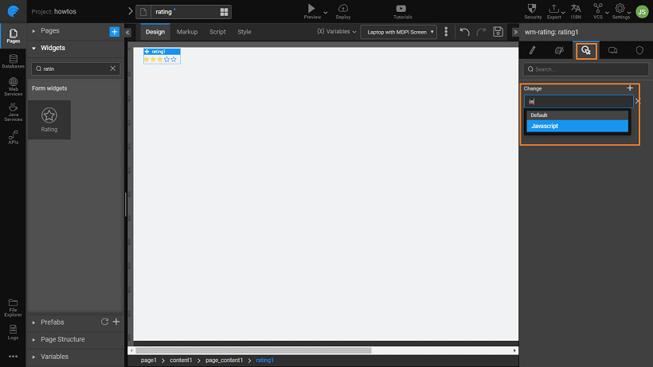

You can change the Rating widget style at the runtime, using the  event. Using the example from the [section with Variable data](/learn/how-tos/rating-widget-using-variable/), here we will see how.

1. to the event of the Rating widget. 
2. the following script. This script captures the rating value as changed by the user, and changes the color of the widget appropriately. : Use the rating widget name from your app in place of _1_ in the following code.
    
    1Change = function ($event, widget, newVal, oldVal) {
        if (widget.datavalue == '1') {
            Page.Widgets.rating1.color = 'red';
        } else if (widget.datavalue == '2') {
            Page.Widgets.rating1.color = 'blue';
        } else if (widget.datavalue == '3') {
            Page.Widgets.rating1.color = 'blue';
        } else if (widget.datavalue == '4') {
            Page.Widgets.rating1.color = 'green';
        } else if (widget.datavalue == '5') {
            Page.Widgets.rating1.color = 'green';
        }
    };
    
3. the app, based upon the rating selection see the color change.

[Widget Use Cases](/learn/app-development/widgets/form-widgets/rating-widget/#use-cases)

- [1\. How to build Rating widget from static data](/learn/how-tos/rating-widget-using-static-data/)
- [2\. How to build Rating widget from variable data](/learn/how-tos/rating-widget-using-variable/)
- [3\. How to build an interactive rating widget](#)
