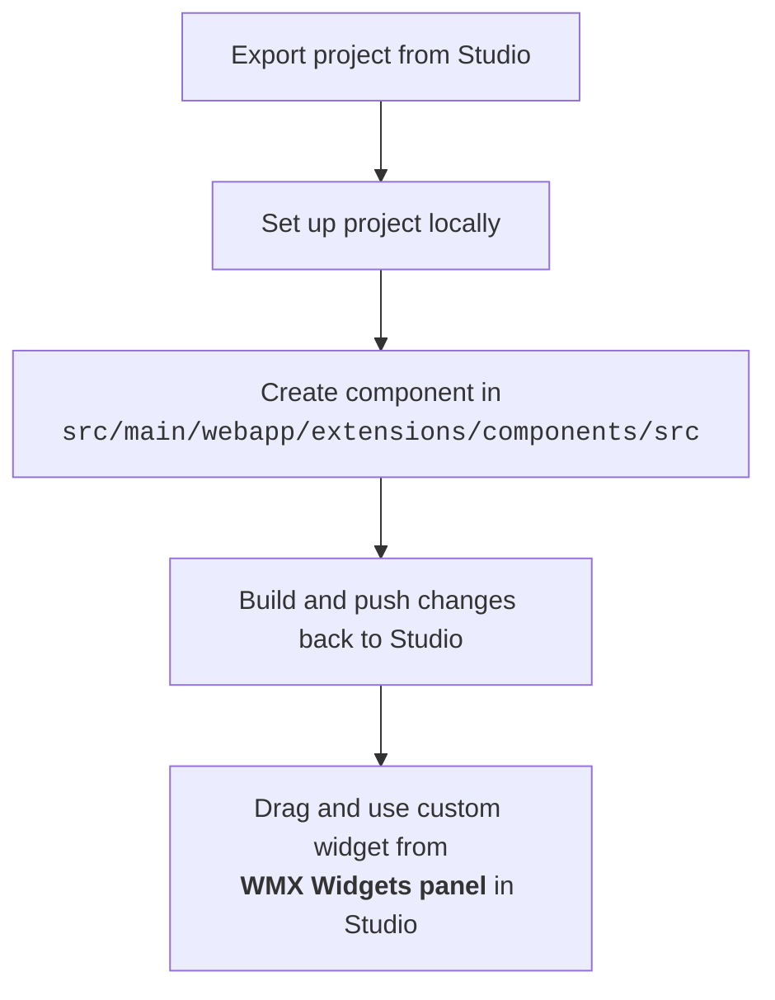

---

import wmxOverview from '/learn/assets/react-native/wmx/wmx-overview.png'
import wmxUseCase from '/learn/assets/react-native/wmx/wmxUseCase.png';

## Introduction

WMX Widgets (WaveMaker Extension Widget) lets you integrate your own custom **React Native components** into a WaveMaker application while still enjoying all the features of native WaveMaker widgets.  

They act as a **wrapper** around your component, enabling you to leverage all the built-in WaveMaker widget capabilities — including property binding, script access, theme styling, and design token support — while still having full control over the component’s internal React Native code.

---

## Why WMX Widgets Exist
WaveMaker comes with a wide range of ready-to-use widgets, but sometimes you need something highly specific like a unique UI element, an uncommon visual style, or a specialized interactive feature.  

WMX Widgets allow developers to:
- Bring in **custom-built React Native components**.
- Use these components with **WaveMaker’s widget features** like property binding, event handling, theming, and scripting.
- Avoid workarounds — the component is first-class in your app.

Typical use cases include:
- Custom variations of widgets (e.g., advanced Progress Bar).
- Specialized UI elements not available in WaveMaker (e.g., Color Picker, Circular Slider, Radar Chart).
- Unique, app-specific features (e.g., seat selection for movie booking, VR product preview).

---

## Key Benefits
- **Script Access** – Your widget can be accessed via `Page.Widgets.<componentName>`.
- **Configurable Props** – Any props you define in your component’s metadata (`wmx.json`) appear in Studio for easy configuration.
- **Two-Way Binding** – Props can be dynamically bound to values in your app, and vice versa.
- **Styling Support** – Works with theme, app, and page-level styles.
- **Design Token Compatibility** – Fully supports WaveMaker’s design tokens.
- **WavePulse** – Supports debugging using WavePulse.
- **Lightweight** – Minimal wrapper overhead for maximum performance.

---

## Custom Component Structure

Your component must have **two required files**:

1. **`index.tsx`**  
   - Must have a **default export** exporting your React Native component.

2. **`wmx.json`**  
   - Defines the widget’s metadata, including:
     - Display name and description.
     - Props and their types.
     - Default values.
     - Bindable properties.

Detailed Schema for `wmx.json` 

### WMX JSON schema
Name | Description | Required |
---- |-------------|----------| 
**name** | Widget name in lowercase letters. | Yes|
**displayName**| Display name shown in Studio. If not set, `name` is used.  | No |
**description**| Description shown as help info in Studio. | No |
**iconUrl** | Relative path to the SVG icon (e.g., icon.svg). | No |
**webSupport** | Can this component render in web preview? Default value is `false` | No |
**props** | Object of properties supported by widget. (see [Property Schema](#property-schema) below). | No |
**events** | Object of events supported by widget. (see [Event Schema](#event-schema) below). | No |
**styles** | Object of styles supported by widget. (see [Style Schema](#style-schema) below). | No |

### Property Schema

Name | Description | Required |
---- |-------------|----------|
**name** | Property name (alphanumeric). | Yes|
**displayName**| Display name in Studio. If not set, `name` is used.  | No |
**description**| Description shown as help info in Studio. | No |
**type** | Property type, valid property type values are `number`, `string`, `boolean`, `object`. Default value is `string` | No |
**isList** | Set to true if this property is an array. Default value is `false` | No |
**defaultValue** | Default value for this property. | No |
**isRequired** | Set to true if this property is required. Default value is `false` | No |

### Event Schema

Name | Description | Required |
---- |-------------|----------|
**name** | Event name (alphanumeric). | Yes|
**displayName**| Display name in Studio. If not set, `name` is used.  | No |
**description**| Description shown as help info in Studio. | No |

### Style Schema

Name | Description | Required |
---- |-------------|----------|
**name** | Style property name (alphanumeric). | Yes|
**style**| Default style value. | No|

This custom component is then **automatically wrapped** by WMX wrapper, creating the WMX Widget, which makes it a fully functional WaveMaker widget, with property binding, script access, and styling features.

Read more about creating the component [here](create-wmx-widget).

---

## Steps to create WMX widget and using in your project.

---

## Limitations

- **No Studio Rendering:** WMX Widgets do not render their actual UI in WaveMaker Studio; a placeholder is shown on the Canvas.
- **No Drop-in Containers:** Cannot be used to create container widgets that accept child components (e.g., Tabs, Accordions, Layout Containers).
- **No Form Integration:** Cannot be added inside WaveMaker forms or used as form fields.
- **Framework-Specific:** Built with React Native and not portable to apps using other frameworks (e.g., Angular, React Web, Lynx).

