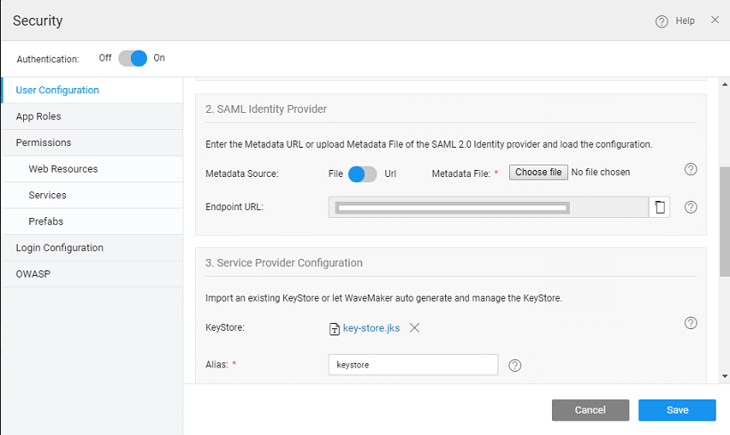

**Assertion Markup Language (SAML)** is an XML-based open standard for exchanging authentication and authorization data between different parties. The SAML exchanges are usually between

- provider (IdP) - producer of assertions, and
- service provider (sp) - the consumer of assertions.

identity provider could be any vendor like ADFS, OneLogin, Okta etc. which supports SAML-based  Sign-On (SSO)  service provider is your WaveMaker application which makes use of Identity Provider to enable single sign-on across all your WaveMaker applications.

advantages of SAML SSO

- and every application do not need to maintain the authentication info (such as user accounts, credentials etc)
- application user does not need to enter credentials for logging into each & every application

configure SAML SSO, the Service Provider (SP) needs to know about the identity provider metadata (URL) and the identity provider needs to know about the service provider metadata URL and SSO endpoint URL.

application can be integrated with SAML 2.0 complaint Identity Provider. However, it supports only two profiles -  **Browser SSO Profile** and **Logout Profile** as explained in the sections below.

## Profiles

SAML profile outlines the set of rules that describe how to embed assertions and extract them from a framework or protocol. Profiles can also define a set of constraints on the use of general SAML protocol or SAML assertions in particular contexts.

### Web Browser SSO Profile

Single Sign-On (SSO), as a subset of identity and access management, was proposed to tackle the usability, security, and management issues. With SSO, a user authenticates once to a trusted third-party, called Identity Provider (IdP), and subsequently gains access to all federated websites (i.e. Service Providers) he/she is entitled to – without being prompted with another login dialog.

an SSO flow (see the figure below) user U navigates user agent U-A (e.g.a browser) and tries to access a restricted resource on SP (1). The user is not authenticated yet, SP generates a token request (2) and redirects U-A with the token request to IdP (3,4). In the following step, U authenticates himself to IdP (5) according to the supported authentication mechanisms. Subsequently, the security token is issued and sent through U-A to SP, where the integrity and authenticity are verified and the content is evaluated (6,7).

### Logout Profile

a principal has authenticated to an identity provider, the authenticating entity may establish a  with the principal (typically by means of a cookie, URL re-writing, or some other implementation-specific means). The identity provider may subsequently issue assertions to service providers or other relying parties, based on this authentication event; a relying party may use this to establish its own session with the principal.

such a situation, the identity provider can act as a session authority and the relying parties as session  At some later time, the principal may wish to terminate his or her session with all session participants in a given session managed by the session authority. This case may be satisfied using this profile of the SAML Single Logout protocol.

that a principal (or an administrator terminating a principal's session) may choose to terminate this "global" session either by contacting the session authority, or an individual session participant. Also, note that an identity provider acting as a session authority may itself act as a session participant in situations in which it is the relying party for another identity provider's assertions regarding that principle. The SSO flow is shown below.

# Integration with WaveMaker App

## Involved:

1. WaveMaker application with Identity Provider
2. the Identity Provider information in WaveMaker application
3. Keystore
4. Role Mapping

## WaveMaker app with Identity Provider

and every application that wants to integrate with Identity Provider (IdP) for SAML SSO has to be registered with that IdP by providing application endpoint URL. Once the application is registered with IdP, the IdP provides a metadata URL that contains the IdP certificate, sso endpoint URL etc.

While registering the application with IdP, some IdP providers ask for Service Provider’s (SP) endpoint URL which can be obtained as mentioned in the below section.

## IdP with WaveMaker application

enabling Security and on selecting SAML as the Security Provider for your app:

1. the 1st section, Service Provider (Application) Information, three read-only URLs are displayed which are required for application registration with IdP (as mentioned in the above section). They are:
    
    - URL – the metadata URL of the service provider which gives information about the service provider.
        
        {app-hosted-url} + /saml/metadata
        
    - URL – the service provider endpoint where the assertions are received.
        
        {app-hosted-url} + /saml/SSO
        
    - Logout URL – This logs out the user from the IdP i.e global log out.
        
        {app-hosted-url} + /saml/SingleLogout
        
    
    
2. the 2nd section - Identity Provider Configuration, enter the Metadata URL of the application registered with IdP as obtained from the above section.
    
    - the metadata URL of the app and select the load button.
    - the load button is clicked, the metadata URL is valid & the IdP endpoint URL should be loaded. This validates the IdP metadata URL. 
    - can also choose to upload the Metadata file. 
3. the 3rd section: the service provider configuration options are shown:
    - Keystore: The SAML message exchange requires a public/private key pair for every participating entity in the message exchange. The Idp key pair is maintained by the IdP provider, but the Service Provider’s key pair should be maintained by the service provider, in this case, the WaveMaker application. In most of the production deployments, a valid key pair is recommended to be used, but during application development, WaveMaker helps in auto-generating a key pair for you which should be used only for demo purposes, but not for actual deployment.  configuration gives information about configuring key pair for your application. In this, the user is prompted to choose auto-generate option or upload a valid key pair in JKS format.
        - user can auto-generate or import a Java KeyStore (JKS).
        - \-Generate - If the user chooses to auto-generate a keystore, WaveMaker will generate a self-signed private-public key pair and store it in the keystore with the following details as input
            
            - \- This is required for the self-signed public key which is generated and imported into the keystore
            - \- this is the keystore password. This should be a minimum of 6 characters
            - Name - This is the Subject name of the self-signed certificate
            
            
        - \- The user can import a java keystore into WaveMaker. The inputs required are
            
            - \- the alias of the public key for the service provider.
            - \- this is the keystore password. This should be a minimum of 6 characters
            
            
4. the 4th section - Role Mapping: roles of an application user logged in through SAML SSO can be mapped using a SAML attribute or database-backed roles. A SAML attribute that maintains the roles can be configured by selecting the SAML as the user role provider as shown below.  In case if the DB is selected as the user role provider, then each and every SAML user must pre-exist in the specified user’s table with the roles. You can follow the [ given here](/learn/app-development/app-security/authorization/#user-onboarding) for the same.

## Files

SAML Configuration done will be stored in a saml-options.json file under project option in Files tab as shown below :

keystore.jks file is also available in the project option under the files tab as shown under and it can be downloaded:

the configuration is done you can run the app and you will be logged into your app.  will see the message “Redirecting to sso login…”

# of Application that is configured with SAML

the app development in WaveMaker, application URLs like Metadata, Audience and Single Signout URL are configured with any of the Identity Provider (for instance- Okta, Onelogin, ADFS, Pingone, etc.). However, these URLs being run URLs are temporary in nature, as such cannot be used for the deployed application. When the WaveMaker application is deployed in the container, the hostname/tenant\_id changes and therefore, the URLs that are to be _/registered in the SAML IdP_ should change. For Example, in WaveMaker Studio,

- **URL** during development would look like this:
    
    ://wavemakeronline.com/studio/services/saml/metadata
    
    whereas, for deployment app, the URL should typically look like:
    
    (http/https)://{hostname}/{appname}/saml/metadata
    
- **URL** during development would look like this:
    
    ://wavemakeronline.com/{tenantid}/{appname}/saml/SSO
    
    whereas, for deployment app, the URL should typically look like:
    
    (http/https)://{hostname}/{appname}/saml/SSO
    
- Single Signout URL during development would look like this:
    
    ://wavemakeronline.com/studio/services/saml/SingleLogout
    
    whereas, for deployment app, the URL should typically look like:
    
    (http/https)://{hostname}/{appname}/saml/SingleLogout
    

: You can get the {hostname} by looking at the URL of any deployed app from your account. It will typically be of the format: `_id.cloud.wavemakeronline.com` for apps deployed to WaveMaker Cloud (ref [Deployed App](/learn/app-development/deployment/manage-deployed-apps/) for details).

# in Application that is configured with SAML

multiple users are collaborating to develop an application that is configured with SAML SSO, each and every user of that application has to configure the SAML authentication every time they pull the changes. As the application endpoint URL is different for every user, they need to register their URLs with the Identity provider as well.

**Synchronization**: Processing of SAML messages and assertions is often limited to a specific time window which e.g. prevents possibilities of replay attacks. Validation of messages can fail when internal clocks of the IDP and SP machines are not synchronized. Make sure to use a time synchronization service on all systems in the federation.

# with Third Party Identity Providers

you can find steps for SAML integration with:

- , and
- [FS](/learn/how-tos/saml-integration-adfs/)

**:** When the app is run with SSO configuration, assuming that there is no session present with third-party identity providers, the third-party IdP login dialog will show up. As our WaveMaker Run Toolbar is within iframe which may not be safe for third parties, we remove the toolbar before the Login dialog of the third-party identity provider appears.

< SSL Encryption

7\. Security

- 7.1 App Security Overview
    - [Overview](/learn/app-security/app-security/#)
    - [How Security Works](/learn/app-security/app-security/#working)
    - [How Security is Implemented](/learn/app-security/app-security/#implementation)
    - [Security Terminology](/learn/app-security/app-security/#terminology)
- 7.2 Authentication
    - [Overview](/learn/app-security/authentication/)
    - [Security Providers](/learn/app-security/authentication/#security-providers)
        - [Demo](/learn/app-security/authentication/#demo)
        - [Database](/learn/app-security/authentication/#database)
        - [LDAP](/learn/app-security/authentication/#ldap)
        - [Active Directory](/learn/app-security/authentication/#ad)
        - [CAS](/learn/app-security/authentication/#cas)
        - [SAML](/learn/app-security/authentication/#saml)
        - [Custom](/learn/app-security/authentication/#custom)
- 7.3 Authorization
    - [Overview](/learn/app-security/authorization/)
    - [User Onboarding](/learn/app-security/authorization/#user-onboarding)
    - [App Roles](/learn/app-security/authorization/#app-roles)
- 7.4 Access Levels & Permissions
    - [Overview](/learn/app-security/access-levels-permissions/)
    - [Setting Permissions](/learn/app-security/access-levels-permissions/#setting-permissions)
    - [Role Based Access to Widgets](/learn/app-security/access-levels-permissions/#role-based-access)
- 7.5 Login Configuration
    - [Overview](/learn/app-security/login-configuration/)
    - [Login Page](/learn/app-security/login-configuration/#login-page)
    - [Landing Page](/learn/app-security/login-configuration/#landing-page)
    - [Session Timeout](/learn/app-security/login-configuration/#session-timeout)
- 7.6 Security Related Variables
    - [Overview](/learn/app-security/security-variables)
- 7.7 SSL Encryption
    - [Overview](/learn/app-security/ssl-encryption/)
- 7.8 OWASP
    - [Overview](/learn/app-security/owasp/)
    - [Preventing XSS Attacks](/learn/app-security/owasp/#xss)
    - [Preventing CSRF Attacks](/learn/app-security/owasp/#csrf)
- 7.9 Single Sign-On (CAS)
    - [Overview](/learn/app-security/central-authentication-system/)
- 7.10 Token Based Authentication
    - [Overview](/learn/app-security/token-based-authentication/)
    - [How Token Based Authentication Works](/learn/app-security/token-based-authentication/#working)
    - [What is Token](/learn/app-security/token-based-authentication/#token)
    - [Token Repository](/learn/app-security/token-based-authentication/#token-repository)
    - [Token Request](/learn/app-security/token-based-authentication/#token-request)
    - [API Invocation](/learn/app-security/token-based-authentication/#api-invocation)
    - [Token Validity](/learn/app-security/token-based-authentication/#token-validity)
- [7.11 SAML Integration](#)
    - [Overview](#)
    - [Profiles](#profiles)
    - [Integration](#integration)
    - [Configuration Files](#files)
    - [Deployment](#deployment)
    - [Troubleshooting](#troubleshooting)
    - [Use Cases](#use-cases)
