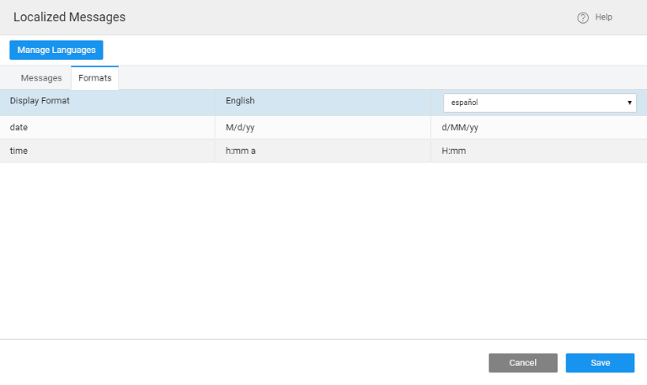
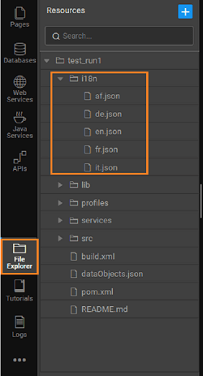
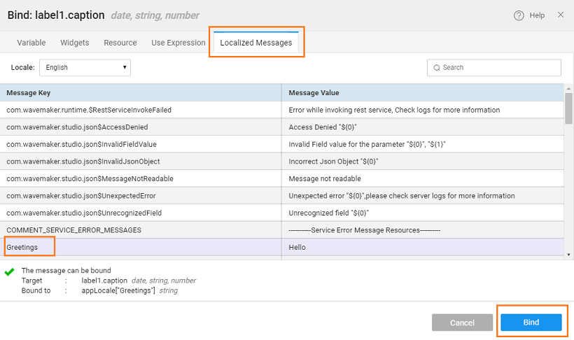

## 1: App Messages

1. the **Actions Menu**, click on **18N** option. 
2. ** Messages** dialog shows a list of localized text in the current application. The localized text appears as a dictionary of keys and values in different languages. 
3. Add new language, click on the **Language** button. It opens the Languages window. Click on the desired language and select the Plus icon. Add all the desired languages and click 
4. add localized messages, select the Language and click on the message to edit. 
5. create a new localized text, click the **icon** 
6. a **Key** and enter messages for all the Languages added and click to save. 
7. can also set the date and time formats specific to a required locale. This will ensure that the date and time pickers are properly aligned and set to the preferred format. 
8. format changes can also be implemented by using the Number widget. This will change the format based upon the selected or browser locale. ( [here to know more](/learn/app-development/widgets/form-widgets/number/)).

## 2: Binding

- creates a file for each of the locales. You can find the list of files when you select in the **Explorer** section from the Developer Utilities Menu. You can edit, save and delete these files in the Code Editor 
- display the messages, select the Label and using the **Panel**, you can bind the or any other relevant property to any of the application messages of the project. Once you have bound all the relevant widgets to the messages, you need to enable the application to show the message based on the user's locale. 

## 3: Application

Let us see how we can add localization to our applications.

- and drop a **Locale** widget on the project. This widget is bound by default to the variable created when the locales were added in the previous step. Use a label bound to the Localized Message created in the previous step. 
- and run the application. From the Select widget choose a language and see the text change in the Label widget
- the user selects a on your application or when you set the _language_ of the app from the [Settings](http://[supsystic-show-popup id=108]) dialog, WaveMaker applies the relevant locale settings to show the messages as per its value for that locale.

[3\. Form Widgets](/learn/app-development/widgets/widget-library/#form)

- [3.1 Button](/learn/app-development/widgets/form/button/)
- [3.2 Button Group](/learn/app-development/widgets/form/button-group/)
- [3.3 Calendar](/learn/app-development/widgets/form/calendar/)
- [3.4 Checkbox](/learn/app-development/widgets/form/checkbox/)
- [3.5 CheckboxSet](/learn/app-development/widgets/form/checkboxset/)
- [3.6 Chips](/learn/app-development/widgets/form-widgets/chips/)
- [3.7 Color Picker](/learn/app-development/widgets/form/color-picker/)
- [3.8 Currency](/learn/app-development/widgets/form/currency/)
- [3.9 Date](/learn/app-development/widgets/form-widgets/date-time-datetime/)
- [3.10 Datetime](/learn/app-development/widgets/form-widgets/date-time-datetime/)
- [3.11 FileUpload](/learn/app-development/widgets/form/file-upload/)
- [3.12 Radioset](/learn/app-development/widgets/form/radioset/)
- [3.13 Rating](/learn/app-development/widgets/form/rating/)
- [3.14 Select](/learn/app-development/widgets/form/select/)
- [3.15 Select Locale](/learn/app-development/widgets/form/select-locale/)
    - [Properties](/learn/app-development/widgets/form/select-locale/#properties)
    - [Events](/learn/app-development/widgets/form/select-locale/#events)
    - [Use Cases](#)
- [3.16 Slider](/learn/app-development/widgets/form/slider/)
- [3.17 Switch](/learn/app-development/widgets/form/switch/)
- [3.18 Text](/learn/app-development/widgets/form/text/)
- [3.19 Textarea](/learn/app-development/widgets/form/textarea/)
- [3.20 Time](/learn/app-development/widgets/form-widgets/date-time-datetime/)
- [3.21 Toggle](/learn/app-development/widgets/form/toggle/)
