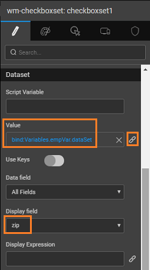

WaveMaker offers three ways of allowing user to choose from given options:

- : widget lets the user to select values from an available list of options. The options are given in the form of a drop-down list from which the user can choose one option.
- and Checkboxset are used when there are multiple values belonging to a single group to choose from. In case we have a yes/no or true/false scenario, we can use the Checkbox widgets.

WaveMaker offers three ways of allowing a user to choose from given options:

Note: We are using Radioset and Checkboxset since we have multiple values belonging to a single group to choose from. In case we have a yes/no or true/false scenario, we can use the Checkbox widgets. Note: Checkbox is used for multiple selections, usually. Here we are using it only for demo purpose.

This document gives you the usage details of these three widgets. We will be:

- the that ships with Studio to display the number of employees from a given city, state and zip.
- user will select the values for the three fields, city, zip and state using the Select, Radio and Checkbox widgets, respectively.
- will be writing a query which takes city, state and zip as input parameters and returns the total number of employees from that place.
- input parameters of the query will be bound to the selected values of the widgets and the result to the text widget for display.

1. /Create a project.
2. [the default hrdb database](http://[supsystic-show-popup id=106])
3. [and save a query](http://[supsystic-show-popup id=117]) to retrieve the total number of employees from a given city, state, zip. Save it as EmpTotal.
    
     count(EMP\_ID) as total
    from employee
    where city = :city and state = :state and zip = :zip
    group by city, state, zip
    
    
4. and drop a Select, Radioset, Checkboxset and a Label widget onto the canvas. 
5. a [Crud Variable](http://[supsystic-show-popup id=105]) for the Employee entity 
6. the widgets thus:
    - : bind it to the Employee - Set the datafield property to city and display field also to city. The display field is the value that the user sees while the datafield is the value that is internally represents the display value. In this case both are the same. 
    - the above two steps for and Choose the appropriate properties.        
7. a [API Variable](http://[supsystic-show-popup id=105]) for the Query service 
8. variable data city, state and zip to the selected values of Select, Checkboxset and Radioset widgets.  
9. the caption property of the Label widget to the output from the query 
10. the project and select the various values to see the output.
