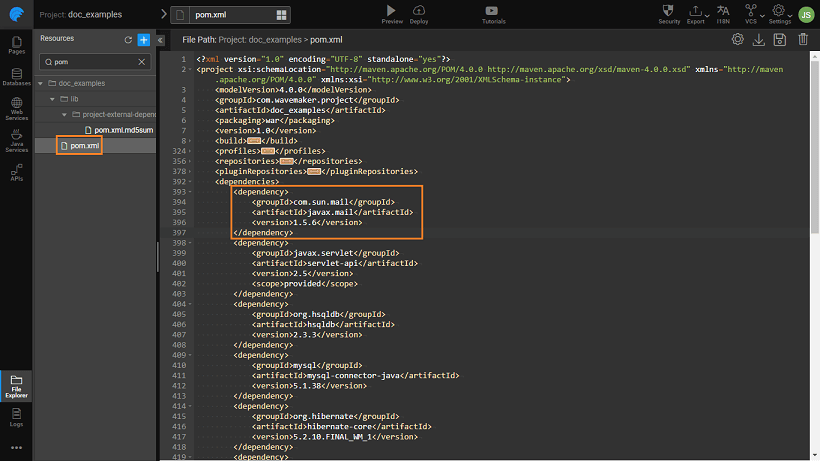
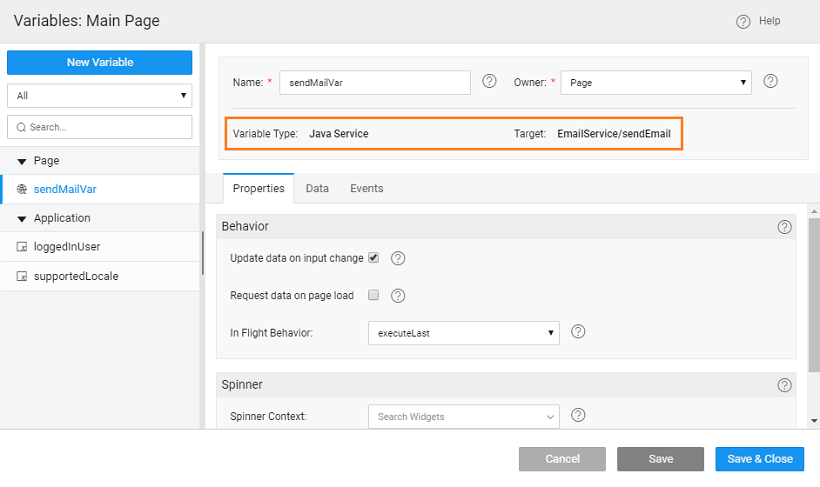
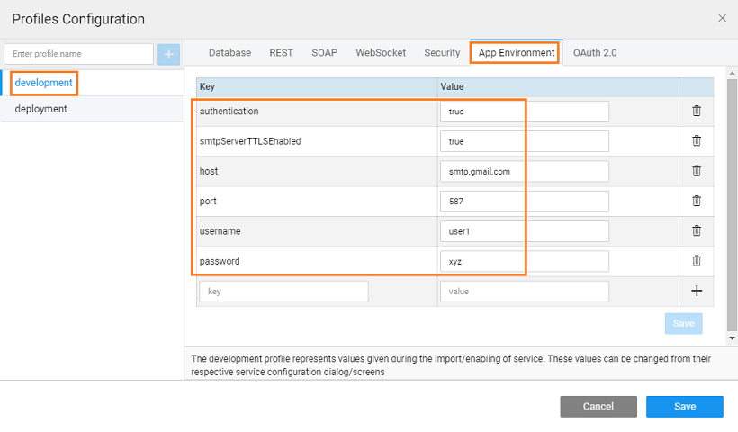

We will see how to implement send email in Java Service using Java Mail API.

The process shows:

1. to create an Email client to send out emails.
2. to use Java Mail API in a Java Service to send out emails.
3. to parameterize the Java Service.

**1: Adding Mail.jar** This can be done in two ways:

**1**: Download and Import file of your choice into your app using the [Resource](http://[supsystic-show-popup id=112]) option to the folder.

OR

**2**: Add dependency:

1. the project and access File Explorer
2. for pom.xml
3. following dependency needs to be added to  file under section:
    
    <dependency>
        <groupId>com.sun.mail</groupId> 
        <artifactId>javax.mail</artifactId> 
        <version>1.5.6</version> 
    </dependency>
    

 **2: Creating Java Service**:

1. a [Service](http://[supsystic-show-popup id=119]), named EmailService
2. the following import statements in the Java service created in the above step.
    
     javax.servlet.http.HttpServletRequest;
    import javax.annotation.PostConstruct;
    import org.slf4j.Logger;
    import org.slf4j.LoggerFactory;
    import org.springframework.beans.factory.annotation.Autowired;
    import org.springframework.beans.factory.annotation.Value;
    import java.util.Properties;
    import javax.mail.Message;
    import javax.mail.Authenticator;
    import javax.mail.MessagingException;
    import javax.mail.Session;
    import javax.mail.Transport;
    import javax.mail.internet.InternetAddress;
    import javax.mail.internet.MimeMessage;
    import javax.mail.PasswordAuthentication;
    import com.wavemaker.runtime.security.SecurityService;
    import com.wavemaker.runtime.service.annotations.ExposeToClient;
    import com.wavemaker.runtime.service.annotations.HideFromClient;
    
3. the following class definition for the EmailService : Here we are setting default values for the properties like username, password, etc. required by the EmailService. To set them to Environment level values see the next section.
    
    @ExposeToClient
    public class EmailService {
    
        private static final Logger logger = LoggerFactory.getLogger(EmailService.class);
        private Session session;
    
        private boolean authentication=true;
        private boolean smtpServerTTLSEnabled = true;
        private String host = "smtp.gmail.com";
        private String port = "587";
        private String username="<Username>";
        private String password="<password>";
    
        @PostConstruct
        public void init() throws Exception {
            Properties props = new Properties();
            props.put("mail.smtp.auth", String.valueOf(authentication));
            props.put("mail.smtp.starttls.enable",smtpServerTTLSEnabled);
            props.put("mail.smtp.host", host);
            props.put("mail.smtp.port", port);
            session = Session.getInstance(props, new Authenticator() {
                @Override
                protected PasswordAuthentication getPasswordAuthentication() {
                return new PasswordAuthentication(username, password);
                }
            });
        }
    
        public void sendEmail(String toEmailAddress, String emailSubject, String emailMessage) {
            logger.info("toEmailAddress {}, emailSubject {}, emailMessage {} ",
            toEmailAddress,emailSubject,emailMessage);
            try {
                Message message = new MimeMessage(session);
                message.setFrom(new InternetAddress(username));
                String\[\] recipientList = toEmailAddress.split(",");
                InternetAddress\[\] recipientAddresses = new InternetAddress\[recipientList.length\];
                int counter = 0;
                for (String recipient: recipientList) {
                    recipientAddresses\[counter\] = new InternetAddress(recipient.trim());
                    counter++;
                    }
                message.setRecipients(Message.RecipientType.TO, recipientAddresses);
                message.setSubject(emailSubject);
                message.setText(emailMessage);
                Transport.send(message);
                logger.info("Sent message successfully....");
                 } catch (MessagingException e) {
                    throw new RuntimeException(e);
                }
            }
    }
    

**3: Using the Java Service**:

1. 1. a [Service Variable](http://[supsystic-show-popup id=105]) the Java service created in the previous steps.

- can then use this service variable as per your business logic.

 

**email Service**:

1. the above Java Service example, you can parameterize the properties.
2. example, currently, in the above Java Service, we are using “ smtp.gmail.com ” as the SMTP host. Also the username, password fields are set to default values.
3. can set these properties at the environment level by adding the “@Value” annotation and remove the default values set onto the fields.
4. parameterizing the fields, the Java Service will look like below:
    
    @Value("${app.environment.authentication}")
    private boolean authentication;
    @Value("${app.environment.smtpServerTTLSEnabled}")
    private boolean smtpServerTTLSEnabled;
    @Value("${app.environment.host}")
    private String host;
    @Value("${app.environment.port}")
    private String port;
    @Value("${app.environment.username}")
    private String username;
    @Value("${app.environment.password}")
    private String password;
    
5. [Settings](http://[supsystic-show-popup id=108]) navigate to the [Configuration](http://[supsystic-show-popup id=109])
6. Development section access the App Environment tab and add the values as per your needs: 
7. can use these app environment variables as per your app needs. [here for more](/learn/how-tos/using-app-environment-properties/)

Service Use Cases

- [1\. How to send emails using Java Service](/learn/how-tos/sending-email-using-java-service/)
- [2\. How to implement forgot password feature using Java Service](/learn/how-tos/implementing-forgot-password-feature-using-java-service/)
- [3\. How to access REST APIs from Java Service](/learn/how-tos/accessing-rest-apis-java-service/)
- [4\. How to schedule a Java Service](/learn/how-tos/scheduling-java-service/)
- [5\. How to accomplish Pre-Post Processing for a DB Service APIs](/learn/how-tos/pre-post-processing-db-service-apis/)
