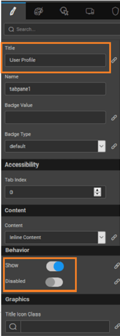

can be used when you need multiple containers within a single window. Tab-based navigation provides an easy and powerful mechanism to handle a huge amount of content within a limited area through separating content into different panes where one pane is viewable at a time. The user can quickly access the content by switching between the panes without leaving the page.

interface design, a tabbed document interface (TDI) or Tab is a graphical control element that allows multiple documents or panels to be contained within a single window,  using tabs as a navigational widget for switching between sets of documents. It is an interface style most commonly associated with a web browser, web application and text-editor, and preference panes.

you drag and drop a Tab widget, it comes with three default three panes. Each pane can have a separate header and content.

### Features - Tabs

1. Tab Pane.
2. Position to change where the tab header will be displayed, with respect to the content.
3. Pane Index - to set the tab to be opened by default.
4. Tab order for the display order.

### Features - Tab Pane

1. \- Provide title to the tab
2. \- Not allowing users to view or perform any operation on the tab

When to use tabs:

1. organize content at a high level
2. alternate between views within the same context
3. logically chunk the content behind the tabs
4. users don't need to see content from multiple tabs simultaneously

 

has few methods exposed on widget scope which can be accessed via JavaScript. See below for usage example

- navigate to previous tab pane:
    
    1.prev(); //Navigates to previous tab
    
- navigate to next tab pane:
    
    1.next(); //Navigates to next tab
    
- navigate to a specific tab pane:
    
    1.goToTab(2); //Navigates to second tab
    
- select to a specific tab pane:
    
    1.select(); //selects tabpane1
    

# Access

will see how Tab events can be accessed using the JavaScript. We will be seeing how to access the previous, next and goToTab functions to navigate between the tabbed content. We are using the sample hrdb with Employee table as an example to load the data. **1:- (Prepare data and widgets)**

1. three variables of type ‘Employee’ entity and for 1st variable from variables tab select the variable and go to data tab and for deptid keep value as 1, do the same for others also as deptid 4, 2 for respective variables, name these variables as ‘EngineeringEmployeesData’, ‘SalesEmployeesData’, ‘MarketingEmployeesData’. [how to create variables from here](/learn/app-development/variables/database-crud/#menu)
2. n Drop Tab widget. By default, you will see a tab with 3 tab panes.
3. ‘Tab’ widget as ‘EmployeesTab’ and name tab panes as ‘engineeringEmpPane’, ‘salesEmpPane’, ‘marketingEmpPane’.
4. tab panes titles to ‘Engineering’, ‘Sales’, ‘Marketing’.
5. ‘List’ widget in each of these tabs and bind to respective variables and map template widgets to respective fields.
6. three buttons and name the first button as ‘previousBtn’, the second one as ‘nextBtn’ and last one as ‘goToSalesBtn’ and also change the titles to ‘Previous’, ‘Next’, ‘Go To Sales’.

**2:- (Scripting with tabs)**

1. JavaScript for the on click event of ‘previousBtn’ and use the following as javascript function with the following script:
    
     = function($event, widget) {
    Page.Widgets.EmployeesTab.prev(); //Navigates to previous tab
    };
    
2. JavaScript for the on click event for ‘nextBtn’ and use the following script:
    
     = function($event, widget) {
    Page.Widgets.EmployeesTab.next(); //Navigates to next tab
    };
    
3. JavaScript for the on click event for ‘goToSalesBtn’ and use the following script:
    
     = function($event, widget) {
    Page.Widgets.EmployeesTab.goToTab(2); //Navigates to sales tab
    };
    

**3:- (Run)**

1. the application by default first tab pane is opened by default.
2. on ‘nextBtn’ and see the ‘salesPane’ will be opened.
3. on ‘previousBtn’ and see the ‘engineeringPane’ will be opened.
4. on ‘goToSalesBtn’ and see the ‘salesPane’ will be opened.

name is a unique identifier for tab.

Tab Pane

action allows one to add multiple panes to the Tab.

height of tab can be specified in px or % (i.e 50px, 75%).

Position

property determines if the tabs should be displayed on the

- ,
- _(default)_,
- or
- of the tab content.

Pane Index

property sets the default active pane on a load of the widget based on the provided index. The tab index is an integer starting from 0, 1, 2 and so on. That is, setting this property to 0 will display the first tab pane; setting to 1 will display the second tab pane.

determines whether or not a component is visible. It is a bindable property.

on Demand (visible only when show property is bound to a variable)

this property is set and show property is bound, the initialization of the widget will be deferred till the widget becomes visible. This behavior improves the load time. Use this feature with caution, as it has a downside (as we will not be able to interact with the widget through script until the widget is initialized). When show property is not bound the widget will be initialized immediately.

property defines the transition effect to be applied when switching tabs. You can choose from or When the transition property is \`slide\`, selected tab will be animated into the viewport. \`Swipe events\` will work only when the transition value is \`slide\`.

Align

text alignment horizontally, can be left, center or right.

Order

order of the Tabs can be changed using the arrow icons next to the tab names.

**Pane**

SubWidget of Tabs, to hold the tab content

property defines the heading or title for the tab panes.

name is a unique identifier for tab pane.

Value

to be displayed in the badge span for the tab pane

Type

property controls the color of the badge. These values are:

- ,
- ,
- ,
- ,
- , or

Index

tab index attribute specifies the tab order of an element. You can use this property to change the default tabbing order for widget access using the tab key. The value can range from 0 to 32767. The default is 0 and -1 makes the element non-focusable.

NOTE: In Safari browsers, by default, Tab highlights only text fields. To enable Tab functionality, in Safari Browser from Preferences -> Advanced -> Accessibility set the option "Press Tab to highlight each item on a webpage".

content or Partial page's content to be included in the widget.

determines whether or not a component is visible. It is bindable.

the disabled property is true (checked) the value of the editor cannot change. The widget becomes display-only. It is bindable.

Icon Class

property can assign an icon for the pane.

load

event handler is called when the widget is loaded.

**Events**

select

event handler is called when the tab is selected.

deselect

event handler is called when the tab is deselected.

[2\. Container Widgets](/learn/app-development/widgets/widget-library/#container)

- [2.1 Accordion](/learn/app-development/widgets/container/accordion/)
- [2.2 Container](/learn/app-development/widgets/container/container/)
- [2.3 Grid Layout](/learn/app-development/widgets/container/grid-layout/)
- [2.4 Panel](/learn/app-development/widgets/container/panel/)
- [2.5 Tabs](/learn/app-development/widgets/container/tabs/)
    - [Features](#features)
        - [Tab Features](#tab-features)
        - [Tab Pane  Features](#pane-features)
    - [Methods](#methods)
    - [Script  Access](#script-access)
    - [Properties](#properties)
    - [Events](#events)
- [2.6 Tile](/learn/app-development/widgets/container/tile/)
- [2.7 Wizard](/learn/app-development/widgets/container/wizard/)
