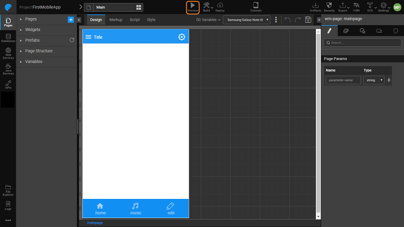

the design and building an app is completed, it needs to be tested. The easiest way to test an application is to click the  from the Project Workspace. When you click **, ** are given an URL for the web application that can be accessed by anyone in your network (e.g., by anyone inside your network firewall).

is recommended only for test or trial purpose as the application is deployed to the WaveMaker server provided with WaveMaker. When you stop WaveMaker, using the WaveMaker console, the application stops too. Using the WaveLens app, you can test run the hybrid mobile apps directly using any smartphone.

- run the application in a new browser window.
- **Preview** will be displayed, where one can select the **device** to run the app. This will give you an idea of how the app looks on various devices like various phone sizes.
- **code** is also displayed which can be used to access the app on a mobile device with ease. You can choose to remove this preview toolbar if not needed. 

**Runtime** The application will then open with a URL in the following format: _://www.wavemakeronline.com/unique-id/app-name/login.html#/login_ Here are the elements of the generated URL:

- : URL of WaveMaker Cloud where applications are hosted.
- **\-id**: Name of the application space that you provide while registration. It is unique to a user.
- **\-name**: Name of your application, which is the same as the name of your WaveMaker project. You can change this by setting the _root_ parameter during the application deployment
- : A default start page for applications with security enabled. If you are not using security, this will not be part of the URL. Instead, your URL would be._://www.wavemakeronline.com/unique-id/app-name/#/Main_

long as your project is running in WaveMaker Studio, it will be available to other users. If you close the project or log out of WaveMaker Studio, it will become unavailable. When you open a new project within WaveMaker Studio the current project is closed.

3 Platform Installer

- [3.1 Test Run (Preview)](#)
    - [App Preview](#)
    - [Debugging Mobile Apps](/learn/hybrid-mobile/debugging-mobile-apps/)
        - [on Android](/learn/hybrid-mobile/debugging-mobile-apps/#android)
        - [on iOS](/learn/hybrid-mobile/debugging-mobile-apps/#ios)
    - [Testing using Wavelens](/learn/hybrid-mobile/testing-hybrid-mobile-apps-using-wavelens/)
- 3.2 Mobile Build
    - [Android Build](/learn/hybrid-mobile/mobile-build/#android)
    - [Send to PhoneGap](/learn/hybrid-mobile/mobile-build-phonegap/#phonegap)
    - [Manual build - Using cordova zip](/learn/hybrid-mobile/mobile-build-manual/#manual)
