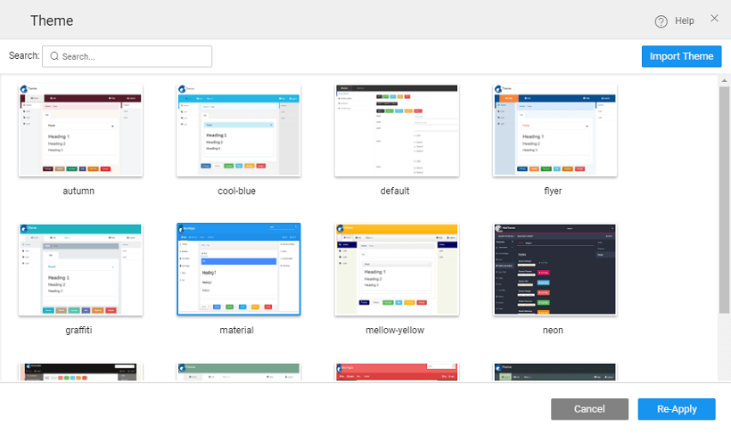
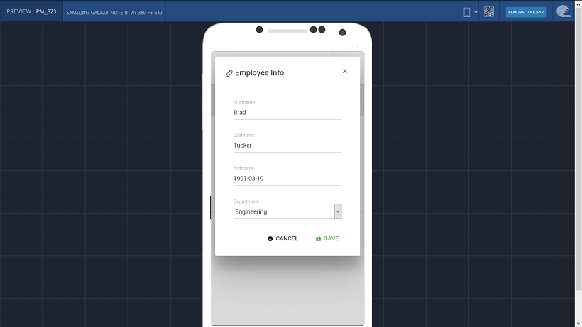
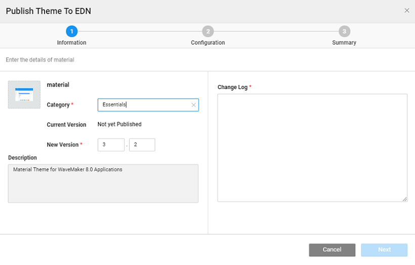

style elements which work at the widget or UI component level. Themes help you provide a consistent look and feel to your application. Theme mainly contains the following styling for all the elements on the page:

1. \- background, text color, border color, hover/active/focus colors etc.
2. for text like text-align, text-decoration, font-size, font-weight etc.
3. like margin, padding, border-radius etc.

In this document the following concepts are elaborated upon:

- [themes](#apply-theme) to WaveMaker app,
- [custom themes](#import-theme),
- [themes](#create-theme) for WaveMaker [apps](#create-theme-web), [Bootswatch](#create-theme-bootswatch), and for  [apps](#create-theme-mobile),
- a WaveMaker app,
- or changing theme temporarily,
- the Theme to EDN, and
- [package structure](#theme-packaging)

## Theme

**the theme** of the page, simply click on the option from the _Toolbar:_

will open a Theme dialog with a list of available themes to choose from.

 : WaveMaker provides a few default themes that can be applied to your apps. From time to time, these Themes might undergo changes and you might be asked to update the theme when you open the project.  that the updates will re-write any changes you made directly to the CSS styles of the corresponding theme.

## Theme

You can use your own theme by importing it into your app. [below to know how to create Theme](#create-theme)

(: For Enterprise version, the custom themes will be available once they are published to the EDN and approved by the EDN Admin, WITHOUT any need for Import)

the above Themes dialog, choose the **Theme ** for a pop-up window which will allow you to select a WaveMaker theme zip file. Once imported, the Theme will appear in the _dialog_ To apply the theme, select the imported theme and **\-Apply**

#  Theme for WaveMaker Apps

app (Web & Mobile) theme is based on the BootStrap CSS markup. Creation of a theme requires a working knowledge of HTML, CSS, LESS and Grunt.

: Before creating a Theme, make sure you have the following installed on your system:

:

1. GIT Bash prompt
2. using the following command:
    
     install -g grunt-cli
    
    For more information on grunt [here](https://gruntjs.com/getting-started)
3. using the following command:
    
     install -g bower
    
    For more information on bower [here](https://www.npmjs.com/package/bower)
4. the **Theme repository**
    
     git clone https://github.com/wavemaker/grunt-wavemaker-theme.git
     cd grunt-wavemaker-theme
     npm install
    
    Follow the instructions given [the GIT repository](https://github.com/wavemaker/grunt-wavemaker-theme)
5. setting up the repository, under the folder you will find the following files that can be modified as per your needs:  : Themes for Web and Mobile(Android/iOS) apps are different, use the appropriate theme source file to generate the theme bundle.

**Structure**

1. : The web fonts can be copied here and referenced in the theme. There will be references to Roboto regular fonts in the variables.less (src/web), to avail them please download Roboto regular fonts and paste them in fonts directory (src/web/fonts).
2. : This contains essential properties required to identify the theme
    - **_:_** for the theme,
    - **_:_** of the theme. Updated version will be used to replace the existing theme in the project.
    - : a short meaningful of the theme,
    - **_:_** THEME (DO NOT CHANGE THIS), and
    - : name of the author for the theme.
3. : Used to visually identify the Theme in the Theme dialog. The size of the image should be 160 x 120 px.
4. **:** This less file includes styles for components like header, footer, leftnav, calendar etc., which are not defined in the bootstrap CSS. These components can be further customized in this file by using the variables defined at the beginning of the file eg header background color can be changed using the @wm-header-bg-color variable.
5. **_: _** less file includes the styles defined by bootstrap. The values defined in this file are used by the widgets like buttons, links, textbox etc. Refer [documentation](http://getbootstrap.com/customize/) on LESS variables for more details.

## WaveMaker Theme for Web Apps

Following are steps for creating a theme for a web app:

1. [up theme repository](#create-theme), navigate to the folder.
2. and in the editor of your choice.
3. use the **fonts** in the theme, copy the web fonts (.ttf,.eot,woff) in the font folder and include the font definition in :
    
    @font-face {
     font-family: 'robotoregular';
     src: url('fonts/Roboto-Regular-webfont.eot');
     src: url('fonts/Roboto-Regular-webfont.eot?#iefix') format('embedded-opentype'),
     url('fonts/Roboto-Regular-webfont.woff') format('woff'),
     url('fonts/Roboto-Regular-webfont.ttf') format('truetype'),
     url('fonts/Roboto-Regular-webfont.svg#robotoregular') format('svg');
    }
    
4. contain variables which are used while building the bootstrap CSS.  For example, `@brand-primary` value change will affect all the styles using this specific property value. More information on variables at the [site](http://getbootstrap.com/customize/)
    
    //## Gray and brand colors for use across Bootstrap.
    @brand-primary:         #551C2B;
    @brand-success:         #088362;
    
    [on Styling App Components](/learn/how-tos/customizing-theme/)
5.  the theme.png with your image in the web folder
6. the .wm-properties to [theme information](#dir-struct)
7. [the theme](#build-theme)
8. theme will be saved under _\-wavemaker-theme/dist_ as
9. and the Theme to your app.

##  WaveMaker Theme for Web apps using Bootswatch

Bootswatch provides bootstrap themes that can be integrated into your WaveMaker web apps. The prerequisites and setup for building WaveMaker theme are the same as mentioned in the [section](#create-theme)

1. a theme from
2. the and files for the selected theme.
3. [up theme repository](#create-theme), navigate to the folder.
4. and files to  _\-wavemaker-theme/src/bootswatch_ folder.  : The variable files downloaded from bootswatch will fail if placed in any other theme folders like mobile or web.
5. can further customize the theme in style.less specific to the header, footer, leftnav etc. [here for details](#create-theme-web)
6.  the theme.png with your image in the bootswatch folder
7. the .wm-properties to [theme information](#dir-struct)
8. [the theme](#build-theme)
9. theme will be saved under _\-wavemaker-theme/dist_ as
10. and the Theme to your app.

## WaveMaker Theme for Mobile Apps

Mobile Apps come in two flavors - Android and iOS. The theme renders differently on these platforms and as such the theme needs to be packaged differently.

For example, below is the rendering of a Live Form within List on Android and  iOS device:

mentioned in the [section](/learn/app-development/ui-design/themes/#create-theme), WaveMaker provides two folders for Mobile Themes - Android and iOS. The structure is replica of that for Web with the content tailored for the specific platform. When building theme for Mobile Apps, make sure that you use the appropriate files and make the same changes to both sets. DO NOT replicate the files, make changes where needed.

## WaveMaker Theme

Once you have incorporated all your changes to the Theme files, you need to build it.

1. the command prompt, build the themes using the following commands:
    
     grunt-wavemaker-theme
    grunt themes
    
2. **file** (web.zip/mobile.zip/bootswatch.zip) for the theme will get generated in the **\-wavemaker-theme/dist** folder.
3. can [the theme](#import-theme) and it to your application.

## a Custom Theme

You can test the custom theme, before import, by copying the file directly into your app. From the left _ Utilities_, open _Explorer_ and you will find the file under **\-> current theme folder** Save and run the app. :

- changes are temporary, for permanent change you have to import the Theme.
- you make changes to the default theme file and do not import it as your custom theme, updating the theme will erase those changes.

## a Custom Theme

##### Enterprise Version post 10.0 release

In order to make a custom theme available to developers across the enterprise, it needs to be published. Following are the steps to publish a Theme:

1. you have created a custom theme, import and test it in your application.
2. the **Configurations**, under select the **to EDN** option. 
3. publishing wizard with three steps will appear:
    
    1. 1. regarding the , , and **Log**
        2.  allows you to add for search and tracking purposes and also includes the populated automatically.
        3. for a review before Publishing.
    
    
4. that the current Theme applied to the application will be selected for Publishing.
5. the EDN Admin approves the Theme, the same will be available in the Artifacts listing and the Themes dialog for other developers to select and apply.

## Theme Package Structure

### Responsive

creating a custom theme for WaveMaker application, you need to understand the package structure. The theme package contains the following files:

containing web-based fonts used in the app.

essential properties required to identify the theme which includes the of the theme, of the theme, a short meaningful of the theme, the should be THEME (DO NOT CHANGE THIS), and the name of the for the theme.

styles related to the theme.

icon.

variables to define colors, sizes and more.

## Mobile

a hybrid app mobile theme, there can be different flavors for android and ios systems. Hence, in a theme bundle, there are different folders for android and ios.

is the package structure:

\-Folder

essential properties required to identify the theme which includes the of the theme, of the theme, a short meaningful of the theme, the should be THEME (DO NOT CHANGE THIS), and the name of the for the theme.

icon.

containing web-based fonts used in the app.

styles related to the theme.

variables to define colors, sizes and more.

containing web-based fonts used in the app.

styles related to the theme.

variables to define colors, sizes and more.

We have learned how WaveMaker themes work and how we can build, import and apply custom themes.

< Page Artefacts

2\. Design UI

- 2.1 Overview
    - [App UI Design](/learn/app-development/ui-design/design-overview/#app-ui-design)
    - [Responsive Design](/learn/app-development/ui-design/design-overview/#responsive-design)
    - [UI Development](/learn/app-development/ui-design/design-overview/#ui-development)
- 2.2 Page Concepts
    - [Single Page Apps](/learn/app-development/ui-design/page-concepts/)
    - [Page Life Cycle](/learn/app-development/ui-design/page-concepts/#page-lifecycle)
    - [Page Creation](/learn/app-development/ui-design/page-creation/)
    - [Parameter Passing](/learn/app-development/ui-design/page-creation/#page-parameters)
    - [Partial Pages](/learn/app-development/ui-design/page-concepts/partial-pages/)
    - vi. Page Basics
        - [Page Layouts](/learn/app-development/ui-design/page-concepts/page-layouts/#page-layouts)
        - [Page Navigation](/learn/app-development/ui-design/page-concepts/page-layouts/#page-navigation)
        - [Events](/learn/app-development/ui-design/page-concepts/page-layouts/#events)
            - [Event Categorization](/learn/app-development/ui-design/page-concepts/page-layouts/#event-categorization)
            - [Multiple Event Handling](/learn/app-development/ui-design/page-concepts/page-layouts/#multiple-events)
    - [Page Templates](/learn/app-development/ui-design/page-concepts/page-templates/)
        - [ Custom Page Templates](/learn/app-development/ui-design/page-concepts/page-templates/#creating-page-templates)
    - [Use Cases](/learn/app-development/ui-design/use-cases-ui-design/)
- [2.3 Project Shell](/learn/app-development/ui-design/project-shells/)
- 2.4 Page Artefacts
    - [Overview](/learn/app-development/ui-design/page-artefacts/)
    - [Markup](/learn/app-development/ui-design/page-artefacts/#page-markup)
    - [Script](/learn/app-development/ui-design/page-artefacts/#page-script)
    - [Style](/learn/app-development/ui-design/page-artefacts/#page-style)
    - [Variables](/learn/app-development/ui-design/page-artefacts/#page-variables)
- [2.5 Themes](#)
    - [Overview](#)
    - [Applying Theme](#apply-theme)
    - [Importing Theme](#import-theme)
    - [Creating Themes](#create-theme)
        - [Creating Web Theme](#create-theme-web)
        - [Creating Web Theme using Bootswatch](#create-theme-bootswatch)
        - [Creating Mobile Theme](#create-theme-mobile)
    - [Building Theme](#build-theme)
    - [Testing Theme](#test-theme)
    - [Publishing Theme](#publish-theme)
