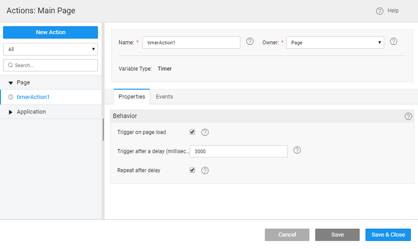
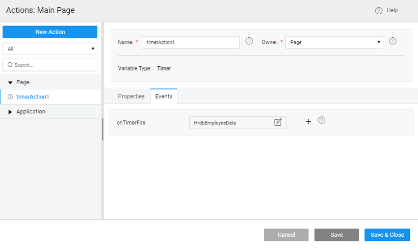

**action** can be used to trigger events repeatedly at timed intervals.

# Creation

1. create a Timer Action:
    - the Action option from Variables on the Workspace Toolbar  click New Action from the Actions dialog. 
2.   **Action** wizard will open.
    
    2. \- set by default which can be modified
    3. \- the scope of the Variable being created. By default it is set to Page, you can change it to Application if you want this variable to be available across the app.
    4. can set the ( [more](#properties))
    5. to create the Action
3. will be directed to the Actions dialog, with the new action listed.  As you can see:
    1. Timer Action is created,
    2. properties tab contains the properties. [more about properties](#properties)
    3. events tab will contain the events that can be configured to trigger any action. [more about events](#events)

Timer Variables are special variables that can be used to trigger a particular event at regular time intervals.

on page load

this option will ensure that the timer starts at page load.

after a delay

the time delay, in milliseconds, before triggering the specified event.

after delay

whether the timer is one-time or a repeating event.

a Timer Action is triggered, if it is Page scoped, then the action (and its repeating event) is destroyed when you navigate away from the page. If it is App scoped, it has to be manually stopped through method.

1. **Timer Fire**: This event will be triggered on the completion of the timer. If the property on the Timer Action is set then the event is invoked after the milliseconds of time supplied in ‘delay’ property of the timer action. The event is invoked once if ‘’ flag is off and repetitively after every ‘delay’ milliseconds if ‘repeating’ flag is on. The repeating Timer Action event can be stopped in either of the two ways:
    
    1. the method on the Timer Action through the script at any point in time.
    2. it is Page scoped, the action (and its repeating event) is destroyed once you navigate away from the page. If it is App scoped, it has to be manually stopped through the above step.
    
    **Examples:**
    
    You can assign a Variable (or multiple Variables) or a Javascript method with custom logic in for dynamic behavior as required.

1. a Variable that fetches the updates from Employee database with the latest after every 30 seconds.  
2. Variable that gives Facebook-like feeds after a certain timestamp. Assign Javascript to the onTimerFire event and write following logic. Once the Timer Action is triggered, if repeating property is set, then the variable will be invoked after every delay milliseconds.
    
    1onTimerFire = function(variable, data){
        // set the dynamic input on the variable
        Page.Variables.WebServiceVariabe.setInput('timestamp', Date.now());
        Page.Variables.WebServiceVariabe.invoke();
    };
    
     

## (object, success callback, error callback)

This method invokes the timer variable

:

- : object with n fields, an empty object has to be passed
- : callback
- : callback

_Value_: None

_:_

  Page.Actions.timerAction1.invoke();

## ()

This method aborts the timer variable.

: none

_Value_: none

_:_

1.cancel();

< Variables & Actions

6\. Data Integration - Variables

- 6.1 Binding Layer
    - [Overview](/learn/app-development/variables/data-integration/)
- [6.2 Variables and Actions](/learn/app-development/variables/variables-actions/)
    - [Overview](/learn/app-development/variables/variables-actions/#)
    - [Variables](/learn/app-development/variables/variables-actions/#variables)
        - a. Database CRUD
            - [Overview](/learn/app-development/variables/database-crud/)
            - [Variable Creation](/learn/app-development/variables/database-crud/#creation)
            - [Properties](/learn/app-development/variables/database-crud/#properties)
            - [Events](/learn/app-development/variables/database-crud/#events)
            - [Methods](/learn/app-development/variables/database-crud/#methods)
        - b. Database API
            - [Overview](/learn/app-development/variables/database-apis/)
            - [Variable Creation](/learn/app-development/variables/database-apis/#creation)
            - [Properties](/learn/app-development/variables/database-apis/#properties)
            - [Events](/learn/app-development/variables/database-apis/#events)
            - [Methods](/learn/app-development/variables/database-apis/#methods)
        - c. Web Service
            - [Overview](/learn/app-development/variables/web-service/)
            - [Variable Creation](/learn/app-development/variables/web-service/#creation)
            - [Properties](/learn/app-development/variables/web-service/#properties)
            - [Events](/learn/app-development/variables/web-service/#events)
            - [Methods](/learn/app-development/variables/web-service/#methods)
        - d. Java Service
            - [Overview](/learn/app-development/variables/java-services)
            - [Variable Creation](/learn/app-development/variables/java-services/#creation)
            - [Properties](/learn/app-development/variables/java-services/#properties)
            - [Events](/learn/app-development/variables/java-services/#events)
            - [Methods](/learn/app-development/variables/java-services/#methods)
        - e. Security Service
            - [Overview](/learn/app-development/variables/security-service/)
            - [Variable Creation](/learn/app-development/variables/security-service/#creation)
            - [Properties](/learn/app-development/variables/security-service/#properties)
            - [Events](/learn/app-development/variables/security-service/#events)
            - [Methods](/learn/app-development/variables/security-service/#methods)
        - f. Model
            - [Overview](/learn/app-development/variables/model-variable/)
            - [Variable Creation](/learn/app-development/variables/model-variable/#creation)
            - [Properties](/learn/app-development/variables/model-variable/#properties)
            - [Events](/learn/app-development/variables/model-variable/#events)
            - [Methods](/learn/app-development/variables/model-variable/#methods)
        - g. Device Variables
            - [Overview](/learn/hybrid-mobile/device-variables/#)
            - [Services](/learn/hybrid-mobile/device-variables/#services)
            - [Operations](/learn/hybrid-mobile/device-variables/#operations)
            - [Events](/learn/hybrid-mobile/device-variables/#events)
            - [Methods](/learn/hybrid-mobile/device-variables/#methods)
            - [Usage](/learn/hybrid-mobile/device-variables/#usage)
    - [Actions](/learn/app-development/variables/variables-actions/#actions)
        - i. Navigation
            - [Overview](/learn/app-development/variables/navigation-action/#)
            - [Action Creation](/learn/app-development/variables/navigation-action/#creation)
            - [Properties](/learn/app-development/variables/navigation-action/#properties)
            - [Methods](/learn/app-development/variables/navigation-action/#methods)
        - ii. Login
            - [Overview](/learn/app-development/variables/login-action/)
            - [Action Creation](/learn/app-development/variables/login-action/#creation)
            - [Properties](/learn/app-development/variables/login-action/#properties)
            - [Data](/learn/app-development/variables/login-action/#data)
            - [Events](/learn/app-development/variables/login-action/#events)
        - iii. Logout
            - [Overview](/learn/app-development/variables/logout-action/)
            - [Action Creation](/learn/app-development/variables/logout-action/#creation)
            - [Properties](/learn/app-development/variables/logout-action/#properties)
            - [Events](/learn/app-development/variables/logout-action/#events)
        - [Timer](#)
            - [Overview](#)
            - [Action Creation](#creation)
            - [Properties](#properties)
            - [Events](#events)
            - [Methods](#methods)
        - v. Notification
            - [Overview](/learn/app-development/variables/notification-action/)
            - [Action Creation](/learn/app-development/variables/notification-action/#creation)
            - [Properties](/learn/app-development/variables/notification-action/#properties)
            - [Events](/learn/app-development/variables/notification-action/#events)
            - [Methods](/learn/app-development/variables/notification-action/#methods)
    - [Scoping](/learn/app-development/variables/variables-actions/#scoping)
    - [Variable Events](/learn/app-development/variables/variables-actions/#events)
    - [Error Handling](/learn/app-development/variables/variables-actions/#error-handling)
- 6.3 Variable Binding
    - [Overview](/learn/variables/variable-binding/#)
    - [Data Binding](/learn/variables/variable-binding/#data-binding)
    - [Widget Binding](/learn/variables/variable-binding/#widget-binding)
    - [Binding Options](/learn/variables/variable-binding/#binding-options)
- 6.4 JavaScript Access
    - [Overview](/learn/variables/accessing-elements-via-javascript/#)
    - [Widget Controllers](/learn/variables/accessing-elements-via-javascript/#widget-controllers)
    - [Page Scripting](/learn/variables/accessing-elements-via-javascript/#page-scripting)
    - [Script Access](/learn/variables/accessing-elements-via-javascript/#script-access)
