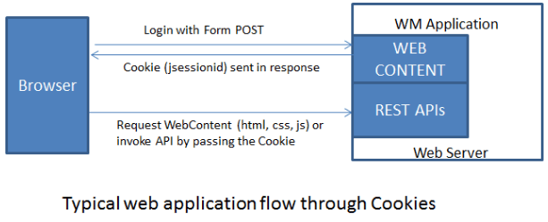

## Overview

The interaction between front-end and back-end for WaveMaker applications goes through REST APIs exposed by the back-end. For every service such as DB, Java, SOAP etc created/imported into WaveMaker application, the corresponding functionality is exposed through REST APIs. These REST APIs can be invoked from the application front-end or they can be integrated with other applications (non-WaveMaker applications). Invocation from the application front-end goes through the login page flow wherein a cookie is provided post authentication, which will be sent while invoking the back-end REST APIs.

If the REST APIs are invoked from a third-party application, the same login flow with cookie will not work. The other alternative is to send the credentials for each and every REST API call through Basic Authentication Header. Though this option works, it is not recommended for security reasons as every request carrying the credentials of the user. To avoid such problems, WaveMaker applications follows **Token Based authentication mechanism** for their REST APIs.

## How it works

Token-based authentication is an authentication mechanism mostly used for authentication of API requests. In this mechanism, the user is issued an API access token upon successful authentication, which will be used while invoking any API request. In this process, a cookie will never be issued by the server. All requests are stateless.

## What is a token?

A token is a piece of data created by the server containing information to uniquely identify the user. A new token is created for every token request, therefore there could be multiple tokens for the same user.

Eg: cc7112734bbde748b7708b0284233419.

The token should be sent as a Header with the name “_wm\_auth\_token_” when making API requests to the WaveMaker applications.

Token has a lifetime. It is valid for 1800 seconds from its creation(configurable). Expired tokens are not valid and will be discarded.

## Token Repository

Tokens issued by the server are stored in the token repository. At present WaveMaker only supports In-Memory token repository, hence they will be lost if the server gets restarted.

## Token Request

To obtain the Token an HTTP GET request has to be made to the following URL: GET \[app-hosted-url\]/services/security/token by passing the credentials through Basic auth request. In Basic authentication approach, the credentials are encoded with Base64 and sent in the header with the name “Authorization” as shown below

Header as: Authorization : Basic <base64(username:password)>

Continuing with the above example, the service URL would be: http://e1d52cdd8ecf.cloud.wavemakeronline.com/Demo/services/security/token and for username as _admin_ and password as _admin_ the header would be: Authorization : Basic YWRtaW46YWRtaW4=.

If your authentication credentials are correct, you will get the following message with the token: {"wm\_auth\_token":"ZXJpYy5saW46MTQ1ODE5MDcyNDU5NTpmZGQwYjUzMDNjMzRiZDgyZmUyZTBhZTQyYTM1NzJjYw"}

If user is not authenticated, you will get an error message as shown below along with the Http Response Code of 401: {"errors":{"error":\[{"id":null,"messageKey":"com.wavemaker.studio.json$UnexpectedError","message":null,"parameters":\["Require authentication to generate access token"\]}\]}}

## Invoke API using Token

Once a token is issued, the APIs can be accessed, by passing the token as Header Or Param. The following example shows to access the User table from the sample hrdb: Token based authorization using header parameter:

http://\[application context url\]/services/hrdb/User/
Header :
wm\_auth\_token : YWRtaW46MTQ1NzY3NjY1ODMzNzo2NmY4NjJkZTY2MGQ5NjhlMDdhMTk0YWFjMTNhNzY4Mg

Token based authorization using request parameter:

http://\[application context url\]/services/hrdb/User/?wm\_auth\_token=YWRtaW46MTQ1NzY3NjY1ODMzNzo2NmY4NjJkZTY2MGQ5NjhlMDdhMTk0YWFjMTNhNzY4Mg

**Notes**:

- If token exists both as request parameter and header, then request parameter takes precedence. Though the token can be sent in either Header or Parameter, we recommend the Header approach for security reasons.
- If the token is invalid, then 401 unauthorized error will be sent in response.

## Token Validity

By default, a token is valid for 1800 seconds since its creation. You can customize token validity seconds in project-security-provider.xml by editing below bean, before deploying the app.

<bean id="wmTokenBasedAuthenticationService" class="com.wavemaker.runtime.security.token.WMTokenBasedAuthenticationService">

The API requests with an invalid/expired token will be returned with the 401 response code.

< SSL Encryption

7\. Security

- 7.1 App Security Overview
    - [i. Overview](/learn/app-security/app-security/#)
    - [ii. How Security Works](/learn/app-security/app-security/#working)
    - [iii. How Security is Implemented](/learn/app-security/app-security/#implementation)
    - [iv. Security Terminology](/learn/app-security/app-security/#terminology)
- 7.2 Authentication
    - [i. Overview](/learn/app-security/authentication/)
    - [ii. Security Providers](/learn/app-security/authentication/#security-providers)
        - [○ Demo](/learn/app-security/authentication/#demo)
        - [○ Database](/learn/app-security/authentication/#database)
        - [○ LDAP](/learn/app-security/authentication/#ldap)
        - [○ Active Directory](/learn/app-security/authentication/#ad)
        - [○ CAS](/learn/app-security/authentication/#cas)
        - [○ SAML](/learn/app-security/authentication/#saml)
        - [○ Custom](/learn/app-security/authentication/#custom)
- 7.3 Authorization
    - [i. Overview](/learn/app-security/authorization/)
    - [ii. User Onboarding](/learn/app-security/authorization/#user-onboarding)
    - [iii. App Roles](/learn/app-security/authorization/#app-roles)
- 7.4 Access Levels & Permissions
    - [i. Overview](/learn/app-security/access-levels-permissions/)
    - [ii. Setting Permissions](/learn/app-security/access-levels-permissions/#setting-permissions)
    - [iii. Role Based Access to Widgets](/learn/app-security/access-levels-permissions/#role-based-access)
- 7.5 Login Configuration
    - [i. Overview](/learn/app-security/login-configuration/)
    - [i. Login Page](/learn/app-security/login-configuration/#login-page)
    - [ii. Landing Page](/learn/app-security/login-configuration/#landing-page)
    - [iii. Session Timeout](/learn/app-security/login-configuration/#session-timeout)
- 7.6 Security Related Variables
    - [i. Overview](/learn/app-security/security-variables)
- 7.7 SSL Encryption
    - [i. Overview](/learn/app-security/ssl-encryption/)
- 7.8 OWASP
    - [i. Overview](/learn/app-security/owasp/)
    - [ii. Preventing XSS Attacks](/learn/app-security/owasp/#xss)
    - [iii. Preventing CSRF Attacks](/learn/app-security/owasp/#csrf)
- 7.9 Single Sign-On (CAS)
    - [i. Overview](/learn/app-security/central-authentication-system/)
- [7.10 Token Based Authentication](#)
    - [i. Overview](#)
    - [ii. How Token Based Authentication Works](#working)
    - [iii. What is Token](#token)
    - [iv. Token Repository](#token-repository)
    - [v. Token Request](#token-request)
    - [vi. API Invocation](#api-invocation)
    - [vii. Token Validity](#token-validity)
- 7.11 SAML Integration
    - [i. Overview](/learn/app-development/app-security/saml-integration/)
    - [i. Profiles](/learn/app-development/app-security/saml-integration/#profiles)
    - [ii. Integration](/learn/app-development/app-security/saml-integration/#integration)
    - [iii. Configuration Files](/learn/app-development/app-security/saml-integration/#files)
    - [iv. Deployment](/learn/app-development/app-security/saml-integration/#deployment)
    - [v. Troubleshooting](/learn/app-development/app-security/saml-integration/#troubleshooting)
    - [vi. Use Cases](/learn/app-development/app-security/saml-integration/#use-cases)
