Assume, an app is used to share tasks across users in a team. A user is assigned a task which has to be completed by 5:00PM. Right now, the time is 4:30 PM and task is not completed. App wants to send an auto-reminder to the user about the task. But, app is not opened on user’s mobile device. So, app has to use third party services to send sms or email. In addition to these notification channels, a mobile operating system also provides a Push notification service. Using this service an app can send messages to the user even when the app is not in foreground. Operating system maintains an http service to which all notifications have to be posted. This service acts as a post office. Each mobile app has to register with this service and should obtain a registration id. If any notification addressed to the registration id is received, then service will simply forward them to respective mobile device. Registration id is unique for each app on device. In iOS, this service is called Apple Push Notification service (APNS). In Android, this service is called Firebase Messaging Service.

[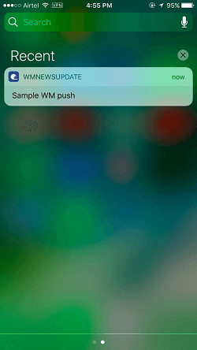](../assets/push_1.png)

 First, both mobile app and server have to register with APNS / FCM.

1. App registers for device notifications and gets registration token. This token functions as the address to send a push notification to.
2. server registers with APN server (iOS) and FCM server (Android) by submitting credentials.
3. receiving token, mobile app sends the token to backend server.
4. server stores it in the database for later use.

 These are the steps for delivering a push notification:

1. Backend wants to send a push notification to users, Backend retrieves the stored registration tokens of devices of those users.
2. , a push notification request is sent to the corresponding user devices (identified with registration tokens) via FCM / APNS.
3. / APNS will send push notification to all the devices which have this app installed.

# Example

A Cordova plugin called _\-plugin-push_ can be used by the app to create a message to be broadcast to all logged-in users.

For registration, app and backend server have to provide some information to push notification service so that they can be verified. These credentials have to be obtained first. NOTE: In a WaveMaker application, ‘Application Id’ in ‘Build for Android’ dialog is used as the App Id. [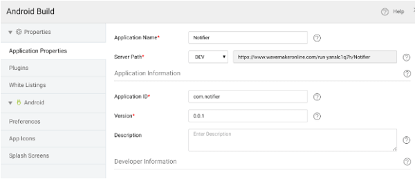](../assets/push_prereq1.png) ** Prerequisites:** Follow below steps to achieve the Android prerequisites:

1. app for Android should have _\-services.json_ that has all information required for registering with Firebase messaging service. Follow below steps to obtain it:
    1. console. Create a new project to register for notifications.
    2. the created project and click the setting icon at the top and choose Project Settings. [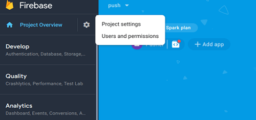](../assets/push_prereq2.png)
    3. settings, go to the general app and click ‘Add Firebase to your Android App’. 
    4. form appears to register your app. Application id that is mentioned in ‘export cordova dialog’ of your WaveMaker project has to be entered as Android package name in this form. Click Next. [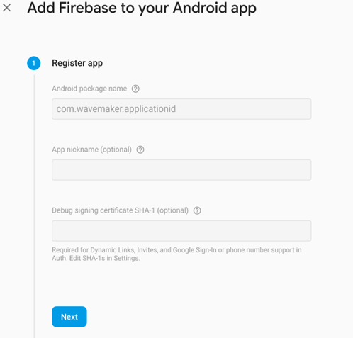](../assets/push_prereq4.png)
    5. _\-services.json_ and click next. 
2. also provides another JSON file that is required by the backend to push messages. This JSON is called the service JSON.
    1. console. Open your app that was created above.
    2. your project and click the setting icon at the top and choose Project Settings. 
    3. Firebase Console, go to settings and open ‘Service Accounts’ tab. 
    4. button with label **new private key** is located the bottom of page. A JSON file is downloaded after clicking this button. Rename this file as _\-admin-service-key.json_ 

**Prerequisites:** **to configure iOS app in developer portal**:

1. ID configured for Push Notifications on Apple Developer Portal has to be created first.
    1. in on [’s Developer Center](https://developer.apple.com/devcenter/ios/index.action)
    2. the Account tab to go to **, Identifiers & Profiles**
    3. you have not already created an App ID, create it now and make sure push notifications is enabled. Or edit your existing App ID and enable them. (NOTE: Wildcard (ending with an asterisk) app id is not allowed to use push notification service) [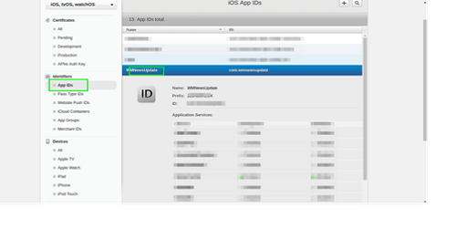](../assets/push_prereq8.png)
2. server requires to provide an APNS certificate to connect APNS.
    1. the app id created above and open push notification section. 
    2. **Certificate** and follow the instructions. 
    3. prompted upload the CSR file and continue. Download and install the certificates on your Mac. If the certificate is already created, a download option is shown.
    4. Mac, open Keychain Access, click login and drag-drop the downloaded certificate.
    5. to the certificate you want to use for your push notifications. Right-click and export it as a P12 certificate. Use as name _\-dev-cert.p12_ (in case of the development certificate). In this demo app, this certificate is named as _12_ When prompted enter a password to protect the file and note it for future use. 
3. provisioning profile has to be created for the app id created above:
    1. a provisioning profile for your app. [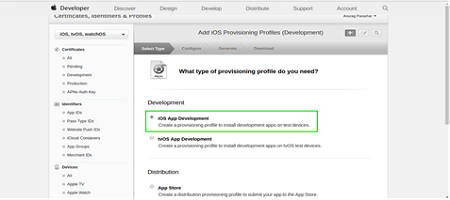](../assets/push_prereq12a.png) [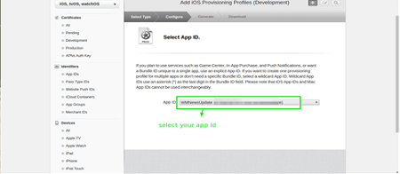](../assets/push_prereq12b.png)
    2. with the next steps
    3. the profile. Install the provisioning profile on your Mac by double-clicking it.

# Creation

1. File Explorer open and add _\-admin_ and javapns_\-jdk16_ as dependencies as shown below:
    
    <dependency>
      <groupId>com.google.firebase</groupId>
      <artifactId>firebase-admin</artifactId>
      <version>6.4.0</version>
    </dependency>
    <dependency>
      <groupId>com.github.fernandospr</groupId>
      <artifactId>javapns-jdk16</artifactId>
      <version>2.2.1</version>
    </dependency>
    
    [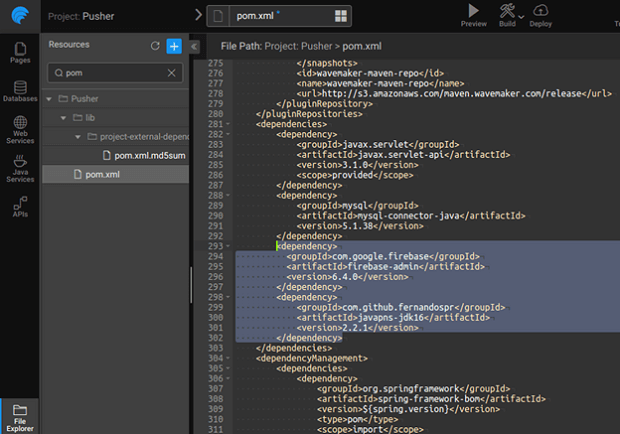](../assets/push_pomxml.png)
2. [Resource](http://[supsystic-show-popup id=112]): Import the following resources to the respective folders:
    - google-services.json (downloaded earlier) to the webapp folder. 
    - ‘FCM-admin-service-key.json’ (downloaded earlier) to /project/src/main/resources.
    - .p12 Certificate to /project/src/main/resources.
3. [a DB](http://[supsystic-show-popup id=106]) named DeviceDetails, which will store all the deviceIds, username and device type i.e. OS (Android or iOS). Mark these columns as unique. 
4. [on security](http://[supsystic-show-popup id=111]) Here we are setting it to Demo. 
5. [a Java Service](http://[supsystic-show-popup id=119]) named This service will contain registerDevice, unregisterDevice and notify methods.
    
    - will create a new record of the registered device details (deviceId, os, userName) in the db.
    - will delete the device details record in db.
    - will request the GCM/APNS to broadcast the messages to the registered devices.
    
    To obtain the above-specified functionality, download [code file ](../assets/push_PushService.txt) include the Java code in this service file.
    
    NOTE: Replace packageName, imports specific to the app, senderId, apiKey, iosCertificateName, iosCertificateKey (password for iosCertificate) values in above code.
6. [a service variable](http://[supsystic-show-popup id=105]) named to register the device to receive push notifications.
    - input fields
        - to _:deviceToken_,
        -  to _variable_ and
        - from variable. 
        - will be bound on successful push registration which is written in app.js [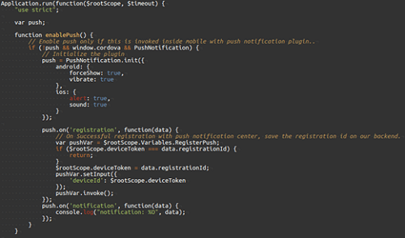](../assets/push_appjs.png)
7. every successful login, register the device for receiving the push notification. For this, [the Actions dialog](http://[supsystic-show-popup id=105]) and select the pre-defined  Go to  tab and write the _ function_ on loginVariable success. 
8. user is already logged-in, then enable push.
9. the plugin to get the deviceId, and start listening to all the events when notification is received. Store the device Id in DB that we receive on successful registration event.
10. the complete [snippet from here](../assets/push_appjs.txt) and use it in the file.
11. the Main page, drag and drop a text widget and button as shown below. [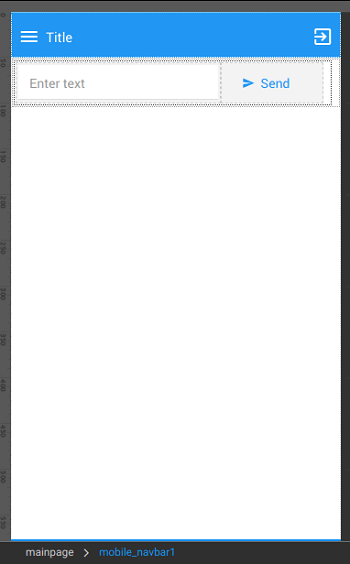](../assets/push_UI.png)
12. [a service variable](http://[supsystic-show-popup id=105]) named which will call notify method of 
    - input field message to the text widget datavalue and currentUser to the name field of loggedInUser variable 
13. Send button tap, invoke the sendNotification service variable created above.Enter the text and click on button, push message will be delivered to the devices. [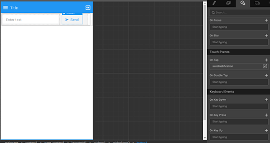](../assets/push_sendButton.png)
14. a service variable named UnregisterPush which will call unregisterDevice method of PushService [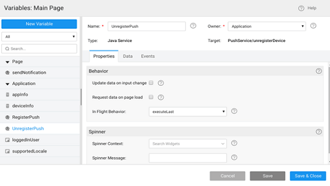](../assets/push_serviceVar3.png)
    - the input field deviceId to bind:deviceToken, which is in app.js, os to deviceInfo variable and userName to loggedInUserName variable as shown below. [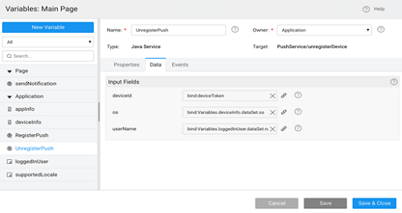](../assets/push_serviceVar3_input.png)
    - success of UnregisterPush, invoke Logout Action. 
15. an anchor in mobile navbar, on tap of this link invoke UnregisterPush service variable.[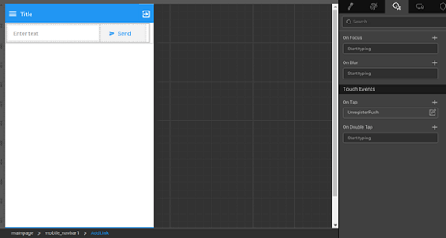](../assets/push_UI_anchor.png)
16. a custom plugin in ‘Build for Android’ dialog 
    - ‘git’ as source, ‘phonegap-plugin-push’ as plugin name and ‘[://github.com/wavemaker/phonegap-plugin-push.git#5817a63](https://github.com/wavemaker/phonegap-plugin-push.git#5817a63)’ as spec. Then, click ‘Add’ button and ‘Save’ button.

# Usage

- plugin that is mentioned above uses ‘hook’ concept of Cordova for Android build. But, Hooks are not supported in So, Android builds fail when this plugin is added in But, Android app can be built using the using **For Android** menu option inside WaveMaker studio or through a manual build. [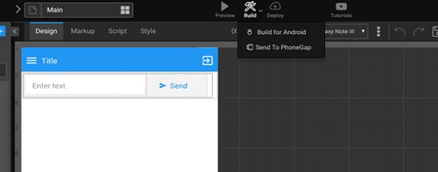](../assets/push_build.png)
- app can be created either through a manual build or through build.phonegap.com. Please make sure that provision profile that is created above (with app id that has push notifications enabled) should be used
- and test the app. Login in one device with user/user credentials. Login to another device with admin/admin credentials. If user sends a message, the other user should get a push notification.

Our aim is to show how this plugin can be integrated into WaveMaker and how to create push notifications. This integration logic can be used at various places as per your use-case. For complete features of the plugin, please visit the [site](https://github.com/wavemaker/phonegap-plugin-push/blob/master/docs/API.md)

4 Mobile Integrations

- [4.1 Amazon SNS](/learn/hybrid-mobile/mobile-integrations-amazon-sns/)
- [4.2 Amazon Mobile Analytics](/learn/hybrid-mobile/mobile-integrations-amazon-mobile-analytics/)
- [4.3 Push Notifications](#)
    - [Overview](#overview)
    - [Architecture](#architecture)
    - [App Creation](#app)
        
        - [Creation](#creation)
    - [App Usage](#usage)
    - [Conclusion](#conclusion)
- [4.4 Invoking Web App API’s in Mobile Apps](/learn/mobile-app-development/invoking-web-app-apis-mobile-apps/)
