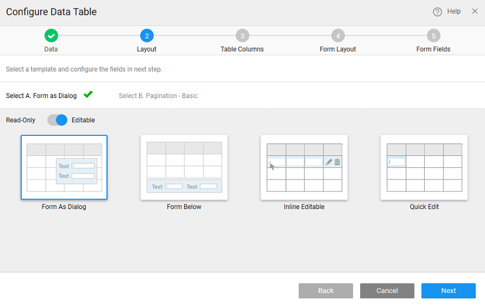

Data Table provides a tabular view for database entities through a database service or Rest APIs by binding to Live, Service or Static Variables and allows for Create, Update and Delete (CRUD) operations on the entities.

### Data Table

To bind the Data Table Widget to your back-end services data, drag and drop the Data Table Widget onto the canvas. 

#### 1 – SELECT DATA

There can be different scenarios to deal with when configuring your Data Table Widget with data source. Data source can be in the form of a Live or Service variable created from a database or web service or from an another widget on the page.

- **1**: You do not have any databases or web services available in your project. In this scenario, no live/service variables can be created as there are no services available in your project.
    1. will prompted to import either a database or a web service. Click the appropriate button to proceed.
    2. a service is available in your application, you need to drag and drop the Widget AGAIN on to your canvas to bind the widget to data source and follow the same steps as mentioned in scenario 2
- **2** – There are no live/service variables created for any of the services in your application
    1. **Source**: Variables is selected by default. If no widgets are placed in the current page, the widgets option will be disabled.
    2. **NEW**
    3. **a Service**: Select a service from the drop-down which lists the services available in your application.
    4. the **/type** of the service which would correspond to the entity in case of database service or a method in case of web/java services
    5. **Creation**: Once you select the service and operation/type for the service, a default variable will be created for you – see the Variable Name field populated by default which will be holding the dataset of the service. You can change the Variable name.
    6. **the Data Node**: You are given the option of choosing either the entire dataset – when you are binding the widget to a data source or any of the fields in the dataset – from Select data node tree when binding a single widget or a List item to a field in the dataset.
    7. **Configuration Options**: You also have the option of setting the following Data Configuration options:
        - **per request**: with an option to enter the number of records to be fetched on each request. Default is 20.
        - **Data on input change**: which is checked on by default. This means that whenever there is a change in the input parameter or filter field of the variable the data will be fetched from the service. This option will have an impact on the app performance.
        - **data on Page Load**: which is checked on by default. This allows for data to be shown when the page is loaded. If this is not checked, you will not be able to view the data when the page gets loaded. Instead No Data Found message appears on the widget at run-time.
- **3** – If the live/service variables are already created in the project
    1. **Source**: Select the source of data for the widget that was dragged and dropped onto the canvas. Variables or Widgets are the options provided to you for choosing the source of data.
    2. **Existing.** Note that you can create a new variable if you so desire.
    3. **a Variable** from the drop-down list of the variables available in the application. You can select the one needed to bind the List Widget to. You can also search for a specific variable by typing in select variable option. If you are able to find your variable in the drop-down select the same.
    4. you select the variables, it shows the dataset that it is bound to.
    5. Data Configuration options are already set for this variable, you do not see those options in this scenario.
- **4**: Binding to widget
    1. **Source**: Select the source of data to Widget.
    2. **a widget** from the drop-down list. This will list the widgets present on this page, you cannot access the widgets from other pages.
    3. can **data node** to be the entire widget or the selecteditem node in case of another Data Table or List or Cards or result from a Live Filter
    4. you are not using a Variable the Data Configuration options will not be available.

#### 2 – Layout Selection

**the Layout** includes two sub steps:

1. a Table Layout: You can choose from:
    1. Table with
        
        - as Dialog: This can be used when you would like to have a data entry form shown as a dialog which will save space as the dialog form will be shown over the Table Layout. For Example: Adding Students to a Course with information such as Skill Level, Expertise to be entered in the dialog form.
        - Below: This can be used when you want to view data in a Table and edit the selected row from the table using a form. For Example: This can be used in an use case where editable items are less for example Qty in a shopping cart
        - Editable Table: This can be used when you want to add/edit data in a Table like table rather than in a form. For Example: This can be used in an use case to create line items of an order detail table.
        
        
    2. \-Only Table with
        
        - of the selected row displayed below the table: This can be used if you wish to select some specific fields in Data Table and would like to view some special fields in the form below. For Example: Viewing catalog items showing the Basic Tech Specs of each Device in the Data Table and on selecting each row in the grid view the Network and Connectivity related Specs in the Form below.
        - Table view: This Data Table provides for Read Only View of the existing Data, when you want to show live data constantly refreshed. For Example: Stock Trading Views, Election Results etc.
        
        
2. Pagination Style 

#### 3 – SELECT DATA TABLE COLUMNS

This step will allow us to select the fields to be shown in Data Table and once done

1. your choice of fields to be displayed in Table
2. the fields for display in Table
3. the Title for the field
4. the Widget type for the field

**:** If the Data Table layout without Form is selected in step 2 DONE button will be provided after this step. Click the DONE button to add the Data Table to the current page. If any other layouts are selected then the you have to go through two more steps to select the Form layout and to select the Form fields. 

#### 4 – SELECTING FORM LAYOUT

If you have selected any of the Data Table layouts that include an inline or a dialog Form this step will allow you to select a Form layout for your inline Form or dialog Form.

- have the option of choosing **1-column, 2-column or 3-column layout** 3-column layout is selected by default
- can also set the alignment, position and size of of the Form fields.

[here for more details](/learn/using-live-form/#layout)

#### 5 – SELECTING FORM FIELDS

Select the fields and set the title and widget property for each field

1. the fields to be displayed in the Form
2. the title for each field
3. the widget type for display of each field value
4. the fields for display. In case you have selected 2- or 3-column layout, then you can specify the fields to be displayed in each column.

[here for more details](/learn/using-live-form/#fields)
