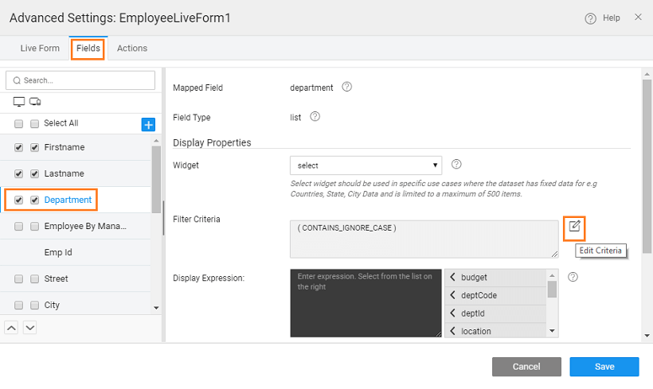
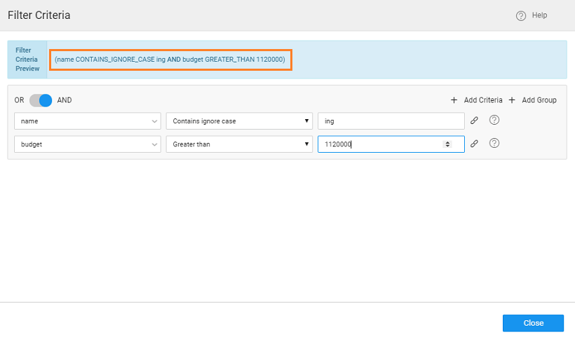

**Scenario**: To apply filter criteria on referenced entities in Data and Live Widgets. **Features**

- Filter Criteria option available for referenced fields.
- Preview of the where clause that will be built based on the specification.

**Prerequisites**:

1. A WaveMaker Web Application, with a database imported (we are using the sample HR Database).
2. Any Data and Live Widget bound to Employee CRUD variable.

**Steps**: We are using the example of a **Live Form**. Same can be implemented for Live Filter and Data Table with Quick Edit and Inline Editable layouts, with some changes as mentioned in the next section.

1. Access the **Advanced Settings** dialog for the Live Form.
2. From the **Fields** tab, select the **Department** field (referenced entity).
3. Notice the **Filter Criteria** property. Click the **Edit Criteria** icon to access the Filter Criteria dialog. 
4. Here you can specify the conditions for applying the row filter on specified field values.
5. Each condition is called a Criteria and multiple conditions can be categorized into a Group.
6. Criteria/Groups can be joined by AND/OR expression.
7. Filter conditions can be selected from the given drop down. The conditions are pre-populated based upon the filter field data type.
8. Filter Criteria Preview gives you the filter expression based on the criteria and groups that you add.
9. You can delete any criteria or group. 
10. You can see the query built for the field 
11. When you preview the app, only the values satisfying the filter criteria will be available for selection 

The above process can be used for Data Table with Quick Edit and Inline Editable layouts and Live Filter with the following changes:

- **Quick Edit and Inline Editable Data Tables**
    
    - The Columns tab from the Advanced Setting dialog lists all the fields from the referenced entity.
    - Filter Criteria option is available only for the primary key field, under Edit Mode.
    
     
- **Live Filter**
    
    - You might have to set the Widget to Select to enable the Filter Criteria option.
    
    

Variable Usage

- [1\. How-to use Filter in Live Variables](/learn/how-tos/using-filter-conditions-variable/)
- [2\. How to use Live Variable APIs](/learn/how-tos/using-live-variable-apis/)
- [3\. How to work with Notification Actions](/learn/how-tos/using-notification-actions/)
- [4\. How to work with Navigation Actions](/learn/how-tos/using-navigation-action/)
- [5\. How to work with Variables to access Queries and Procedures](/learn/how-tos/using-variables-queries-procedure/)
- [6\. How to work with Service Variables in a Form](/learn/how-tos/using-service-variable-form/)
- [7\. How to work use Filter Fields with Database CRUD Variables](#)
