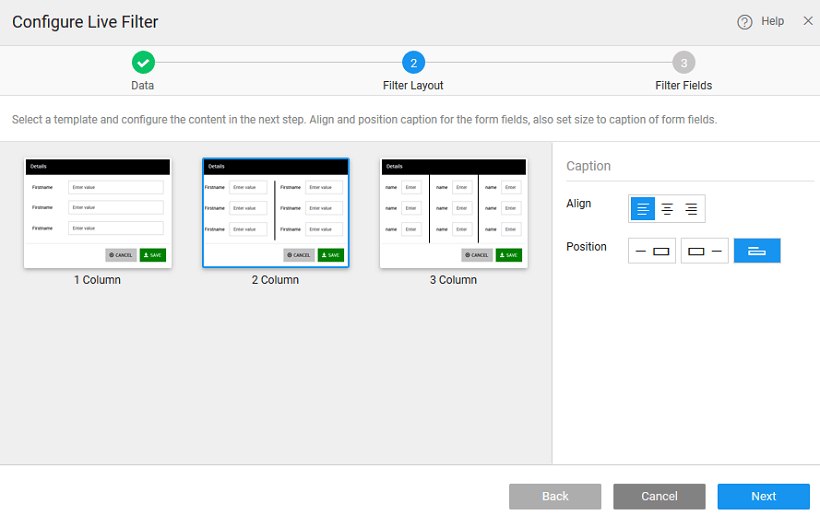

## Overview

Live Filter provides data filtering UI and functionality. Live Filter can be bound to a Live Variable and returns filtered results which in turn can be bound to any widget

Drag-and-drop the **Live Filter** widget. 

#### STEP 1 – SELECT DATA

There can be different scenarios to deal with when configuring your Live Filter Widget with data source. Data source can be in the form of a Live variable created from a database or web service or from an another widget on the page.

- **Scenario 1**: You do not have any databases or web services available in your project. In this scenario, no live variables can be created as there are no services available in your project.
    1. You will prompted to import a database. Click the appropriate button to proceed.
    2. Once a service is available in your application, you need to drag and drop the Widget AGAIN on to your canvas to bind the widget to data source and follow the same steps as mentioned in scenario 2
- **Scenario 2** – There are no live variables created for any of the services in your application
    1. **Select Source**: Variables is selected by default. If no widgets are placed in the current page, the widgets option will be disabled.
    2. Select **CREATE NEW**
    3. **Select a Service**: Select a service from the drop-down which lists the services available in your application.
    4. Select the **operation/type** of the service which would correspond to the entity in case of database service or a method in case of web/java services
    5. **Variable Creation**: Once you select the service and operation/type for the service, a default variable will be created for you – see the Variable Name field populated by default which will be holding the dataset of the service. You can change the Variable name.
    6. **Select the Data Node**: You are given the option of choosing either the entire dataset – when you are binding the widget to a data source or any of the fields in the dataset – from Select data node tree when binding a single widget or a List item to a field in the dataset.
    7. **Data Configuration Options**: You also have the option of setting the following Data Configuration options:
        - **Records per request**: with an option to enter the number of records to be fetched on each request. Default is 20.
        - **Update Data on input change**: which is checked on by default. This means that whenever there is a change in the input parameter or filter field of the variable the data will be fetched from the service. This option will have an impact on the app performance.
        - **Request data on Page Load**: which is checked on by default. This allows for data to be shown when the page is loaded. If this is not checked, you will not be able to view the data when the page gets loaded. Instead No Data Found message appears on the widget at run-time.
- **Scenario 3** – If the live/service variables are already created in the project
    1. **Select Source**: Select the source of data for the widget that was dragged and dropped onto the canvas. Variables or Widgets are the options provided to you for choosing the source of data.
    2. Select **Use Existing.** Note that you can create a new variable if you so desire.
    3. **Select a Variable** from the drop-down list of the variables available in the application. You can select the one needed to bind the List Widget to. You can also search for a specific variable by typing in select variable option. If you are able to find your variable in the drop-down select the same.
    4. Once you select the variables, it shows the dataset that it is bound to.
    5. As Data Configuration options are already set for this variable, you do not see those options in this scenario.
- **Scenario 4**: Binding to widget
    1. **Select Source**: Select the source of data to Widget.
    2. **Select a widget** from the drop-down list. This will list the widgets present on this page, you cannot access the widgets from other pages.
    3. You can **select data node** to be the entire widget or the selecteditem node in case of another Data Table or List or Cards or result from a Live Filter
    4. As you are not using a Variable the Data Configuration options will not be available.

## Layout and Alignment Configuration

Select the Live Filter **Layout** from _one-column, two-column or three-column_. You can also specify the **Caption** _Alignment, Position and Size_. 

## Field Selection

Once the datasource and layout are selected, you can set the filter **fields**. You can choose the fields to be displayed on the filter by selecting from the list and set the appropriate widget for the fields. Click on the **Done** button. Now your filter is ready. 

### How to Apply Live Filter to a Data Table/Chart

1. Drag and drop _Data Table or Chart_ widget on the page.
2. Bind the Data Table/Chart widget to the filter created by clicking on the _bind variable_ button next to the _Value_ Property in the _Dataset_ section of the Data Table/Chart widget.
3. Select the _Result_ of the filter you just created from the _Widgets_ tab on the **Bind** dialog box. 
4. Select the x-axis and y-axis values for the chart. (in case of Data Table, select the columns to be displayed at the time of [configuration](/learn/using-datatable-widget/#fields) or from [Advanced Settings](/learn/howtos-datatable/#intro)) 
5. Run the application.
6. Select a value in the filter and click on _Filter_ button and see the values change in the table/chart.
