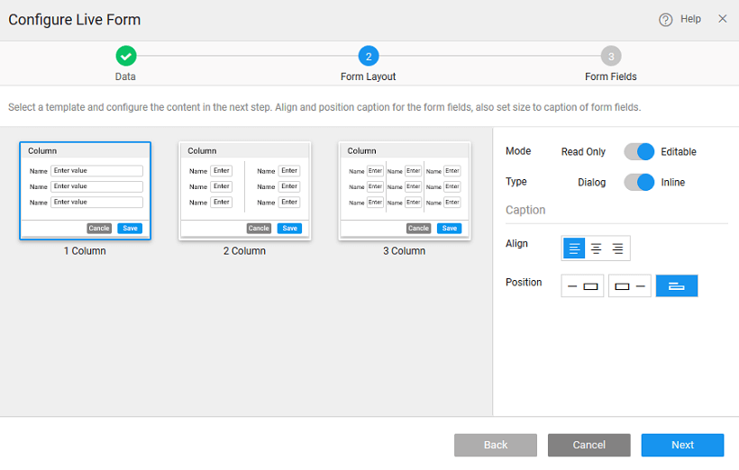

The **Form** widget has built-in functionality for performing **operations** on the data source it is bound to. A typical Live Form set up in WaveMaker has the following steps:

1. the **source** that the Live Form will be working on. This takes the form of a Live Variable or a selected item from a Widget like a List or a Data Table.
2. the display of the Live Form. You can choose from one-column, two-column or a three-column layout.
3. the to be available for the user to interact with. All the fields from the selected data source will be presented for selection.
4. \- Cancel and Save are provided by default with every Live Form. No need to code these functionalities .

Drag and drop the **Form** widget on to the page. 

#### 1 – SELECT DATA

There can be different scenarios to deal with when configuring your Live Form Widget with data source. Data source can be in the form of a Live variable created from a database or from an another widget, usually Data Table, on the page.

- **1**: You do not have any databases available in your project. In this scenario, no live variables can be created as there are no services available in your project.
    1. will prompted to import either a database. Click the appropriate button to proceed.
    2. a service is available in your application, you need to drag and drop the Widget AGAIN on to your canvas to bind the widget to data source and follow the same steps as mentioned in scenario 2
- **2** – There are no live variables created for any of the services in your application
    1. **Source**: Variables is selected by default. If no widgets are placed in the current page, the widgets option will be disabled.
    2. **NEW**
    3. **a Service**: Select a service from the drop-down which lists the services available in your application.
    4. the **/type** of the service which would correspond to the entity in case of database service
    5. **Creation**: Once you select the service and operation/type for the service, a default variable will be created for you – see the Variable Name field populated by default which will be holding the dataset of the service. You can change the Variable name.
    6. **the Data Node**: You are given the option of choosing either the entire dataset – when you are binding the widget to a data source or any of the fields in the dataset – from Select data node tree when binding a single widget or a List item to a field in the dataset.
    7. **Configuration Options**: You also have the option of setting the following Data Configuration options:
        - **per request**: with an option to enter the number of records to be fetched on each request. Default is 20.
        - **Data on input change**: which is checked on by default. This means that whenever there is a change in the input parameter or filter field of the variable the data will be fetched from the service. This option will have an impact on the app performance.
        - **data on Page Load**: which is checked on by default. This allows for data to be shown when the page is loaded. If this is not checked, you will not be able to view the data when the page gets loaded. Instead No Data Found message appears on the widget at run-time.
- **3** – If the live/service variables are already created in the project
    1. **Source**: Select the source of data for the widget that was dragged and dropped onto the canvas. Variables or Widgets are the options provided to you for choosing the source of data.
    2. **Existing.** Note that you can create a new variable if you so desire.
    3. **a Variable** from the drop-down list of the variables available in the application. You can select the one needed to bind the List Widget to. You can also search for a specific variable by typing in select variable option. If you are able to find your variable in the drop-down select the same.
    4. you select the variables, it shows the dataset that it is bound to.
    5. Data Configuration options are already set for this variable, you do not see those options in this scenario.
- **4**: Binding to widget
    1. **Source**: Select the source of data to Widget.
    2. **a widget** from the drop-down list. This will list the widgets present on this page, you cannot access the widgets from other pages.
    3. can **data node** to be the entire widget or the selecteditem node in case of another Data Table or List or Cards or result from a Live Filter
    4. you are not using a Variable the Data Configuration options will not be available.

## and Alignment Configuration

- can choose to have a _1-, 2- or 3-column layout_
- can also set the as _ONLY_ or Read only will be used for display purposes alone, while with a Editable form, user will be allowed to enter or modify values.
- can set the _, Position and Size_ of the for the Form.

## 3: Field Configuration

- the to be displayed on the form,
- **widget** to represent the selected field. The widgets applicable to the field based upon the field data type, are available for selection from the drop-down box.
- case of a multi-column layout you can choose the fields to be displayed in the respective columns. You can use the up and down arrows to arrange the fields.

