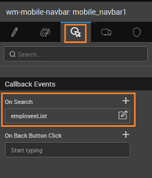

We will see how to configure the Search widget within the Navbar. We will create a list using the Employee data from sample hrdb and provide search functionality on the Employee's first name. 

1. Create a page with and ‘blank’ template and ‘One column layout with top navbar’.
2. Select mobile navbar and set the ‘Show Search button’ from the Properties Panel. 
3. [Database Integration](http://[supsystic-show-popup id=106]) - add the sample HRDB into your project.
4. [Create a Database CRUD Variable](http://[supsystic-show-popup id=105]) with ‘hrdb’ Database, ‘Employee’ Table and ‘read’ Operation. (name it say, employeeList) 
5. From the Data tab of the above Variable, bind the firstname Filter Field to query option under the mobile\_navbar Widget  
6. Drag and drop a List Widget. Use Existing ‘employeeList’ variable as the source of data.
7. Pick a template, pagination type and configure the respective data fields and click on ‘Done’ button. We have used ‘Action List’ as the template and ‘Pager’ as the pagination.
8. Select Mobile navbar, and set ‘On search’ Event to invoke ‘employeeList’ Live Variable 
9. ‘Preview’ the project and on the employee list page, click on search button. 
10. Now, filter employee ‘Chris’ by typing ‘chris’ in search text box. That’s how search widget on mobile navbar can be used. 

Mobile Widgets

- [1\. How to use search widget within leftnav](/learn/how-tos/using-search-widget-within-navbar/)
