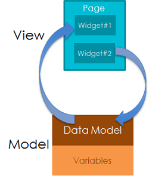
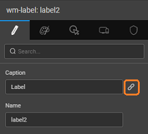

leverages the concept of Data Binding by Angular, to bind Widgets with Variables. Widgets can be configured to bind the UI Elements to specific fields of the Data Model.

is used to serve two purposes:

1. [the value of variables to a component or widget](#widget-binding)
2. [to data from Variables](#data-binding)

# to Widgets

Once you have created the necessary variables ( [Access](http://[supsystic-show-popup id=105])), you can display the data or capture user input by binding data to a component/widget. The connection between a widget (or widget property) and a source of data is called the

1. bind widgets to data, you need to use the dialog.
2. the **Panel**, anything that can support data from a different source is marked with the _ chain_ icon. You can edit or delete the bindings. Click the bind icon to display the dialog. 
3. on the _chain icon_ next to any widget property will open a dialog. From this dialog you can:
    - a listing the various binding options, fields along with the data types,
    - multiple bindings, that is all the fields can be bound at the same time,
    - a parent level binding using the objects
    - the binding requirement.
4. dialog displays the binding options i.e. a list of everything that you can bind to, including all variables, widgets and so on. You can bind to widgets, variables that are defined on the current page, or that are defined at the app level. The compatible types are indicated by success or failure message once you select a field from the variable list.
    - :  List of available variables are listed here.
    - : List of all the widgets on the current page.
    - :  List of resources included in the project, including images, HTML, CSS, and JavaScript.
    - **Expression**: Any JavaScript expression.
    - **Messages**: Any of the application messages that you created in the Application Messages repository.
5. the appropriate binding options and click 
6. **message** will be displayed to indicate whether the binding is valid or not. Along with the message, you will see the expected data type (Target) and your selection (Bound to). Based on this information, you may either choose to ignore the message or change the binding accordingly.

# to Data from Variables

can be bound to each other. Usually, this is the requirement with Variables when the data needs to be filtered i.e. output limited by a constraint or when a Variable which needs parameters as input in order to process information from the data source. These input/filter parameters will be available from the tab of the Variable. For example, the Variable corresponding to the Employee CRUD API from the sample hrdb can be filtered on any field of the dataset:  Clicking on the _ chain icon_ next to any parameter will open a  dialog. From this dialog you can:

- a listing the various binding options, fields along with the data types,
- multiple bindings, that is all the fields can be bound at the same time,
- a parent level binding using the objects
- the binding requirement.

**Options:**

- :  List of available variables are listed here.
- : List of all the widgets on the current page.
- :  List of resources included in the project, including images, HTML, CSS, and JavaScript.
- : Any JavaScript expression.
- **Messages**: Any of the application messages that you created in the Application Messages repository.

 A ** message** will be displayed to indicate whether the binding is valid or not. Along with the message, you will see the expected data type (Target) and your selection (Bound to). Based on this information, you may choose to ignore the message or change the binding accordingly. 

# Options

### to Variables

We can use bind option to bind variables to appropriate widgets or another variable. :

- binding to Service Variables make sure that the _data on page load_ is selected to ensure the component/widget is initialized with data at the time of page (application in case of app owned variables) load.
- _data on input change_ to trigger the live variable automatically when the filter condition or the input parameter value changes.

### to Widgets

You can bind a widget value to another widget value. For example, you can bind a widget to a selected value from the **Table** or **List**

### to Resource

You can bind your widgets to images, videos etc.. For this you have to [Resource](http://[supsystic-show-popup id=112]) first.

### using Expression

the **Expression** tab, you can write a custom expression to change the display setting. The expression can be simple string concatenation expressions or HTML syntax following AngularJS conventions for binding. For complex expressions, it is advisable to [a function](/learn/how-tos/using-javascript-binding/#js-function) For example, when displaying name you want the display to say _Name is: some\_value_, you can achieve this by using the expression:

"User Name is: " + datavalue

You can also change the data format, combine various data fields and do much more using the to bind your widgets. You can select the variable you want to bind this text box from the left side panel. Using the arithmetic symbols you can build an expression involving multiple variables and the format you want it to be displayed. Currently, there are the following formatting options to choose from:

- \- formats number to a string. **Size** specifies the number of decimal places to round the number to. Eg: If the value is 12345.6789 and fraction size is 3, then the formatted value is 12,345.679.
- \- allows you to add a prefix to the expression,
- \- formats string to a number. Eg: If value is '123', then formatted value is 123
- \- allows you to add a suffix to the expression,
- \- Formats date and time to a relative time. Eg: If the value is 5 PM and the current time is 6 PM, formatted value is 'an hour ago'. Moment library is used for this functionality. Moment supports localization. Moment locale files are bundled with the project. Thus at runtime, when the locale changes, the respective locale file is loaded and all-time conversions are localized accordingly.
- \- lets you define the type of currency thus giving the appropriate display symbol and specify the precision value,
- \- lets you select the date format, and
- \- allows you to convert the text to number format for use in arithmetic operations and specify the precision value.

### to Localized Messages

can bind your custom Application messages and bind them to a widget. This is particularly useful when trying to implement localization in your app. [here for more](/learn/how-tos/select-locale-usage/)

< Variables & Actions

Access >

6\. Data Integration - Variables

- 6.1 Binding Layer
    - [Overview](/learn/app-development/variables/data-integration/)
- 6.2 Variables and Actions
    - [Overview](/learn/app-development/variables/variables-actions/#)
    - [Variables](/learn/app-development/variables/variables-actions/#variables)
        - a. Database CRUD
            - [Overview](/learn/app-development/variables/database-crud/)
            - [Variable Creation](/learn/app-development/variables/database-crud/#creation)
            - [Properties](/learn/app-development/variables/database-crud/#properties)
            - [Events](/learn/app-development/variables/database-crud/#events)
            - [Methods](/learn/app-development/variables/database-crud/#methods)
        - b. Database API
            - [Overview](/learn/app-development/variables/database-apis/)
            - [Variable Creation](/learn/app-development/variables/database-apis/#creation)
            - [Properties](/learn/app-development/variables/database-apis/#properties)
            - [Events](/learn/app-development/variables/database-apis/#events)
            - [Methods](/learn/app-development/variables/database-apis/#methods)
        - c. Web Service
            - [Overview](/learn/app-development/variables/web-service/)
            - [Variable Creation](/learn/app-development/variables/web-service/#creation)
            - [Properties](/learn/app-development/variables/web-service/#properties)
            - [Events](/learn/app-development/variables/web-service/#events)
            - [Methods](/learn/app-development/variables/web-service/#methods)
        - d. Java Service
            - [Overview](/learn/app-development/variables/java-services)
            - [Variable Creation](/learn/app-development/variables/java-services/#creation)
            - [Properties](/learn/app-development/variables/java-services/#properties)
            - [Events](/learn/app-development/variables/java-services/#events)
            - [Methods](/learn/app-development/variables/java-services/#methods)
        - e. Security Service
            - [Overview](/learn/app-development/variables/security-service/)
            - [Variable Creation](/learn/app-development/variables/security-service/#creation)
            - [Properties](/learn/app-development/variables/security-service/#properties)
            - [Events](/learn/app-development/variables/security-service/#events)
            - [Methods](/learn/app-development/variables/security-service/#methods)
        - f. Model
            - [Overview](/learn/app-development/variables/model-variable/)
            - [Variable Creation](/learn/app-development/variables/model-variable/#creation)
            - [Properties](/learn/app-development/variables/model-variable/#properties)
            - [Events](/learn/app-development/variables/model-variable/#events)
            - [Methods](/learn/app-development/variables/model-variable/#methods)
        - g. Device Variables
            - [Overview](/learn/hybrid-mobile/device-variables/#)
            - [Services](/learn/hybrid-mobile/device-variables/#services)
            - [Operations](/learn/hybrid-mobile/device-variables/#operations)
            - [Events](/learn/hybrid-mobile/device-variables/#events)
            - [Methods](/learn/hybrid-mobile/device-variables/#methods)
            - [Usage](/learn/hybrid-mobile/device-variables/#usage)
    - [Actions](/learn/app-development/variables/variables-actions/#actions)
        - i. Navigation
            - [Overview](/learn/app-development/variables/navigation-action/#)
            - [Action Creation](/learn/app-development/variables/navigation-action/#creation)
            - [Properties](/learn/app-development/variables/navigation-action/#properties)
            - [Methods](/learn/app-development/variables/navigation-action/#methods)
        - ii. Login
            - [Overview](/learn/app-development/variables/login-action/)
            - [Action Creation](/learn/app-development/variables/login-action/#creation)
            - [Properties](/learn/app-development/variables/login-action/#properties)
            - [Data](/learn/app-development/variables/login-action/#data)
            - [Events](/learn/app-development/variables/login-action/#events)
        - iii. Logout
            - [Overview](/learn/app-development/variables/logout-action/)
            - [Action Creation](/learn/app-development/variables/logout-action/#creation)
            - [Properties](/learn/app-development/variables/logout-action/#properties)
            - [Events](/learn/app-development/variables/logout-action/#events)
        - iv. Timer
            - [Overview](/learn/app-development/variables/timer-action/)
            - [Action Creation](/learn/app-development/variables/timer-action/#creation)
            - [Properties](/learn/app-development/variables/timer-action/#properties)
            - [Events](/learn/app-development/variables/timer-action/#events)
            - [Methods](/learn/app-development/variables/timer-action/#methods)
        - v. Notification
            - [Overview](/learn/app-development/variables/notification-action/)
            - [Action Creation](/learn/app-development/variables/notification-action/#creation)
            - [Properties](/learn/app-development/variables/notification-action/#properties)
            - [Events](/learn/app-development/variables/notification-action/#events)
            - [Methods](/learn/app-development/variables/notification-action/#methods)
    - [Scoping](/learn/app-development/variables/variables-actions/#scoping)
    - [Variable Events](/learn/app-development/variables/variables-actions/#events)
    - [Error Handling](/learn/app-development/variables/variables-actions/#error-handling)
- [6.3 Variable Binding](#)
    - [Overview](#)
    - [Data Binding](#data-binding)
    - [Widget Binding](#widget-binding)
    - [Binding Options](#binding-options)
- 6.4 JavaScript Access
    - [Overview](/learn/variables/accessing-elements-via-javascript/#)
    - [Widget Controllers](/learn/variables/accessing-elements-via-javascript/#widget-controllers)
    - [Page Scripting](/learn/variables/accessing-elements-via-javascript/#page-scripting)
    - [Script Access](/learn/variables/accessing-elements-via-javascript/#script-access)
