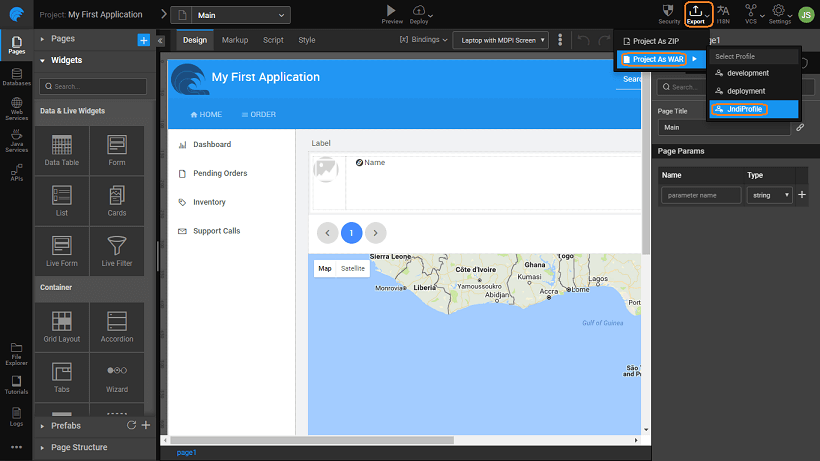

WaveMaker Apps can be exported as a WAR file. This generated file can be deployed to any standard Java Web Server running on JDK 1.8. This section walks through the steps to deploy WaveMaker app to **JBoss - WildFly**. You can know more about [Deployment to Web Server](/learn/app-development/deployment/deployment-web-server/) from here.

## Prerequisites

**JBoss Server setup**

- You need to configure JBoss server. [see here for details](http://wildfly.org/downloads/). **NOTE**: Deployment has been tested on JBoss WildFly versions 11.0.0.CR1 and 10.1.0.Final
- Login to JBoss server with valid username and password.

**Start JBoss Server**

- Navigate to “_\\jboss-\[version\]\\jboss-\[version\]\\bin_".
    - Windows: Double click on _standalone.bat_ file to start JBoss server
    - Linux: Double click on _standalone.sh_ file to start JBoss server
- Open Browser and navigate to _http://localhost:9990_ as JBoss by default starts in 9990 port.

**The Project sources zip/directory** Export Project as zip from WaveMaker.

## Preparing WAR File

From WaveMaker Studio, for the app that you want to deploy to JBoss, Export the app as WAR file using the appropriate configurations. [See here for more](/learn/app-development/deployment/deployment-web-server/#war-file-generation).

## Deploy to JBOSS Server

(NOTE: The screenshots from JBoss website were current at the time of documentation. The actual images might differ)

**JBoss-WildFly**

- Copy prepared war file into JBoss home dir\\standalone\\deployments
- Open JBoss terminal and check app deployment logs for deployment status
- Once success message is displayed in the terminal navigate to http://localhost:8080/ to view the deployed application.

# Deploying Application that uses JNDI Datasource

## Configure JNDI in JBOSS Server

**Configure JNDI for Oracle database server**

- Navigate to folder "..\\Jboss Home Directory\\modules\\system\\layers\\base\\com". Create structure ..\\oracle\\oracle\\main.
- Copy ojdbc6-11.2.0.jar in the main directory.
- Add following details to module.xml file (in main directory).
    
    <module xmlns="urn:jboss:module:1.1" name="com.oracle.oracle">
    	<properties>
    		<property name="jboss.api" value="unsupported"/>
    	</properties>
    	<resources>
    		<resource-root path="ojdbc6-11.2.0.jar"/>
    		<!-- Insert resources here -->
    	</resources>
    	<dependencies>
    		<module name="javax.api"/>
    		<module name="javax.transaction.api"/>
    		<module name="javax.servlet.api" optional="true"/>
    	</dependencies>
    </module>
    
- Open standalone.xml file in '..Jboss home directory\\standalone\\configuration'.
- Add following details in profile.
    
    <subsystem xmlns="urn:jboss:domain:datasources:1.2">
    	<datasources>
    		<datasource jndi-name="java:/jdbc/oracle" pool-name="poolname" enabled="true" use-java-context="true">
    			<connection-url>jdbc:oracle:thin:@//<host>:<port>/<SID></connection-url>
    			<driver>oracledriver</driver>
    			<security>
    				<user-name>username</user-name>
    				<password>password</password>
    			</security>
    		</datasource>
    		<drivers>
    			<driver name="oracledriver" module="com.oracle.oracle">
    				<xa-datasource-class>oracle.jdbc.driver.OracleDriver</xa-datasource-class>
    			</driver>
    		</drivers>
    	</datasources>
    </subsystem>
    

**Use JNDI name in the application using Config Profiles**

- Click on settings menu in project workspace and create a new profile.
- Select datasource as JNDI and provide jndi name in the respective text box.
- Save profile and close settings. 
- Export war for the newly created profile. 
- Save the war file

**Deploy to JBOSS Server** [click here](#process)

## Troubleshooting

- - To know on which port the application is being running open \\jboss-home-directory\\standalone\\configuration\\standalone.xml
    - And search <socket-binding name="http"
    - On this port the application will be running.

**Deployment to JBoss**

- [i. Prerequisites](#prerequisites)
- [ii. Preparing WAR File](#prepare)
- [iii. Deploy to JBoss Server](#process)
- [iv. Deployment for JNDI Datasource](#JNDI)
- [v. Troubleshooting](#troubleshooting)
